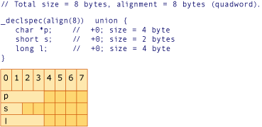

# 结构对齐示例
[!INCLUDE[vs2017banner](../assembler/inline/includes/vs2017banner.md)]

以下四个示例各声明了一个对齐结构或联合，对应的图形说明了该结构或联合在内存中的布局。  图形中的每列都表示一字节的内存，列中的数字指示该字节的位移。  每个图形第二行中的名称对应于声明中的一个变量名。  阴影列指示达到指定对齐所需的填充。  
  
   
示例 1  
  
   
示例 2  
  
   
示例 3  
  
   
示例 4  
  
## 请参阅  
 [类型和存储](../build/types-and-storage.md)