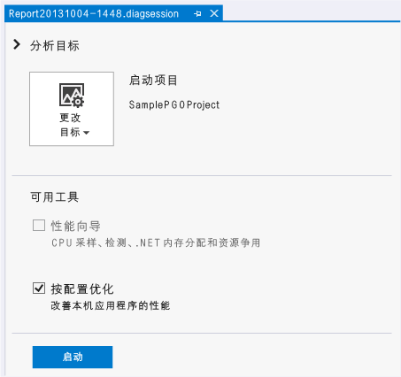
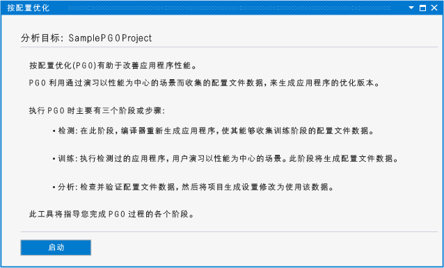
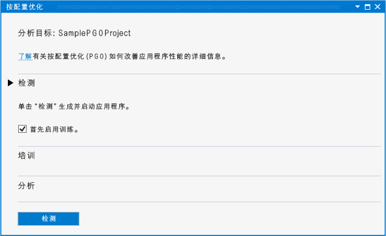
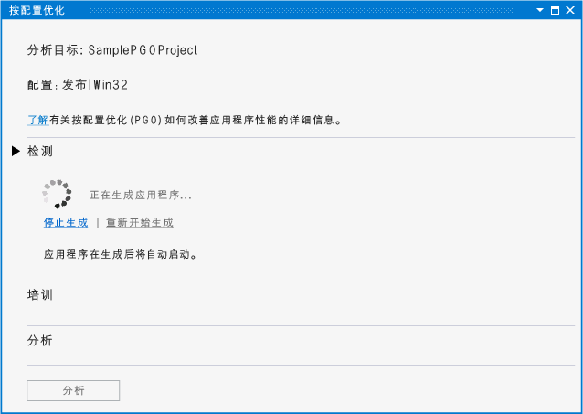
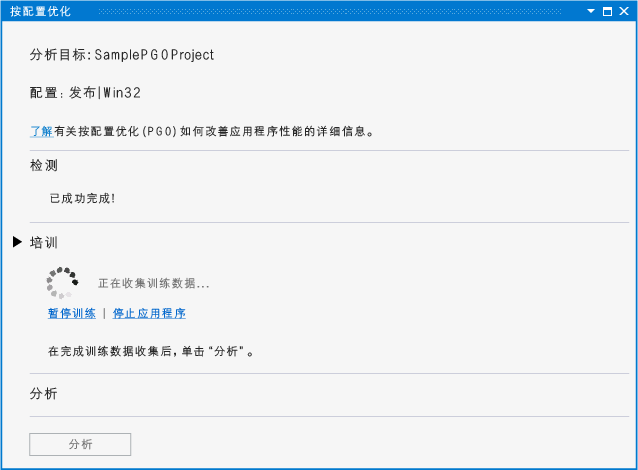
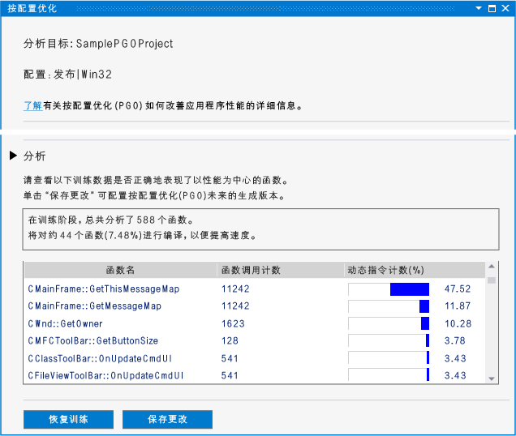
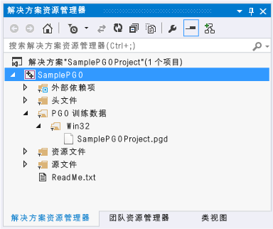
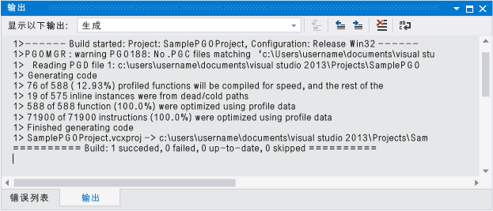

# 性能和诊断中心的按配置文件优化
[!INCLUDE[vs2017banner](../../assembler/inline/includes/vs2017banner.md)]

性能和诊断中心中的 Visual C\+\+ 插件按配置优化可以简化开发人员的按配置优化体验。  可从 Visual Studio 网站[下载插件](http://go.microsoft.com/fwlink/p/?LinkId=327915)。  
  
 按配置优化 \(PGO\) 可帮助您创建 x86 和 x64 本机应用的生成版本，同时优化用户与它们之间的交互方式。  PGO 是多步骤的过程：您创建用于分析检测的应用，然后执行“训练”，即您通过常用用户交互方案运行所检测的应用。  您保存捕获的分析数据，然后使用结果引导全程序优化，从而重新生成应用。  尽管您可以在 Visual Studio 或命令行中分别执行这些步骤，但 PGO 插件可以集中并简化这一过程。  PGO 插件可以设置所有必需的选项，指导您完成每个步骤，为您显示分析，然后使用结果配置生成版本，以便优化每个函数的大小或速度。  当您更改代码时，PGO 插件可以让您轻松地重新执行应用训练，并更新生成版本优化数据。  
  
## 系统必备  
 必须[下载 PGO 插件](http://go.microsoft.com/fwlink/p/?LinkId=327915)，并将其安装到 Visual Studio 中，然后才能在性能和诊断中心中使用。  
  
## 演练：使用 PGO 插件优化应用  
 首先，您将在 Visual Studio 创建一个基本的 Win32 桌面应用。  如果您已有一个要优化的本机应用，则可以直接使用并跳过此步骤。  
  
#### 创建应用  
  
1.  在菜单栏上，依次选择**“文件”**、**“新建”**、**“项目”**。  
  
2.  在“新建项目”对话框的左窗格中，依次展开“已安装”、“模板”、“Visual C\+\+”，然后选择“MFC”。  
  
3.  在中间窗格中，选择“MFC 应用程序”。  
  
4.  在“名称”框中为项目指定名称，例如 SamplePGOProject。  选择**“确定”**按钮。  
  
5.  在“MFC 应用程序向导”对话框的“概述”页上，选择“完成”按钮。  
  
 接下来，将应用的生成配置设置为“发布”，使之为 PGO 生成和测试步骤做好准备。  
  
#### 设置生成配置  
  
1.  在菜单栏上，依次选择**“生成”**、**“配置管理器”**。  
  
2.  在“配置管理器”对话框中选择“活动解决方案配置”下拉按钮，然后选择“发布”。  选择“关闭”按钮。  
  
 打开性能和诊断中心，在菜单上选择“分析”、“性能和诊断”。  这将打开一个诊断会话页，其中具有您的项目类型的可用分析工具。  
  
   
  
 在“可用工具”中，选中“按配置优化”复选框。  选择“开始”按钮，启动 PGO 插件。  
  
   
  
 “按配置优化”页描述了插件用来提高应用性能的步骤。  选择“开始”按钮。  
  
   
  
 在“检测”部分中，使用“最初启用训练”选项选择是否在训练中包括应用的启动阶段。  如果未选中此选项，则在显式启用训练之前，不会记录正在运行的检测应用中的训练数据。  
  
 选择“检测”按钮，使用一组特殊的编译器选项生成应用。  编译器会在所生成的代码中插入探测指令。  这些指令会在测试阶段记录分析数据。  
  
   
  
 当完成所检测的应用生成时，将自动启动此应用。  
  
 如果生成过程中发生任何错误或警告，请予以更正，并选择“重新开始生成”，以便重新启动检测的生成。  
  
 当启动应用后，您可以使用“训练”部分中的“开始训练”和“暂停训练”链接，来控制何时记录分析信息。  您可以使用“停止应用程序”和“启动应用程序”链接，来停止和重新启动应用。  
  
   
  
 在训练过程中，请完成您的用户方案，以便捕获 PGO 插件为优化代码而需要的分析信息。  完成训练后，请关闭应用或选择“停止应用程序”链接。  选择“分析”按钮，启动分析步骤。  
  
 当分析完成后，“分析”部分会显示一份报告，其中包括用户方案训练期间捕获的分析信息。  您可以使用该报告检查应用调用哪些函数的次数最多、花费的时间最长。  PGO 插件可以使用这些信息确定哪些函数需要优化速度，哪些函数需要优化大小。  PGO 插件可以配置生成优化，以便为训练期间所记录的用户方案创建最小、最快的应用。  
  
   
  
 如果训练捕获到了期望中的分析信息，则您可以选择“保存更改”，以便在项目中保存所分析的分析数据，从而优化未来的生成版本。  若要丢弃分析数据并重新启动训练，请选择“重做训练”。  
  
 分析数据文件保存在项目中的“PGO Training Data”文件夹中。  此数据用于控制应用中的编译器生成优化设置。  
  
   
  
 在分析后，PGO 插件会在项目中设置生成选项，以便在编译时使用分析数据有选择地优化您的应用。  可以使用相同的分析数据继续修改并生成您的应用。  当生成应用后，生成输出将报告使用分析数据优化了多少函数和指令。  
  
   
  
 在开发过程中，如果进行了大量代码更改，则可能需要重新训练您的应用，以便实现最佳优化。  当生成输出报告不到 80% 的函数或指令使用分析数据进行了优化时，建议您重新训练您的应用。