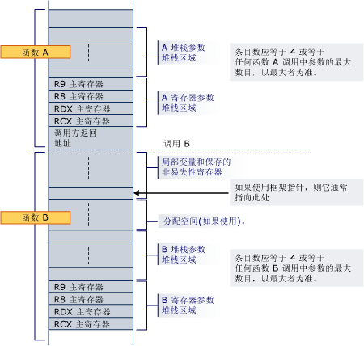

# 堆栈分配
函数的 prolog 负责对本地变量分配堆栈空间，保存的寄存器，堆栈参数，并注册参数。  
  
 参数区域始终在堆栈的底部 （即使是使用 alloca），以便它将始终为旁边的寄信人地址的任何函数调用过程。 它包含至少四个条目，但始终足够空间来保留所有参数的所需的不能调用任何函数。 请注意，即使参数本身永远不会托管到堆栈; 始终为寄存器参数分配空间为所有参数分配了空间保证被调用方。 这样的相邻区域才可以使用在所调用的函数需要参数列表 (va_list) 或单个自变量的地址的情况下，家庭地址不需要将寄存器自变量。 此区域还提供了方便的位置，若要在转换 （thunk） 执行期间以及作为调试选项保存寄存器自变量 （例如，它可以轻松自变量就存储在他们的家庭住址在 prolog 代码中在调试期间查找）。 即使被调用的函数具有少于 4 个参数，这些 4 堆栈位置有效地归被调用函数，并可能会用于其他目的除了保存寄存器值的参数调用的函数。  因此调用方可能未保存的信息在堆栈的此区域中跨函数调用。  
  
 如果动态分配空间 （分配） 的函数中，然后非易失寄存器必须用作帧指针以标记的固定部分，堆栈的基础并必须保存并在序言中初始化该寄存器。 请注意，使用 alloca 时，从相同的调用方调用同一个被调用方可能具有不同的内部地址，为其注册参数。  
  
 堆栈将始终保持不变 16 字节对齐，除外 （例如，推送到的回邮地址后），prolog 中，除非中的指示位置[函数类型](../build/function-types.md)对于框架函数的某一类。  
  
 下面是其中函数的调用非叶函数 B.函数 A 的序言的堆栈布局的示例已为所有寄存器和堆栈所都需的参数在堆栈的底部 B 已分配空间。 该调用将返回地址和 B 的 prolog 为其本地变量、 非易失寄存器和它调用的函数所需的空间分配空间。 如果 B 使用 alloca，保存区域的本地变量/非易失性寄存器和参数堆栈区域之间分配空间。  
  
   
  
 当函数 B 调用另一个函数时，返回地址正下方的家庭地址按以 RCX 中。  
  
## 请参阅  
 [堆栈使用](../build/stack-usage.md)