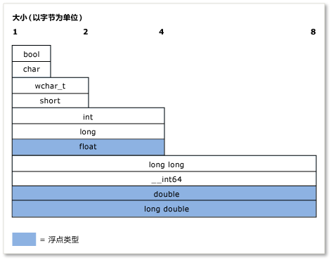

---
title: C++ 类型系统（现代 C++）
ms.date: 11/19/2018
ms.topic: conceptual
ms.assetid: 553c0ed6-77c4-43e9-87b1-c903eec53e80
ms.openlocfilehash: 476ebabc4bfc19f995119649d6f012d4b39d8369
ms.sourcegitcommit: 9e891eb17b73d98f9086d9d4bfe9ca50415d9a37
ms.translationtype: MT
ms.contentlocale: zh-CN
ms.lasthandoff: 11/20/2018
ms.locfileid: "52176336"
---
# <a name="c-type-system-modern-c"></a>C++ 类型系统（现代 C++）

这一概念*类型*在 C++ 中非常重要。 每个变量、函数自变量和函数返回值必须具有一个类型以进行编译。 此外，在计算表达式前，编译器会给出每个表达式（包括文本值）的隐式类型。 类型的一些示例包括**int**用于存储整数值， **double**用于存储浮点值 (也称为*标量*数据类型)，或标准库类[std:: basic_string](../standard-library/basic-string-class.md)来存储文本。 您可以通过定义来创建你自己的类型**类**或**结构**。 该类型指定将分配给变量（或表达式结果）的内存量、可能存储在该变量中的值类型、如何对那些值（作为位模式）进行说明以及可对其执行的操作。 本文包含对 C++ 类型系统的主要功能的非正式概述。 

## <a name="terminology"></a>术语

**变量**: 符号的数据量的名称，以便可以使用名称来访问它是指在范围内的代码定义它的数据。 C++ 中*变量*通常用于指标量数据类型的实例而其他类型的实例通常称为*对象*。

**对象**： 为了简易性和一致性，本文使用术语*对象*来引用任何实例的类或结构，并使用一般意义时包括所有类型甚至标量变量。

**POD 类型**（纯旧数据）： C++ 中的数据类型此非正式类别是指作为标量 （参见基础类型部分） 或*POD 类*。 POD 类没有不是 POD 的静态数据成员，没有用户定义的构造函数、用户定义的析构函数或用户定义的赋值运算符。 此外，POD 类无虚函数、基类、私有的或受保护的非静态数据成员。 POD 类型通常用于外部数据交换，例如与用 C 语言编写的模块（仅具有 POD 类型）进行的数据交换。

## <a name="specifying-variable-and-function-types"></a>指定变量和函数类型

C++ 是*强类型*语言，也是*静态类型化*; 每个对象都具有类型和类型永远不会更改 （不以与静态数据对象相混淆）。 
**当你声明一个变量**在代码中，您必须显式指定其类型或使用**自动**关键字指示编译器通过初始值设定项推断类型。
**当你声明一个函数**必须在代码中，指定每个自变量和其返回值的类型或**void**如果函数不返回任何值。 例外情况是，当使用允许任意类型参数的函数模板时。

在你首次声明变量后，稍后无法更改其类型。 但是，你可以将变量的值或函数的返回值复制到其他类型的另一个变量中。 此类操作称为*类型转换*，这有时是必需的但也是可能的数据丢失或潜在来源。

在声明 POD 类型的变量时，强烈建议你将其初始化，也就是为其指定初始值。 在初始化某个变量之前，该变量会有一个“垃圾”值，该值包含之前正好位于该内存位置的位数。 这是需要注意的 C++ 的一个重要方面，尤其是当你使用另一种语言来处理初始化时。 如果声明非 POD 类类型的变量，则构造函数会处理初始化。

下面的示例演示了一些简单变量声明，并分别对它们进行了说明。 该示例还演示了编译器如何使用类型信息允许或禁止对变量进行某些后续操作。

```cpp
int result = 0;              // Declare and initialize an integer.
double coefficient = 10.8;   // Declare and initialize a floating
                             // point value.
auto name = "Lady G.";       // Declare a variable and let compiler
                             // deduce the type.
auto address;                // error. Compiler cannot deduce a type
                             // without an intializing value.
age = 12;                    // error. Variable declaration must
                             // specify a type or use auto!
result = "Kenny G.";         // error. Can’t assign text to an int.
string result = "zero";      // error. Can’t redefine a variable with
                             // new type.
int maxValue;                // Not recommended! maxValue contains
                             // garbage bits until it is initialized.
```

## <a name="fundamental-built-in-types"></a>基本（内置）类型

不同于某些语言，C++ 中不存在派生所有其他类型的通用基类型。 语言的 Visual C++ 实现包括许多*基本类型*，也称为*内置类型*。 这包括数字类型，如**int**， **double**，**长**， **bool**，再加上**char**和**wchar_t**类型分别为 ASCII 和 UNICODE 字符。 最基本类型 (除**bool**， **double**， **wchar_t**和相关类型) 都具有未签名版本中，对其进行修改的变量可存储的值范围。 例如， **int**，它存储 32 位带符号的整数可以表示值介于-2,147,483,648 到 2,147,483,647。 **无符号的 int**，也存储为 32 位，可以存储一个介于 0 和 4,294,967,295 之间。 可能的值的总数在每种情况下都相同；仅范围不同。

基础类型由编译器识别，编译机包含内置规则，这些规则管理可对它们执行的操作以及将它们转换为其他基础类型的方式。 有关内置类型及其大小和数值限制的完整列表，请参阅[基本类型](../cpp/fundamental-types-cpp.md)。

下图显示了内置类型的相对大小：



下表列出了最常用的基础类型：

|类型|大小|注释|
|----------|----------|-------------|
|int|4 个字节|整数值的默认选择。|
|double|8 个字节|浮点值的默认选择。|
|bool|1 个字节|表示可为 true 或 false 的值。|
|char|1 个字节|用于早期 C 样式字符串或 std:: 字符串对象中无需转换为 UNICODE 的 ASCII 字符。|
|wchar_t|2 个字节|表示可能以 UNICODE 格式进行编码的“宽”字符值（Windows 上为 UTF-16，其他操作系统上可能不同）。 这是用于 `std::wstring` 类型字符串的字符类型。|
|无符号&nbsp;char|1 个字节|C++ 无内置 `byte` 类型。  使用 unsigned char 表示字节值。|
|unsigned int|4 个字节|位标志的默认选项。|
|long long|8 个字节|表示非常大的整数值。|

## <a name="the-void-type"></a>void 类型

**Void**类型是一种特殊类型; 不能声明类型的变量**void**，但可以声明类型的变量__void \*__  (指向**void**)，这有时是必要的分配原始 （非类型化） 内存时。 但是，指向**void**不是类型安全和它们的使用通常是强烈建议不要在现代 c + + 中使用。 在函数声明中， **void**返回值表示函数不返回值; 这是常见和可接受用法**void**。 尽管 C 语言所需函数具有零个参数来声明**void**在参数列表中，例如， `fou(void)`，这种做法是建议你不要在现代 c + +，应该声明为`fou()`。 有关详细信息，请参阅[类型转换和类型安全](../cpp/type-conversions-and-type-safety-modern-cpp.md)。

## <a name="const-type-qualifier"></a>const 类型限定符

任何内置或用户定义的类型都可由 const 关键字限定。 此外，成员函数可能**const**-限定甚至**const**的重载。 值**const**在初始化后无法修改类型。

```cpp

const double PI = 3.1415;
PI = .75 //Error. Cannot modify const variable.
```

**Const**限定符广泛应用于函数和变量声明和"const 有效性"是 c + + 中的重要概念; 它实质上表示使用**const**以确保在编译时，值不是无意中修改。 有关详细信息，请参阅[const](../cpp/const-cpp.md)。

一个**const**类型是不同于其非常量版本; 例如， **const int**是从不同的类型**int**。可以使用 c + + **const_cast**运算符时必须删除这些极少数情况下的*常量性*变量中。 有关详细信息，请参阅[类型转换和类型安全](../cpp/type-conversions-and-type-safety-modern-cpp.md)。

## <a name="string-types"></a>字符串类型

严格地说，c + + 语言不具有内置的字符串类型;**char**并**wchar_t**存储单个字符-必须声明一个数组以估计字符串，这些类型添加一个终止 null 值 (例如，ASCII `'\0'`) 到的数组元素最后一个有效字符 (也称为*C 样式字符串*)。 C 样式字符串需要编写更多的代码或者需要使用外部字符串实用工具库函数。 在现代 c + + 中，我们已有标准库类型，但是`std::string`(用于 8 位**char**-键入字符的字符串) 或`std::wstring`(对于 16 位**wchar_t**-键入字符的字符串)。 可以将这些 C++ 标准库容器视为本机字符串类型因为它们是包含在任何符合 C++ 生成环境中的标准库的一部分。 只需使用 `#include <string>` 指令即可使这些类型在你的程序中可用。 （如果使用的是 MFC 或 ATL，还可使用 CString 类，但其不符合 C++ 标准。）强烈建议你不要在现代 C++ 中使用 null 终止字符数组（前面提到的 C 样式字符串）。

## <a name="user-defined-types"></a>用户定义的类型

定义时**类**，**结构**，**联合**，或者**枚举**，该构造使用你代码的其余部分中，就好像一种基本类型. 它具有内存的已知大小以及一些有关可以如何在程序生命期内将其用于编译时检查和运行时的规则。 基本内置类型和用户定义的类型之间的主要区别如下：

- 编译器没有用户定义的类型的内置知识。 它会了解类型的第一次遇到在编译过程定义时。

- 通过定义（通过重载）适当的运算符作为类成员或非成员函数，可以指定可对你的类型执行的操作以及你的类型转换为其他类型的方式。 有关详细信息，请参阅[函数重载](function-overloading.md)。

- 不必将它们静态类型化（对象类型的规则从不改变）。 通过的机制*继承*并*多态性*，声明为类 （称为类的对象实例） 的用户定义类型的变量可能会在运行时比在具有不同的类型编译时间。 有关详细信息，请参阅[继承](../cpp/inheritance-cpp.md)。

## <a name="pointer-types"></a>指针类型

C++ 仍然允许使用特殊声明符 `*`（星号）来声明指针类型的变量，此功能可以追溯到 C 语言的最早版本。指针类型存储实际数据值在内存中存储时的位置所对应的地址。在现代 C++ 中，这些指针称为原始指针**，可以在代码中通过特殊运算符 `*`（星号）或 `->`（短划线加大于号）进行访问。这称为取消引用**。使用哪一种取消引用方法取决于你是取消引用标量的指针还是取消引用对象中成员的指针。使用指针类型长期以来都是 C 和 C++ 程序开发过程中最具挑战性和最难以理解的内容之一。本部分概述了一些使用原始指针的事实和做法，对那些希望使用原始指针的用户会有帮助。但在现代 C++ 中，随着[智能指针](../cpp/smart-pointers-modern-cpp.md)（在本部分末尾有详细讨论）的发展，根本不需要使用原始指针来表示对象所有权（也不建议这样做）。使用原始指针来观察对象仍是有用且安全的，但如果必须将其用于对象所有权，则需谨慎操作并仔细考虑如何创建和销毁其所拥有的对象。

首先你应该知道的是，声明一个原始指针变量只会分配存储了取消指针时需引用的内存地址的内存。 数据值本身的内存分配 (也称为*后备存储*) 尚未分配。 换言之，通过声明原始指针变量，将创建内存地址变量而非实际数据变量。 在确保指针变量包含指向备份存储的有效地址前取消对其的引用将导致程序发生未定义行为（通常为严重错误）。 下面的示例演示了此种错误：

```cpp
int* pNumber;       // Declare a pointer-to-int variable.
*pNumber = 10;      // error. Although this may compile, it is
                    // a serious error. We are dereferencing an
                    // uninitialized pointer variable with no
                    // allocated memory to point to.
```

该示例取消引用指针类型，未分配用于存储实际整数数据的任何内存或向其分配有效内存地址。 下面的代码更正这些错误：

```cpp
    int number = 10;          // Declare and initialize a local integer
                              // variable for data backing store.
    int* pNumber = &number;   // Declare and initialize a local integer
                              // pointer variable to a valid memory
                              // address to that backing store.
...
    *pNumber = 41;            // Dereference and store a new value in
                              // the memory pointed to by
                              // pNumber, the integer variable called
                              // "number". Note "number" was changed, not
                              // "pNumber".
```

已纠正的代码示例使用本地堆栈内存创建 `pNumber` 指向的后备存储。 我们使用基本类型，以求简单。 在实践中，指针的后备存储是在内存中，调用一个区域中将是动态分配的大多数通常为用户定义类型*堆*(或*自由存储*) 使用**新**关键字表达式 (在 C 样式编程中，较旧`malloc()`C 运行时库函数)。 分配后，这些变量通常称为对象，尤其是基于类定义。 使用分配的内存**新**必须删除相应的**删除**语句 (或者，如果您使用`malloc()`函数以分配它，C 运行时函数`free()`)。

但是，很容易忘记删除动态分配对象-尤其是在复杂代码中，这会导致调用的资源 bug*内存泄漏*。 为此，强烈建议你不要在现代 C++ 中使用原始指针。 始终是更好的做法在原始指针包装[智能指针](../cpp/smart-pointers-modern-cpp.md)，这将自动释放内存时 （当代码超出智能指针的范围） 时，将调用其析构函数; 使用智能指针您几乎消除了所有类的 C++ 程序中的 bug。 在下面的示例中，假定 `MyClass` 是具有公共方法 `DoSomeWork();` 的用户定义的类型

```cpp
void someFunction() {
    unique_ptr<MyClass> pMc(new MyClass);
    pMc->DoSomeWork();
}
  // No memory leak. Out-of-scope automatically calls the destructor
  // for the unique_ptr, freeing the resource.
```

有关智能指针的详细信息，请参阅[智能指针](../cpp/smart-pointers-modern-cpp.md)。

有关指针转换的详细信息，请参阅[类型转换和类型安全](../cpp/type-conversions-and-type-safety-modern-cpp.md)。

有关指针的详细信息一般情况下，请参阅[指针](../cpp/pointers-cpp.md)。

## <a name="windows-data-types"></a>Windows 数据类型

在 C 和 C++ 的经典 Win32 编程中，大多数函数使用 Windows 特定的 Typedef 和 #define 宏（在 `windef.h` 中定义）来指定参数类型和返回值。 这些 Windows 数据类型通常是只是特殊名称 （别名） 赋予 C/C++ 内置类型。 这些 typedef 和预处理器定义的完整列表，请参阅[Windows 数据类型](/windows/desktop/WinProg/windows-data-types)。 这些 typedef 中的一些（例如 HRESULT 和 LCID）有用且具有描述性。 诸如 INT 的其他数据没有特殊含义，并且只是基础 C++ 类型的别名。 其他 Windows 数据类型的名称自 C 编程和 16 位处理器得到保留，并且在现代硬件或操作系统中不具有目的和意义。 也有特殊的数据类型与 Windows 运行时库，列为关联[Windows 运行时的基本数据类型](/windows/desktop/WinRT/base-data-types)。 在现代 C++ 中，一般准则是首选 C++ 基本类型，除非 Windows 类型传达一些有关如何解释值的附加意义。

## <a name="more-information"></a>详细信息

有关 C++ 类型系统的更多信息，请参见下列主题。

|||
|-|-|
|[值类型](../cpp/value-types-modern-cpp.md)|介绍*值类型*以及与其使用相关的问题。|
|[类型转换和类型安全](../cpp/type-conversions-and-type-safety-modern-cpp.md)|描述常见类型转换问题并说明如何避免这些问题出现。|

## <a name="see-also"></a>请参阅

[欢迎回到 C++](../cpp/welcome-back-to-cpp-modern-cpp.md)<br/>
[C++ 语言参考](../cpp/cpp-language-reference.md)<br/>
[C++ 标准库](../standard-library/cpp-standard-library-reference.md)
