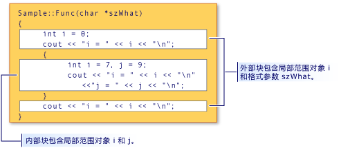

# <a name="scope-c"></a>范围 (C++)

在程序元素，如类、 函数或变量声明时，可以仅"看到"并在程序的某些部分中使用其名称。 在其中一个名称是可见的上下文调用其*作用域*。 例如，如果将变量声明`x`内的函数`x`时才会显示该函数体中。 它具有*局部范围*。 中可以有其他变量同名的程序;只要它们是在不同的作用域中，只要不违反单个定义规则，并不会引发错误。

自动的非静态变量的范围还可决定何时创建和销毁程序内存中。

有六种范围：

- **全局范围内**全局名称是指任何类、 函数或命名空间的外部声明。 但是，c + + 中甚至这些名称存在一个隐式全局命名空间。 从声明点扩展了全局名称的作用域到声明它们的文件的末尾。 对于全局名称，可见性也由规则的控制[链接](program-and-linkage-cpp.md)确定名称在程序中的其他文件中是否可见。

- **Namespace 作用域**中声明的名称[命名空间](namespaces-cpp.md)、 任何类或枚举的定义或函数块的外部是可见的声明点到命名空间的末尾。 跨不同的文件可能在多个块中定义命名空间。

- **局部范围**声明函数或 lambda，包括参数名称中的名称具有局部范围。 它们通常被称为"局部变量"。 它们只是从其声明的点对函数或 lambda 体的结尾可见。 本地作用域是一种类型的块范围，这将在本文后面部分进行讨论。

- **类范围内使用**类成员的名称具有类范围内，整个类定义，而不考虑声明点扩展。 类成员可访问性进一步受**公共**，**专用**，并**保护**关键字。 公共或受保护的成员可以访问只能通过使用成员选择运算符 (**。** 或**->**) 或指向成员的指针运算符 (**。**<strong>\*</strong>或**->** <strong>\*</strong>)。

- **语句作用域**中声明的名称**有关**，**如果**，**虽然**，或**切换**语句结束时才是可见语句块。

- **函数范围**A[标签](labeled-statements.md)具有函数范围，这意味着它是整个函数体甚至之前声明点可见。 函数范围，使可能编写等语句`goto cleanup`之前`cleanup`声明标签。

## <a name="hiding-names"></a>隐藏名称

可通过在封闭块中声明名称来隐藏该名称。 在下图中，在内部块中重新声明 `i`，从而隐藏与外部块范围中的 `i` 关联的变量。

块范围和名称隐藏

来自图中显示的程序的输出为：

```cpp
i = 0
i = 7
j = 9
i = 0
```

> [!NOTE]
> 参数 `szWhat` 被视为处于函数的范围内。 因此，它被当做就像已在函数的最外层块中声明一样。

## <a name="hiding-class-names"></a>隐藏类名

通过声明同一范围内的函数、对象或变量或枚举器，可以隐藏类名称。 但是，类名仍可访问时前缀由关键字**类**。

```cpp
// hiding_class_names.cpp
// compile with: /EHsc
#include <iostream>
using namespace std;

// Declare class Account at global scope.
class Account
{
public:
    Account( double InitialBalance )
        { balance = InitialBalance; }
    double GetBalance()
        { return balance; }
private:
    double balance;
};

double Account = 15.37;            // Hides class name Account

int main()
{
    class Account Checking( Account ); // Qualifies Account as
                                       //  class name

    cout << "Opening account with balance of: "
         << Checking.GetBalance() << "\n";
}
//Output: Opening account with balance of: 15.37
```

> [!NOTE]
> 任何位置的类名 (`Account`) 调用，必须使用关键字类以将它与全局范围内的变量 Account 区分开来。 当类名出现在范围解析运算符 (::) 的左侧时，此规则不适用。 在范围解析运算符的左侧的名称始终被视为类名称。

下面的示例演示如何声明指向类型的对象的指针`Account`使用**类**关键字：

```cpp
class Account *Checking = new class Account( Account );
```

`Account` （在括号内） 在前面的语句中的初始值设定项中具有全局作用域; 它是类型**double**。

> [!NOTE]
> 此示例中所示的标识符名称的重用被视为较差的编程样式。

有关声明和初始化类对象的信息，请参阅[类、 结构和联合](../cpp/classes-and-structs-cpp.md)。 有关使用信息**新**并**删除**自由存储运算符，请参阅[新和 delete 运算符](new-and-delete-operators.md)。

## <a name="hiding-names-with-global-scope"></a>隐藏具有全局作用域的名称

可以通过显式声明块范围中的具有相同名称来隐藏具有全局作用域的名称。 但是，全局作用域名称可以使用访问作用域解析运算符 (`::`)。

```cpp
#include <iostream>

int i = 7;   // i has global scope, outside all blocks
using namespace std;

int main( int argc, char *argv[] ) {
   int i = 5;   // i has block scope, hides i at global scope
   cout << "Block-scoped i has the value: " << i << "\n";
   cout << "Global-scoped i has the value: " << ::i << "\n";
}
```

```Output
Block-scoped i has the value: 5
Global-scoped i has the value: 7
```

## <a name="see-also"></a>请参阅

[基本概念](../cpp/basic-concepts-cpp.md)
