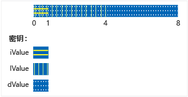

# <a name="unions"></a>Unions

> [!NOTE]
> 在 c + + 17 和更高版本中， **std：： variant**类是联合的一种类型安全的替代类。

**联合**是用户定义的类型，其中的所有成员共享相同的内存位置。 这意味着在任何给定时间，联合都不能包含来自其成员列表的多个对象。 这还意味着无论联合具有多少成员，它始终仅使用足以存储最大成员的内存。

具有大量对象和/或内存有限时，联合可用于节省内存。 但是，需要格外小心才能正确使用它们，因为由你负责确保可始终访问写入的最后一个成员。 如果任何成员类型具有不常用构造函数，则必须编写附加代码来显式构造和销毁该成员。 使用联合之前，应考虑是否可以使用基类和派生类来更好地表示尝试解决的问题。

## <a name="syntax"></a>语法

```cpp
union [name]  { member-list };
```

### <a name="parameters"></a>参数

*name*<br/>
为联合提供的类型名称。

*member-list*<br/>
联合可以包含的成员。 请参阅“备注”。

## <a name="remarks"></a>备注

## <a name="declaring-a-union"></a>声明联合

使用**union**关键字开始联合的声明，并将成员列表括在大括号中：

```cpp
// declaring_a_union.cpp
union RecordType    // Declare a simple union type
{
    char   ch;
    int    i;
    long   l;
    float  f;
    double d;
    int *int_ptr;
};
int main()
{
    RecordType t;
    t.i = 5; // t holds an int
    t.f = 7.25; // t now holds a float
}
```

## <a name="using-unions"></a>使用联合

在前面的示例中，任何访问联合的代码都需要了解保存数据的成员。 此问题最常见的解决方案是将联合以及其他枚举成员（指示当前存储在联合中的数据的类型）放入一个结构中。 这称为可*区分联合*，下面的示例演示基本模式。

```cpp
#include <queue>

using namespace std;

enum class WeatherDataType
{
    Temperature, Wind
};

struct TempData
{
    int StationId;
    time_t time;
    double current;
    double max;
    double min;
};

struct WindData
{
    int StationId;
    time_t time;
    int speed;
    short direction;
};

struct Input
{
    WeatherDataType type;
    union
    {
        TempData temp;
        WindData wind;
    };
};

// Functions that are specific to data types
void Process_Temp(TempData t) {}
void Process_Wind(WindData w) {}

// Container for all the data records
queue<Input> inputs;
void Initialize();

int main(int argc, char* argv[])
{
    Initialize();
    while (!inputs.empty())
    {
        Input i = inputs.front();
        switch (i.type)
        {
        case WeatherDataType::Temperature:
            Process_Temp(i.temp);
            break;
        case WeatherDataType::Wind:
            Process_Wind(i.wind);
            break;
        default:
            break;
        }
        inputs.pop();

    }
    return 0;
}

void Initialize()
{
    Input first, second;
    first.type = WeatherDataType::Temperature;
    first.temp = { 101, 1418855664, 91.8, 108.5, 67.2 };
    inputs.push(first);

    second.type = WeatherDataType::Wind;
    second.wind = { 204,1418859354, 14, 27 };
    inputs.push(second);
}
```

在前面的示例中，请注意 Input 结构中的联合没有名称。 这是匿名联合，可以访问其成员，如同它们是结构的直接成员一样。 有关匿名联合的详细信息，请参阅下面一节。

当然，上面的示例演示的问题也可以通过以下方法解决：使用派生自公共基类的类，并基于容器中每个对象的运行时类型对代码进行分支。 这可以生成更易于维护和理解的代码，但是也可能比使用联合更慢。 此外，通过联合可以存储完全不相关的类型，并动态更改存储的值的类型，而无需更改联合变量本身的类型。 因此可以创建其元素存储不同类型的不同值的 MyUnionType 异类数组。

请注意，可能会很容易误用前面示例中的 `Input` 结构。 完全由用户负责正确使用鉴别器来访问保存数据的成员。 你可以通过使联合成为专用并提供特殊访问函数（如下一个示例所示）来防止误用。

## <a name="unrestricted-unions-c11"></a>无限制的联合 (C++11)

在 C++03 及更低版本中，联合可以包含具有类类型的非静态数据成员，只要该类型没有用户提供的构造函数、析构函数或赋值运算符即可。 在 C++11 中，消除了这些限制。 如果在联合中包含这样一个成员，则编译器会自动将不是用户提供的任何特殊成员函数标记为已删除。 如果联合是类或结构中的匿名联合，则类或结构的不是用户提供的任何特殊成员函数都会标记为已删除。 下面的示例演示如何处理联合的某个成员具有需要此特殊处理的成员的情况：

```cpp
// for MyVariant
#include <crtdbg.h>
#include <new>
#include <utility>

// for sample objects and output
#include <string>
#include <vector>
#include <iostream>

using namespace std;

struct A
{
    A() = default;
    A(int i, const string& str) : num(i), name(str) {}

    int num;
    string name;
    //...
};

struct B
{
    B() = default;
    B(int i, const string& str) : num(i), name(str) {}

    int num;
    string name;
    vector<int> vec;
    // ...
};

enum class Kind { None, A, B, Integer };

#pragma warning (push)
#pragma warning(disable:4624)
class MyVariant
{
public:
    MyVariant()
        : kind_(Kind::None)
    {
    }

    MyVariant(Kind kind)
        : kind_(kind)
    {
        switch (kind_)
        {
        case Kind::None:
            break;
        case Kind::A:
            new (&a_) A();
            break;
        case Kind::B:
            new (&b_) B();
            break;
        case Kind::Integer:
            i_ = 0;
            break;
        default:
            _ASSERT(false);
            break;
        }
    }

    ~MyVariant()
    {
        switch (kind_)
        {
        case Kind::None:
            break;
        case Kind::A:
            a_.~A();
            break;
        case Kind::B:
            b_.~B();
            break;
        case Kind::Integer:
            break;
        default:
            _ASSERT(false);
            break;
        }
        kind_ = Kind::None;
    }

    MyVariant(const MyVariant& other)
        : kind_(other.kind_)
    {
        switch (kind_)
        {
        case Kind::None:
            break;
        case Kind::A:
            new (&a_) A(other.a_);
            break;
        case Kind::B:
            new (&b_) B(other.b_);
            break;
        case Kind::Integer:
            i_ = other.i_;
            break;
        default:
            _ASSERT(false);
            break;
        }
    }

    MyVariant(MyVariant&& other)
        : kind_(other.kind_)
    {
        switch (kind_)
        {
        case Kind::None:
            break;
        case Kind::A:
            new (&a_) A(move(other.a_));
            break;
        case Kind::B:
            new (&b_) B(move(other.b_));
            break;
        case Kind::Integer:
            i_ = other.i_;
            break;
        default:
            _ASSERT(false);
            break;
        }
        other.kind_ = Kind::None;
    }

    MyVariant& operator=(const MyVariant& other)
    {
        if (&other != this)
        {
            switch (other.kind_)
            {
            case Kind::None:
                this->~MyVariant();
                break;
            case Kind::A:
                *this = other.a_;
                break;
            case Kind::B:
                *this = other.b_;
                break;
            case Kind::Integer:
                *this = other.i_;
                break;
            default:
                _ASSERT(false);
                break;
            }
        }
        return *this;
    }

    MyVariant& operator=(MyVariant&& other)
    {
        _ASSERT(this != &other);
        switch (other.kind_)
        {
        case Kind::None:
            this->~MyVariant();
            break;
        case Kind::A:
            *this = move(other.a_);
            break;
        case Kind::B:
            *this = move(other.b_);
            break;
        case Kind::Integer:
            *this = other.i_;
            break;
        default:
            _ASSERT(false);
            break;
        }
        other.kind_ = Kind::None;
        return *this;
    }

    MyVariant(const A& a)
        : kind_(Kind::A), a_(a)
    {
    }

    MyVariant(A&& a)
        : kind_(Kind::A), a_(move(a))
    {
    }

    MyVariant& operator=(const A& a)
    {
        if (kind_ != Kind::A)
        {
            this->~MyVariant();
            new (this) MyVariant(a);
        }
        else
        {
            a_ = a;
        }
        return *this;
    }

    MyVariant& operator=(A&& a)
    {
        if (kind_ != Kind::A)
        {
            this->~MyVariant();
            new (this) MyVariant(move(a));
        }
        else
        {
            a_ = move(a);
        }
        return *this;
    }

    MyVariant(const B& b)
        : kind_(Kind::B), b_(b)
    {
    }

    MyVariant(B&& b)
        : kind_(Kind::B), b_(move(b))
    {
    }

    MyVariant& operator=(const B& b)
    {
        if (kind_ != Kind::B)
        {
            this->~MyVariant();
            new (this) MyVariant(b);
        }
        else
        {
            b_ = b;
        }
        return *this;
    }

    MyVariant& operator=(B&& b)
    {
        if (kind_ != Kind::B)
        {
            this->~MyVariant();
            new (this) MyVariant(move(b));
        }
        else
        {
            b_ = move(b);
        }
        return *this;
    }

    MyVariant(int i)
        : kind_(Kind::Integer), i_(i)
    {
    }

    MyVariant& operator=(int i)
    {
        if (kind_ != Kind::Integer)
        {
            this->~MyVariant();
            new (this) MyVariant(i);
        }
        else
        {
            i_ = i;
        }
        return *this;
    }

    Kind GetKind() const
    {
        return kind_;
    }

    A& GetA()
    {
        _ASSERT(kind_ == Kind::A);
        return a_;
    }

    const A& GetA() const
    {
        _ASSERT(kind_ == Kind::A);
        return a_;
    }

    B& GetB()
    {
        _ASSERT(kind_ == Kind::B);
        return b_;
    }

    const B& GetB() const
    {
        _ASSERT(kind_ == Kind::B);
        return b_;
    }

    int& GetInteger()
    {
        _ASSERT(kind_ == Kind::Integer);
        return i_;
    }

    const int& GetInteger() const
    {
        _ASSERT(kind_ == Kind::Integer);
        return i_;
    }

private:
    Kind kind_;
    union
    {
        A a_;
        B b_;
        int i_;
    };
};
#pragma warning (pop)

int main()
{
    A a(1, "Hello from A");
    B b(2, "Hello from B");

    MyVariant mv_1 = a;

    cout << "mv_1 = a: " << mv_1.GetA().name << endl;
    mv_1 = b;
    cout << "mv_1 = b: " << mv_1.GetB().name << endl;
    mv_1 = A(3, "hello again from A");
    cout << R"aaa(mv_1 = A(3, "hello again from A"): )aaa" << mv_1.GetA().name << endl;
    mv_1 = 42;
    cout << "mv_1 = 42: " << mv_1.GetInteger() << endl;

    b.vec = { 10,20,30,40,50 };

    mv_1 = move(b);
    cout << "After move, mv_1 = b: vec.size = " << mv_1.GetB().vec.size() << endl;

    cout << endl << "Press a letter" << endl;
    char c;
    cin >> c;
}
#include <queue>
#include <iostream>
using namespace std;

enum class WeatherDataType
{
    Temperature, Wind
};

struct TempData
{
    TempData() : StationId(""), time(0), current(0), maxTemp(0), minTemp(0) {}
    TempData(string id, time_t t, double cur, double max, double min)
        : StationId(id), time(t), current(cur), maxTemp(max), minTemp(0) {}
    string StationId;
    time_t time = 0;
    double current;
    double maxTemp;
    double minTemp;
};

struct WindData
{
    int StationId;
    time_t time;
    int speed;
    short direction;
};

struct Input
{
    Input() {}
    Input(const Input&) {}

    ~Input()
    {
        if (type == WeatherDataType::Temperature)
        {
            temp.StationId.~string();
        }
    }

    WeatherDataType type;
    void SetTemp(const TempData& td)
    {
        type = WeatherDataType::Temperature;

        // must use placement new because of string member!
        new(&temp) TempData(td);
    }

    TempData GetTemp()
    {
        if (type == WeatherDataType::Temperature)
            return temp;
        else
            throw logic_error("Can't return TempData when Input holds a WindData");
    }
    void SetWind(WindData wd)
    {
        // Explicitly delete struct member that has a
        // non-trivial constructor
        if (type == WeatherDataType::Temperature)
        {
            temp.StationId.~string();
        }
        wind = wd; //placement new not required.
    }
    WindData GetWind()
    {
        if (type == WeatherDataType::Wind)
        {
            return wind;
        }
        else
            throw logic_error("Can't return WindData when Input holds a TempData");
    }

private:

    union
    {
        TempData temp;
        WindData wind;
    };
};
```

联合不能存储引用。 联合不支持继承，因此联合本身不能用作基类、继承自另一个类或具有虚函数。

## <a name="initializing-unions"></a>初始化联合

可以通过指定包含在括号中的表达式来在相同语句中声明并初始化联合。 计算该表达式并将其分配给联合的第一个字段。

```cpp
#include <iostream>
using namespace std;

union NumericType
{
    short       iValue;
    long        lValue;
    double      dValue;
};

int main()
{
    union NumericType Values = { 10 };   // iValue = 10
    cout << Values.iValue << endl;
    Values.dValue = 3.1416;
    cout << Values.dValue) << endl;
}
/* Output:
10
3.141600
*/
```

`NumericType` 联合排列在内存中（概念性的），如下图所示。

 <br/>
NumericType 联合中的数据存储

## <a name="anonymous-unions"></a><a name="anonymous_unions"></a>匿名联合

匿名联合是在没有*类名称*或*声明符列表*的情况下声明的联合。

```cpp
union  {  member-list  }
```

匿名联合中声明的名称可直接使用，就像非成员变量一样。 因此，匿名联合中声明的名称必须在周边范围中是唯一的。

除了对命名联合的限制之外，匿名联合还服从以下附加限制：

- 如果在文件或命名空间范围内声明，则还必须将它们声明为**static** 。

- 它们只能有**公共**成员;匿名联合中的**私有**和**受保护**成员会产生错误。

- 它们不能具有函数成员。

## <a name="see-also"></a>请参阅

[类和结构](../cpp/classes-and-structs-cpp.md)<br/>
[关键字](../cpp/keywords-cpp.md)<br/>
[class](../cpp/class-cpp.md)<br/>
[struct](../cpp/struct-cpp.md)
