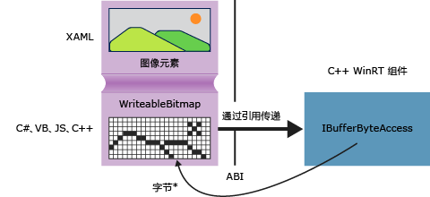

# <a name="obtaining-pointers-to-data-buffers-ccx"></a>获取数据缓冲区的指针 (C++/CX)

在 Windows 运行时中， [Windows::Storage::Streams::IBuffer](/uwp/api/windows.storage.streams.ibuffer) 接口提供了一种基于流的非特定语言方式来访问数据缓冲区。 在 C++ 中，可使用 robuffer.h 中定义的 Windows 运行时 IBufferByteAccess 接口获取指向基础字节数组的原始指针。 通过这种方式，可就地修改字节数组，而不必创建任何数据副本。

下图显示了一个 XAML 图像元素，其源是一个 [Windows::UI::Xaml::Media::Imaging WriteableBitmap](/uwp/api/Windows.UI.Xaml.Media.Imaging.WriteableBitmap)。 以任何语言编写的客户端应用程序均可将对 `WriteableBitmap` 的引用传递到 C++ 代码，随后 C++ 可使用该引用获取基础缓冲区。 在通用 Windows 平台应用中用 c + + 编写的可以在以下示例中的源代码中直接使用函数，而无需在 Windows 运行时组件打包。



## <a name="getpointertopixeldata"></a>GetPointerToPixelData

以下方法接受 [Windows::Storage::Streams::IBuffer](/uwp/api/windows.storage.streams.ibuffer) 并返回指向基础字节数组的原始指针。 若要调用函数，请传入 [WriteableBitmap::PixelBuffer](/uwp/api/windows.ui.xaml.media.imaging.writeablebitmap.pixelbuffer) 属性。

```cpp
#include <wrl.h>
#include <robuffer.h>
using namespace Windows::Storage::Streams;
using namespace Microsoft::WRL;
typedef uint8 byte;
// Retrieves the raw pixel data from the provided IBuffer object.
// Warning: The lifetime of the returned buffer is controlled by
// the lifetime of the buffer object that's passed to this method.
// When the buffer has been released, the pointer becomes invalid
// and must not be used.
byte* Class1::GetPointerToPixelData(IBuffer^ pixelBuffer, unsigned int *length)
{
    if (length != nullptr)
    {
        *length = pixelBuffer ->Length;
    }
    // Query the IBufferByteAccess interface.
    ComPtr<IBufferByteAccess> bufferByteAccess;
    reinterpret_cast<IInspectable*>( pixelBuffer)->QueryInterface(IID_PPV_ARGS(&bufferByteAccess));

    // Retrieve the buffer data.
    byte* pixels = nullptr;
    bufferByteAccess->Buffer(&pixels);
    return pixels;
}
```

## <a name="complete-example"></a>完整的示例

以下步骤演示如何创建一个 C# 通用 Windows 平台应用，它将传递`WriteableBitmap`到 c + + Windows 运行时组件 DLL。 此 C++ 代码包含一个指向像素缓冲区的指针，并在图像上就地执行简单的修改。 另外也可以使用 Visual Basic、JavaScript 或 C++ 代替 C# 来创建该客户端应用程序。 如果使用 C++，则不需要该组件 DLL；你可以将这些方法直接添加到 MainPage 类或你定义的某个其他类。

#### <a name="create-the-client"></a>创建客户端

1. 使用空白应用程序项目模板创建 C# 通用 Windows 平台应用。

1. 在 MainPage.xaml 中

   - 使用此 XAML 替换 `Grid` 元素：

        ```xml
        <Grid Background="{StaticResource ApplicationPageBackgroundThemeBrush}">
            <StackPanel HorizontalAlignment="Left" Margin="176,110,0,0" VerticalAlignment="Top" Width="932">
                <Image x:Name="Pic"/>
                <Button Content="Process Image" HorizontalAlignment="Stretch" VerticalAlignment="Stretch" Height="47" Click="Button_Click_1"/>
            </StackPanel>
        </Grid>
        ```

1. 在 MainPage.xaml.cs 中

   1. 添加以下命名空间声明：

        ```csharp
        using Windows.Storage;
        using Windows.Storage.FileProperties;
        using Windows.UI.Xaml.Media.Imaging;
        using Windows.Storage.Streams;
        using Windows.Storage.Pickers;
        ```

   1. 向 `WriteableBitmap` 类添加一个 `MainPage` 成员变量并将其命名为 `m_bm`。

        ```csharp
        private WriteableBitmap m_bm;
        ```

   1. 使用以下代码替换 `OnNavigatedTo` 方法存根。 这将在启动应用程序时打开文件选取器。 （请注意， `async` 关键字已添加到函数签名中。）

        ```csharp
        async protected override void OnNavigatedTo(NavigationEventArgs e)
        {
            FileOpenPicker openPicker = new FileOpenPicker();
            openPicker.ViewMode = PickerViewMode.Thumbnail;
            openPicker.SuggestedStartLocation = PickerLocationId.PicturesLibrary;
            openPicker.FileTypeFilter.Add(".jpg");
            openPicker.FileTypeFilter.Add(".jpeg");
            openPicker.FileTypeFilter.Add(".png");

            StorageFile file = await openPicker.PickSingleFileAsync();
            if (file != null)
            {
                // Get the size of the image for the WriteableBitmap constructor.
                ImageProperties props = await file.Properties.GetImagePropertiesAsync();
                m_bm = new WriteableBitmap((int)props.Height, (int)props.Width);
                m_bm.SetSource(await file.OpenReadAsync());
                Pic.Source = m_bm;
            }
            else
            {
                //  Handle error...
            }
        }
        ```

   1. 为按钮单击事件添加事件处理程序。 （由于尚未创建 `ImageManipCPP` 命名空间引用，编辑器窗口中可能会显示一条波浪下划线。）

        ```csharp
        async private void Button_Click_1(object sender, RoutedEventArgs e)
        {
            ImageManipCPP.Class1 obj = new ImageManipCPP.Class1();
            await obj.Negativize(m_bm);
            Pic.Source = m_bm;
        }
        ```

#### <a name="create-the-c-component"></a>创建 C++ 组件

1. 将新的 c + + Windows 运行时组件添加到现有的解决方案，并将其命名`ImageManipCPP`。 通过在 **“解决方案资源管理器”** 中右击该 C# 项目并选择 **“添加”** 和 **“引用”**，在项目中添加对该组件的引用。

1. 在 Class1.h 中

   1. 将此 `typedef` 添加到第二行中 `#pragma once`的紧后面：

        ```cpp
        typedef uint8 byte;
        ```

   1. 将 `WebHostHidden` 特性添加到 `Class1` 声明开头的紧上方。

        ```cpp
        [Windows::Foundation::Metadata::WebHostHidden]
        ```

   1. 将此公共方法签名添加到 `Class1`：

        ```cpp
        Windows::Foundation::IAsyncAction^ Negativize(Windows::UI::Xaml::Media::Imaging::WriteableBitmap^ bm);
        ```

   1. 添加上一代码片段中显示的 `GetPointerToPixelData` 方法中的签名。 请确保此方法为私有方法。

1. 在 Class1.cpp 中

   1. 添加以下 `#include` 指令和命名空间声明：

        ```cpp
        #include <ppltasks.h>
        #include <wrl.h>
        #include <robuffer.h>

        using namespace Windows::Storage;
        using namespace Windows::UI::Xaml::Media::Imaging;
        using namespace Windows::Storage::Streams;
        using namespace Microsoft::WRL;
        ```

   1. 添加上一代码片段中的 `GetPointerToPixelData` 的实现。

   1. 添加 `Negativize`的实现。 此方法可反转像素中的每个 RGB 值，从而模拟出底片的效果。 我们将此方法设置为异步，因为在较大的图像上，它可能需要明显较长的时间才能完成。

        ```cpp
        IAsyncAction^ Class1::Negativize(WriteableBitmap^ bm)
        {
            unsigned int length;
            byte* sourcePixels = GetPointerToPixelData(bm->PixelBuffer, &length);
            const unsigned int width = bm->PixelWidth;
            const unsigned int height = bm->PixelHeight;

            return create_async([this, width, height, sourcePixels]
            {
                byte* temp = sourcePixels;
                for(unsigned int k = 0; k < height; k++)
                {
                    for (unsigned int i = 0; i < (width * 4); i += 4)
                    {
                        int pos = k * (width * 4) + (i);
                        temp[pos] = ~temp[pos];
                        temp[pos + 1] = ~temp[pos + 1] / 3;
                        temp[pos + 2] = ~temp[pos + 2] / 2;
                        temp[pos + 3] = ~temp[pos + 3];
                    }
                }
            });

        }
        ```

      > [!NOTE]
      > 如果使用 AMP 或并行模式库来并行执行操作，此方法的运行速度可能会有所提高。

1. 请确保图片文件夹中至少有一个图片，然后再按 F5 编译和运行程序。
