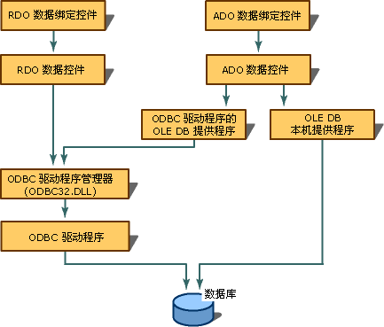

# 创建数据库连接
[!INCLUDE[vs2017banner](../../assembler/inline/includes/vs2017banner.md)]

若要使用数据绑定，必须配置数据源。  使用 ADO 数据控件时，必须配置 OLE DB 连接。  使用 RDO RemoteData 控件时，必须创建开放式数据库连接 \(ODBC\) 连接。  由于 Visual C\+\+ 附带了用于 ODBC 数据源的 OLE DB 提供程序，ADO 数据控件也可以使用 ODBC 连接。  
  
   
  
## 请参阅  
 [数据绑定控件（ADO 和 RDO）](../../data/ado-rdo/data-bound-controls-ado-and-rdo.md)   
 [ODBC 连接](../../data/ado-rdo/odbc-connections.md)   
 [Oracle 连接](../../data/ado-rdo/oracle-connections.md)