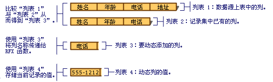

# <a name="recordset-dynamically-binding-data-columns-odbc"></a>记录集：动态绑定数据列 (ODBC)
本主题适用于 MFC ODBC 类。  
  
 记录集管理你在设计时指定的绑定表列，但有某些情况下你可能想要将在设计时处于未知到你的列绑定。 本主题说明：  
  
-   [当你可能想要将列绑定到记录集的动态](#_core_when_you_might_bind_columns_dynamically)。  
  
-   [如何在运行时动态绑定列](#_core_how_to_bind_columns_dynamically)。  
  
> [!NOTE]
>  本主题适用于派生自`CRecordset`中哪些批量行提取尚未实现。 如果使用的批量行提取，不建议通常所述的技术。 有关批量行提取的详细信息，请参阅[记录集： 批量获取记录 (ODBC)](../../data/odbc/recordset-fetching-records-in-bulk-odbc.md)。  
  
##  <a name="_core_when_you_might_bind_columns_dynamically"></a>当可能动态绑定列  
 在设计时，MFC 应用程序向导或[MFC ODBC 使用者向导](../../mfc/reference/adding-an-mfc-odbc-consumer.md)(从**添加类**) 创建基于的已知的表和列对数据源的记录集类。 当您设计并随后在你的应用程序在运行时使用这些表和列之间可以更改数据库。 您或其他用户可能添加或删除的表或添加或从你的应用程序的记录集依赖于表中删除列。 这可能并不是问题的所有数据访问应用程序，但如果它是针对你的帐户，可以解决数据库架构，而非通过重新设计，并重新编译中的更改？ 本主题的目的是要回答这个问题。  
  
 本主题介绍最常见的情况可能动态绑定列-具有已开始基于已知的数据库架构的记录集，想要在运行时处理其他的列。 本主题进一步假定其他列将映射到`CString`字段数据成员，最常见的情况，但建议也提供了可帮助您管理其他数据类型。  
  
 使用少量的额外的代码，你可以：  
  
-   [确定在运行时可用的哪些列](#_core_how_to_bind_columns_dynamically)。  
  
-   [将附加列绑定到记录集动态，运行时](#_core_adding_the_columns)。  
  
 记录集仍包含在设计时知道此信息的列的数据成员。 它还包含少量的额外代码来动态确定任何新的列是否已添加到目标表，并且如果是这样，这些新将列绑定到动态分配的存储 （而不是对记录集数据成员）。  
  
 本主题不涉及其他动态绑定的情况下，如删除的表或列。 对于这些情况下，你需要更直接使用 ODBC API 调用。 有关信息，请参阅 ODBC SDK*程序员参考*MSDN 库 CD 上。  
  
##  <a name="_core_how_to_bind_columns_dynamically"></a>如何动态绑定列  
 若要动态绑定列，你必须知道 （或无法确定） 的其他列的名称。 此外必须为其他字段数据成员分配存储空间、 指定它们的名称以及其类型，并指定要添加的列数。  
  
 下面的讨论涉及两个不同的记录集。 第一种是选择的目标表的主记录集。 第二个是用于你的目标表中获取信息的列的特殊列记录集。  
  
###  <a name="_core_the_general_process"></a>一般过程  
 在最一般的级别，你执行以下步骤：  
  
1.  构造主要记录集对象。  
  
     （可选） 将指针传递到已打开`CDatabase`对象或必须能够连接信息提供给列记录集以某种其他方式。  
  
2.  采取措施来动态添加列。  
  
     请参阅添加下面的列中所述的过程。  
  
3.  打开你的主要记录集。  
  
     记录集选择记录，并使用记录字段交换 (RFX) 将 （那些映射到记录集字段数据成员） 的静态列和 （映射到你分配的额外存储空间） 的动态列绑定。  
  
###  <a name="_core_adding_the_columns"></a>添加列  
 动态绑定添加列在运行时需要执行下列步骤：  
  
1.  在运行时确定哪些目标表的列。 从该信息中提取记录集类旨在由于已添加到表的列的列表。  
  
     一种好方法是使用列记录集类旨在查询 （如列名称和数据类型） 对目标表的列信息的数据源。  
  
2.  为新的字段数据成员提供存储。 因为主要记录集类不具有未知的列的字段数据成员，你必须提供一个位置来存储名称、 结果值和可能的数据类型信息 （如果列是不同的数据类型）。  
  
     一种方法是生成一个或多个动态列表，另一个用于新列的名称，另一个用于其结果值和第三个其数据类型 （如有必要）。 这些列表，尤其是值列表中，提供信息和绑定必要的存储区。 下图说明了生成列表。  
       
生成要动态绑定的列列表  
  
3.  在主要记录集的中添加的 RFX 函数调用`DoFieldExchange`函数为每个已添加列。 这些 RFX 调用执行提取一条记录，包括其他列，和绑定到记录集数据成员或动态提供存储为它们的列的工作。  
  
     一种方法是将循环添加到主要记录集的`DoFieldExchange`循环访问您的新列，对于列表中每个列调用相应的 RFX 函数列表的函数。 在每个 RFX 调用上，将从列名称列表和结果值列表的对应成员中的存储位置传递的一个列名称。  
  
###  <a name="_core_lists_of_columns"></a>列列表  
 你需要使用的四个列表下表所示。  
  
 **当前表列 (图中的列表 1)**当前在数据源的表中列的列表。 此列表可能与当前绑定记录集中的列列表匹配。  
  
 **绑定的记录集的列 (图中的列表 2)**  
 记录集中绑定的列的列表。 这些列中已经有 RFX 语句你`DoFieldExchange`函数。  
  
 **列-到-动态绑定 (图中的列表 3)**  
 表中但不是在记录集中的列的列表。 下面是你想要动态绑定的列。  
  
 **动态列值 (图中的列表 4)**  
 从动态绑定列中检索包含存储的值的列表。 此列表的元素对应于那些在列-到-动态绑定的一对一。  
  
###  <a name="_core_building_your_lists"></a>生成您的列表  
 记住一般策略后，就可以开始的详细信息。 此主题的其余部分中的过程显示如何生成的列表中所示[列出的列](#_core_lists_of_columns)。 过程将指导你完成：  
  
-   [确定不在记录集中的列的名称](#_core_determining_which_table_columns_are_not_in_your_recordset)。  
  
-   [为新添加到表的列提供动态存储](#_core_providing_storage_for_the_new_columns)。  
  
-   [为新列中动态添加 RFX 调用](#_core_adding_rfx_calls_to_bind_the_columns)。  
  
###  <a name="_core_determining_which_table_columns_are_not_in_your_recordset"></a>确定哪些表列未处于记录集  
 生成包含已绑定主记录集中的列的列表的列表 （绑定记录集列，如图中的列表 2 所示）。 然后生成 （列-到-动态绑定，派生自当前表列和记录集的绑定列） 包含在数据源的表中而不是在主记录集中的列名的列表。  
  
##### <a name="to-determine-the-names-of-columns-not-in-the-recordset-columns-to-bind-dynamically"></a>若要确定记录集 （列-到-动态绑定） 中没有列的名称  
  
1.  生成的主记录集中已绑定列的列表 （绑定记录集列）。  
  
     一种方法是在设计时创建记录集的绑定列。 你可以直观地检查在记录集的 RFX 函数调用`DoFieldExchange`函数可获取这些名称。 然后，将设置你的列表为具有名称初始化的数组。  
  
     例如，图中显示绑定的记录集的列 (列表 2) 具有三个元素。 记录集的绑定列缺少电话列在当前表列 (列表 1) 中所示。  
  
2.  当前表列和记录集的绑定列生成列表 （列-到-动态绑定） 尚未绑定主记录集中的列进行比较。  
  
     一种方法是在运行的时 （当前表列） 和你绑定的列列表已在你的记录集 （绑定记录集列） 中并行循环访问表中的列的列表。 列-到-动态绑定到当前--在表列中未出现在绑定记录集列中将任何名称。  
  
     例如，图中显示列-到-动态绑定 (列表 3) 与一个元素： 出现在当前表列 (列表 1) 中但不是在绑定的记录集的列 (列表 2) 的 Phone 列。  
  
3.  要在其中存储对应于每个列名称存储在你要动态绑定的列的列表 （列-到-动态绑定） 的数据值生成动态列的值 （如图中的列表 4) 的列表。  
  
     此列表的元素的作用是新的记录集字段数据成员。 它们是动态列绑定到的存储位置。 有关列表的说明，请参阅[列出的列](#_core_lists_of_columns)。  
  
###  <a name="_core_providing_storage_for_the_new_columns"></a>为新列提供存储  
 接下来，设置要动态绑定的列的存储位置。 其目的是提供中用于存储每个列的值的列表元素。 这些存储位置的并行存储通常绑定的列的记录集成员变量。  
  
##### <a name="to-provide-dynamic-storage-for-new-columns-dynamic-column-values"></a>若要为新列 （动态列值） 提供动态存储  
  
1.  生成动态列的值，类似于列-到-动态绑定，使其包含的每个列中的数据值。  
  
     例如，图中显示一个元素动态列值 (列表 4):`CString`对象，其中包含当前记录的实际电话号码:"555-1212"。  
  
     在最常见的情况下，列的动态值都具有类型元素的`CString`。 如果你处理不同数据类型的列，则需要可以包含各种类型的元素的列表。  
  
 前面的过程的结果是两个主列表： 列-到-包含要动态绑定列和动态列的值包含当前记录的列中的值的名称。  
  
> [!TIP]
>  如果新列并不是所有相同的数据类型，你可能需要一个额外的并行列出以某种方式定义的列列表中的每个相应的元素的类型的包含项。 (你可以使用值**AFX_RFX_BOOL**， **AFX_RFX_BYTE**，依次类推中，你想为此如果。 这些常量 AFXDB 中定义。H。)选择基于如何表示的列数据类型的列表类型。  
  
###  <a name="_core_adding_rfx_calls_to_bind_the_columns"></a>添加 RFX 调用将列绑定  
 最后，安排动态绑定发生通过将新列中的 RFX 调用你`DoFieldExchange`函数。  
  
##### <a name="to-dynamically-add-rfx-calls-for-new-columns"></a>若要动态添加为新的列的 RFX 调用  
  
1.  在主要记录集的`DoFieldExchange`成员函数中，添加代码以循环遍历你的新列 （列-到-动态绑定） 的列表。 在每个循环中，从列-到-动态绑定和列的动态值的列的结果值中提取的一个列名称。 这些项传递到 RFX 函数调用适用于列的数据类型。 有关列表的说明，请参阅[列出的列](#_core_lists_of_columns)。  
  
 通常情况下，在你`RFX_Text`函数的调用你提取`CString`对象从列表中，如下所示的代码，其中列-到-要动态绑定的是以下行`CStringList`调用`m_listName`和列的动态值是`CStringList`调用`m_listValue`:  
  
```  
RFX_Text( pFX,   
            m_listName.GetNext( posName ),   
            m_listValue.GetNext( posValue ));  
```  
  
 有关 RFX 函数的详细信息，请参阅[宏和全局函数](../../mfc/reference/mfc-macros-and-globals.md)中*类库参考*。  
  
> [!TIP]
>  如果新的列是不同的数据类型，使用 switch 语句在循环中的每个类型调用适当的 RFX 函数。  
  
 当框架调用`DoFieldExchange`期间**打开**过程以将列绑定到记录集 RFX 调用，静态列，请将绑定的那些列。 然后你循环将重复调用 RFX 函数的动态列。  
  
## <a name="see-also"></a>请参阅  
 [记录集 (ODBC)](../../data/odbc/recordset-odbc.md)   
 [记录集：处理大数据项 (ODBC)](../../data/odbc/recordset-working-with-large-data-items-odbc.md)