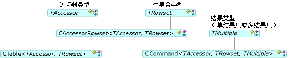

# 命令和表

命令和表允许你访问行集;也就是说，打开行集、 执行命令，并将列绑定。 [CCommand](../../data/oledb/ccommand-class.md)并[CTable](../../data/oledb/ctable-class.md)类实例化的命令和表的对象，分别。 这些类派生自[CAccessorRowset](../../data/oledb/caccessorrowset-class.md)下图中所示。

 
命令和表类

上表中`TAccessor`可以中列出的任何取值函数类型[访问器类型](../../data/oledb/accessors-and-rowsets.md)。 `TRowset` 可以将任何行集类型列入[行集类型](../../data/oledb/accessors-and-rowsets.md)。 `TMultiple` 指定结果类型 （单个或多个结果集）。

[ATL OLE DB 使用者向导](../../atl/reference/atl-ole-db-consumer-wizard.md)，可以指定是否希望命令或表对象。

- 对于不带命令数据源，可以使用`CTable`类。 通常将其用于简单的行，未指定任何参数，还需要没有多个结果集。 这个简单的类将打开使用您指定的表名称的数据源上的表。

- 对于支持命令的数据源，可以使用`CCommand`类。 若要执行的命令，调用[打开](../../data/oledb/ccommand-open.md)此类。 或者，可以调用`Prepare`准备你想要多次执行的命令。

   `CCommand` 包含三个模板参数： 取值函数类型、 行集类型和结果类型 (`CNoMultipleResults`，默认情况下，或`CMultipleResults`)。 如果指定`CMultipleResults`，则`CCommand`类支持`IMultipleResults`接口，并处理多个行集。 [DBVIEWER](https://github.com/Microsoft/VCSamples)示例演示如何处理多个结果。

## 请参阅

[OLE DB 使用者模板](../../data/oledb/ole-db-consumer-templates-cpp.md)