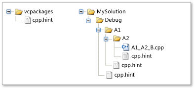

# <a name="hint-files"></a>提示文件

提示文件包含否则会导致代码区域被 C++ 浏览数据库分析器跳过。 打开 Visual C++ 项目时，分析器会分析项目中每个源文件内的代码，并使用每个识别符的相关信息构建数据库。 IDE 使用此信息来支持代码浏览功能，例如“类视图”浏览器和“导航栏”。

C++ 浏览数据库分析器是一款模糊分析器，它可在很短的时间内分析大量代码。 其快速运行的原因之一是因为它跳过了块内容。 例如，它仅记录函数的位置和参数，而忽略其内容。 某些宏可能导致用于确定块的开头和结尾的启发出现问题。 这些问题会导致代码区域记录不当。

跳过的区域可以多种方式显示：

- “类视图”、“转到”和“导航栏”中缺少类型和函数

- “导航栏”中的范围错误

- 针对已定义的函数建议“创建声明/定义”

提示文件包含用户可自定义的提示，其语法与 C/C++ 宏定义相同。 Visual C++ 包含对大部分项目而言已足够的内置提示文件。 但是，你可自行创建提示文件以改进专用于你的项目的分析器。

> [!IMPORTANT]
> 如果修改或添加提示文件，则需要采取额外的步骤才能使更改生效：
> - 在 Visual Studio 2017 版本 15.6 之前的版本中：针对所有更改在解决方案中删除 .sdf 文件和/或 VC.db 文件。
> - 在 Visual Studio 2017 版本 15.6 至 15.9 之间的版本中：关闭解决方案，并在添加新的提示文件后重新打开它。

## <a name="scenario"></a>方案

```cpp
#define NOEXCEPT noexcept
void Function() NOEXCEPT
{
}
```

如果没有提示文件，则“类视图”、“转到”和“导航栏”中不会显示 `Function`。 在添加具有此宏定义的提示文件之后，分析器现可理解并替换 `NOEXCEPT` 宏，使其能够正确分析函数：

```cpp.hint
#define NOEXCEPT
```

## <a name="disruptive-macros"></a>中断型宏

存在两种会中断分析器的宏类别：

- 封装修饰函数的关键字的宏

   ```cpp
   #define NOEXCEPT noexcept
   #define STDMETHODCALLTYPE __stdcall
   ```

   对于这些类型的宏，只需在提示文件中包含宏名称：

   ```cpp.hint
   #define NOEXCEPT
   #define STDMETHODCALLTYPE
   ```

- 包含不完整括号的宏

   ```cpp
   #define BEGIN {
   ```

   对于这些类型的宏，提示文件中需同时包含宏名及其内容：

   ```cpp.hint
   #define BEGIN {
   ```

## <a name="editor-support"></a>编辑器支持

自 Visual Studio 2017 版本 15.8 起，有多项功能可用于识别中断型宏：

- 位于分析器跳过的区域内部的宏会突出显示。

- 有一个快速操作，可用于创建包含突出显示的宏的提示文件；如果现已存在提示文件，则用于将宏添加到提示文件。


在执行任一快速操作之后，分析器会重新分析受提示文件影响的文件。

默认情况下，问题宏突出显示为建议。 突出显示项可更改更醒目的效果，例如红色或绿色波浪线。 通过“工具” > “选项” > “文本编辑器” > “C/C++” > “视图”在“代码波浪线”部分内使用“跳过的浏览区域中的宏”。


## <a name="display-browsing-database-errors"></a>显示浏览数据库错误

“项目” > “显示浏览数据库错误”菜单命令会显示“错误列表”中分析失败的所有区域。 此命令旨在简化初始提示文件的生成。 但是，分析器无法分辨错误是否由中断型宏导致，因此你必须对每个错误进行评估。 运行“显示浏览数据库错误”命令，再导航到每个错误以在编辑器中加载受影响的文件。 文件加载后，如果该区域中存在任何宏，则将突出显示这些宏。 你可调用“快速操作”以将其添加到提示文件中。 提示文件更新后，错误列表自动更新。 或者，如果要手动修改提示文件，可使用“重新扫描解决方案”命令来触发更新。

## <a name="architecture"></a>体系结构

提示文件与物理目录相对，不是解决方案资源管理器中显示的逻辑目录。 无需将提示文件添加到项目中即可使提示文件生效。 分析系统仅在分析源文件时使用提示文件。

每个提示文件均命名为 cpp.hint。 提示文件可包含在多个目录中，但特定目录中仅可具有一个提示文件。

不存在提示文件还是存在多个提示文件，你的项目将受此影响。 如果没有提示文件，则分析系统使用错误恢复技术来忽略无法辨认的源代码。 否则，分析系统使用以下策略查找和收集提示。

### <a name="search-order"></a>搜索顺序

分析系统按以下顺序在目录中搜索提示文件。

- 包含 Visual C++ 安装包 (vcpackages) 的目录。 此目录包含一个内置的提示文件，用于描述常用系统文件中的符号（如 windows.h）。 因此，项目会自动继承其所需的大部分提示。

- 从源文件根目录指向包含源文件本身的目录的路径。 在典型的 Visual C++ 项目中，根目录包含解决方案或项目文件。

   此规则的例外情况是“停止”文件位于源文件的路径中。 停止文件是指名为 cpp.stop 的任意文件。 此文件可加强对搜索顺序的控制。 分析系统首先搜索的不是根目录，而是先搜索包含“停止”文件的目录，再逐一搜索到包含源文件的目录。 在典型项目中，无需停止文件。

### <a name="hint-gathering"></a>提示收集

提示文件包含零个或多个提示。 提示的定义或删除方式与 C/C++ 宏一样。 也就是说，`#define` 预处理器指令用于创建或重新定义提示，`#undef` 指令用于删除提示。

分析系统按上述搜索顺序打开每个提示文件。 它将每个文件的提示累积到一组有效提示中，然后使用有效提示来解释代码中的标识符。

分析系统按以下规则来累积提示：

- 如果新提示指定了尚未定义的名称，则新提示将该名称添加到有效提示中。

- 如果新提示指定了已定义的名称，则新提示将重新定义现有提示。

- 如果新提示是指定现有有效提示的 `#undef` 指令，则新提示会删除现有提示。

第一条规则表示有效提示是从以前打开的提示文件中继承的。 后两条规则表示搜索顺序中稍后出现的提示可替代先前出现的提示。 例如，如果在包含源文件的目录中创建提示文件，则可替代以前的任何提示。

若要了解如何收集提示，请参阅[示例](#example)部分。

### <a name="syntax"></a>语法

通过与用于创建和删除宏的预处理器指令相同的语法来创建和删除提示。 事实上，分析系统使用 C/C++ 预处理器来评估提示。 有关预处理器指令的详细信息，请参阅 [#define 指令 (C/C++)](../preprocessor/hash-define-directive-c-cpp.md) 和 [#undef 指令 (C/C++)](../preprocessor/hash-undef-directive-c-cpp.md)。

唯一罕见的语法元素是 `@<``@=` 和 `@>` 替换字符串。 提示文件特定的这些替换字符串仅在 map 宏中使用。 映射是将数据、函数或事件与其他数据、函数或事件处理程序相关联的一组宏。 例如，`MFC` 通过映射创建[消息映射](../mfc/reference/message-maps-mfc.md)，而 `ATL` 通过映射创建[对象映射](../atl/reference/object-map-macros.md)。 提示文件特定的替换字符串会标记映射的开始、中间和结束元素。 只有映射宏的名称很重要。 因此，每个替换字符串都故意隐藏宏的实现。

提示使用以下语法：

|语法|含义|
|------------|-------------|
|`#define` *hint-name* *replacement-string*<br /><br /> `#define` *hint-name* `(` *parameter*, ...`)`*replacement-string*|定义新提示或重新定义现有提示的预处理器指令。 指令发出后，预处理器用替换字符串替换源代码中每次出现的提示名称。<br /><br /> 第二种语法形式定义类似函数的提示。 如果源代码中出现类似函数的提示，则预处理器首先使用源代码中的相应参数替换替换字符串中每次出现的参数，然后使用替换字符串替换提示名称。|
|`@<`|指示一组映射元素开始的提示文件特定的替换字符串。|
|`@=`|指示中间映射元素的提示文件特定的替换字符串。 一个映射可有多个映射元素。|
|`@>`|指示一组映射元素结束的提示文件特定的替换字符串。|
|`#undef` *hint-name*|删除现有提示的预处理器指令。 提示的名称由 hint-name 标识符提供。|
|`//` *comment*|单行注释。|
|`/*` *注释* `*/`|多行注释。|

## <a name="example"></a>示例

此示例显示了如何从提示文件中累积提示。 本例中不使用停止文件。

此图显示了 Visual C++ 项目中的一些物理目录。 `vcpackages`、`Debug``A1` 和 `A2` 目录中存在提示文件。

### <a name="hint-file-directories"></a>提示文件目录



### <a name="directories-and-hint-file-contents"></a>目录和提示文件内容

下列表显示了该项目中包含提示文件的目录以及这些提示文件的内容。 `vcpackages` 目录提示文件中存在很多提示，此处仅列举一些：

- vcpackages

    ```cpp.hint
    // vcpackages (partial list)
    #define _In_
    #define _In_opt_
    #define _In_z_
    #define _In_opt_z_
    #define _In_count_(size)
    ```

- 调试

    ```cpp.hint
    // Debug
    #undef _In_
    #define OBRACE {
    #define CBRACE }
    #define RAISE_EXCEPTION(x) throw (x)
    #define START_NAMESPACE namespace MyProject {
    #define END_NAMESPACE }
    ```

- A1

    ```cpp.hint
    // A1
    #define START_NAMESPACE namespace A1Namespace {
    ```

- A2

    ```cpp.hint
    // A2
    #undef OBRACE
    #undef CBRACE
    ```

### <a name="effective-hints"></a>有效提示

下表列出了此项目中源文件的有效提示：

- 源文件：A1_A2_B.cpp

- 有效提示：

    ```cpp.hint
    // vcpackages (partial list)
    #define _In_opt_
    #define _In_z_
    #define _In_opt_z_
    #define _In_count_(size)
    // Debug...
    #define RAISE_EXCEPTION(x) throw (x)
    // A1
    #define START_NAMESPACE namespace A1Namespace {
    // ...Debug
    #define END_NAMESPACE }
    ```

以下注释适用于上述列表：

- 有效提示来自 `vcpackages`、`Debug``A1` 和 `A2` 目录。

- `Debug` 提示文件中的 #undef 指令删除了 `vcpackages` 目录提示文件中的 `#define _In_` 提示。

- `A1` 目录中的提示文件重新定义 `START_NAMESPACE`。

- `A2` 目录中的 `#undef` 提示删除了 `Debug` 目录提示文件中 `OBRACE` 和 `CBRACE` 的提示。

## <a name="see-also"></a>请参阅

[为 Visual C++ 项目创建的文件类型](../ide/file-types-created-for-visual-cpp-projects.md)<br>
[#define 指令 (C/C++)](../preprocessor/hash-define-directive-c-cpp.md)<br>
[#undef 指令 (C/C++)](../preprocessor/hash-undef-directive-c-cpp.md)<br>
