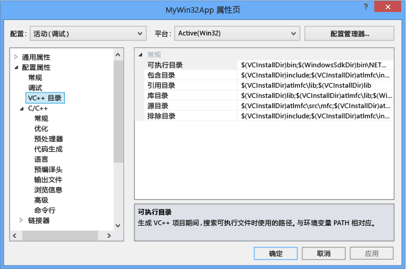
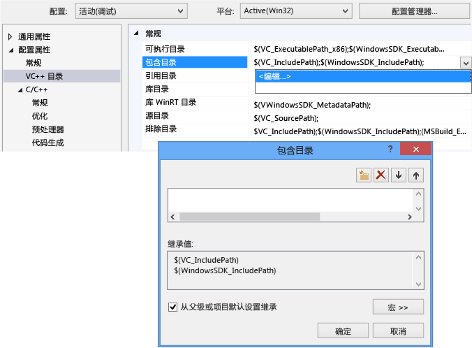
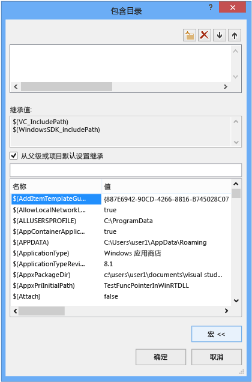
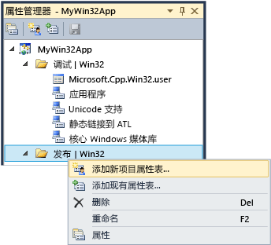

# 使用项目属性
[!INCLUDE[vs2017banner](../assembler/inline/includes/vs2017banner.md)]

在 IDE 中，生成项目所需的所有信息都公开为              *属性*。 此信息包括应用程序名称、 扩展名 （如 DLL、 LIB、 EXE）、 编译器选项、 链接器选项、 调试器设置、 自定义生成步骤和许多其他事情。 您使用              *属性页* (             **项目 &#124;属性**) 查看和修改这些属性。  
  
 创建项目时，系统会为分配的各种属性的值。 默认值根据类型稍有不同，在应用向导中选择项目模板和选项。 例如，ATL 项目具有与 MIDL 文件相关的属性，但这些都不存在于基本控制台应用程序。   默认属性在属性页中常规窗格中所示︰  
  
   
  
 某些属性，如应用程序名称、 适用于所有生成变体，而不考虑目标平台或是否 debug 或 release 生成。 但是，大多数属性是依赖于配置的。   这是因为编译器都必须知道哪些特定平台运行此程序将和哪些特定的编译器选项时要使用生成正确的代码。 因此，当设置属性时，很重要必须要注意的配置和平台的新值应该应用于。  它仅应用于 Debug Win32 版本中，或者它还应将应用到调试 ARM 和 x64 调试？ 例如，              **优化** 属性，默认情况下，设置为              **最大化速度 (/ O2)** 在发布配置中，但在调试配置中禁用。  
  
 属性页，以便您始终可以看到，如果需要修改，哪些配置和平台的属性值应适用于设计。 下图显示顶部的列表框中使用的配置和平台信息的属性页。 当在此处设置优化属性时，它将仅适用于调试 Win32 版本中，它恰巧是活动配置显示的红色箭头。  
  
   
  
 下图显示相同的项目属性页中，但配置已更改为发行版。 请注意优化属性的不同值。 还要注意活动配置仍然是调试。 可在此处; 设置进行任何配置的属性它不必使处于活动状态。  
  
   
  
 项目系统本身基于 MSBuild，定义文件格式和规则，用于构建任何类型的项目。 MSBuild 管理的诸多复杂性构建为多个配置和平台，但您需要稍微了解它的工作原理。 这一点尤其重要，如果您想要定义自定义配置或创建可重用的属性集的它们可以共享并将导入到多个项目。  
  
 直接在项目文件 (*.vcxproj) 或项目文件导入和它提供的默认值其他.xml 或.props 文件中存储项目属性。 如前面所示，在同一配置相同的属性可能会分配不同的值在不同的文件。 在生成项目时，MSBuild 引擎计算项目文件和明确的顺序 （如下所述） 中的所有导入的文件。 每个文件将在计算，在该文件中定义的任何属性值将覆盖现有值。  未指定任何值将继承自前面已评估的文件。  因此，当您设置与属性页的属性，也很重要必须要注意，您将其设置。 如果您将属性设置为"X"在.props 文件中，但该属性设置为"Y"在项目文件中，该项目将生成属性设置为"Y"。 如果同一个属性设置为"Z"项目项，例如.cpp 文件，则 MSBuild 引擎将使用"Z"值。 有关详细信息，请参阅              [属性继承](#bkmkPropertyInheritance) 本文后续部分中。  
  
## 生成配置  
 配置是只需指定一个名称的属性的任意组。 Visual Studio 提供了调试和发布配置和每个设置为适当的调试版本或发行版的各种属性。 您可以使用                  **Configuration Manager** 来定义自定义配置为生成的特定风格的组属性的便捷方式。  属性管理器用于高级使用属性，但我们因为它有助于直观显示的属性配置引入此处。 访问从                  **视图 &#124; 属性管理器** 或                  **视图 &#124;其他 Windows &#124;属性管理器** 具体取决于您的设置。 它具有在项目中的每个配置/平台对节点。 在下，其中每个节点都是对设置为该配置一些特定属性的属性表 （.props 文件） 的节点。  
  
   
  
 如果您转到 （请参见上面的插图） 的属性页中的常规窗格和的字符集属性设置为"未设置"而不是"使用 Unicode"并单击                  **确定**,  ，属性管理器会显示任何                  **Unicode 支持** 属性表的当前配置，但它仍在那里，对于其他配置。  
  
 属性管理器和属性表相关的详细信息，请参阅                  [创建可重用的属性配置](#bkmkPropertySheets) 本文后续部分中。  
  
> [!TIP]
>  其中的.user 文件是一项旧功能，我们建议将其删除为了确保正确配置/平台根据分组的属性。  
  
## 目标平台  
 *目标平台* 指的是何种设备和/或可执行文件将在运行的操作系统。 您可以构建用于多个平台的项目。 C + + 项目可用的目标平台依赖类型的项目;包括但不是限于 Win32、 x64、 ARM、 Android 和 iOS。                        **X86** 目标平台中可能会看到                  **Configuration Manager** 等同于                  **Win32** 在本机 c + + 项目中。 Win32 意味着 32 位 Windows 和                  **x64** 意味着 64 位 Windows。  有关这两个平台的详细信息，请参阅                  [运行 32 位应用程序](https://msdn.microsoft.com/library/windows/desktop/aa384249\(v=vs.85\).aspx)。  
  
                   **任意 CPU** 目标平台值中可能会看到                  **Configuration Manager** 不起作用的本机 c + + 项目; 适用于 C + + /cli CLI 和其他.NET 项目类型。 有关详细信息，请参阅                  [/CLRIMAGETYPE （指定类型的 CLR 映像）](../build/reference/clrimagetype-specify-type-of-clr-image.md)。  
  
## 属性页  
 正如前文所述，Visual c + + 项目系统基于                  [MSBuild](MSBuild%20Properties.md) 和这些值存储在 XML 项目文件中，默认值的.props 和.targets 文件，（对于 Visual Studio 2015) 位于                     **\< 驱动器>\Program Files (x86)\MSBuild\Microsoft.Cpp\v4.0\V140** 和您可以添加自定义的.props 文件中。 我们强烈建议使用的编辑手动，这些文件，并改为使用在 IDE 中的属性页来修改所有属性，尤其是那些参与继承，除非您有很好的理解的 MSBuild。  
  
 下图显示了 Visual C++ 项目的属性页。 在左窗格中，                  **VC + + 目录***规则* 选择后，右侧窗格中列出与该规则相关联的属性。                   `$(...)` 值遗憾的是称为                  *宏*。 这些是                  *不* C/c + + 宏，但只需编译时常量。 中讨论了宏                  [属性页宏](#bkmkPropertiesVersusMacros) 本文后面的部分。)  
  
   
  
> [!WARNING]
>  已删除 Visual Studio 的早期版本中的                      **“通用属性”** 配置。 若要添加对项目的引用，现在以用于托管语言的相同方式使用                      **“添加引用”** 对话框。 请参阅                      [管理项目中的引用](../Topic/Managing%20references%20in%20a%20project.md)。  
  
#### 设置项目属性  
  
1.  大多数情况下，您可以在无需创建自定义属性表在项目级别中设置属性。 在主菜单中，选择                                  **项目 &#124;属性**, ，或右键单击项目节点中                                  **解决方案资源管理器** ，然后选择                                  **属性**。  
  
2.  使用                                  **配置** 和                                  **平台** 列表框顶部的对话框中，若要指定哪些属性组应应用所做的更改。 在许多情况下                                  **所有平台** 和                                  **所有配置** 是合适的选择。 若要只为某些配置设置属性，请在                                  **“属性管理器”**中选择多个配置，然后打开快捷菜单并选择                                  **“属性”**。  
  
 **“属性页”** 对话框仅显示适用于当前项目的属性页。 例如，如果该项目没有 .idl 文件则不会显示 MIDL 属性页。  
  
 当突出显示的属性在属性页中时，您可以按                  **F1** 转到有关相应的编译器或链接器开关的详细信息的参考主题。  
  
 这些主题中，可以找到有关每个属性页的详细信息︰  
  
-   [常规属性页 （项目）](../ide/general-property-page-project.md)  
  
-   [属性常规页 （文件）](../ide/general-property-page-file.md)  
  
-   [命令行属性页](../ide/command-line-property-pages.md)  
  
-   [C + + 调试配置项目设置](../Topic/Project%20Settings%20for%20a%20C++%20Debug%20Configuration.md)  
  
-   [NMake 属性页](../ide/nmake-property-page.md)  
  
-   [链接器属性页](../ide/linker-property-pages.md)  
  
-   [资源属性页](../ide/resources-property-pages.md)  
  
-   [MIDL 属性页](../ide/midl-property-pages.md)  
  
-   [Web 引用属性页](../ide/web-references-property-page.md)  
  
-   [XML 数据生成器工具属性页](../ide/xml-data-generator-tool-property-page.md)  
  
## 若要快速浏览和搜索所有属性  
                   **所有选项** 属性页 (在下                  **配置属性 &#124;C/C++** 中的节点                  **属性页** 对话框) 提供快速的方法来浏览和搜索当前上下文中可用的属性。 它具有特殊的搜索框和简单的语法，能够帮助你筛选结果：  
  
 无前缀：  
 仅在属性名称中搜索（不区分大小写的子字符串）。  
  
 '/' 或 '-'：  
 仅在编译器开关中搜索（不区分大小写的前缀）  
  
 v:  
 仅在值中搜索（不区分大小写的子字符串）。  
  
##   属性页宏  
 一个                  *宏* 编译时常量，它可以引用一个值，由 Visual Studio 或 MSBuild 系统定义或用户定义的值。 通过使用宏（而不是硬编码值，例如目录路径），你可更轻松地在计算机之间以及 Visual Studio 的版本之间共享属性设置，并且可更好地确保项目设置正确地参与属性继承。 可以使用属性编辑器以查看所有可用宏的值。  
  
### 预定义宏  
 全局宏  
 应用于项目配置的所有项目。 具有语法                                  `$(name)`。 全局宏的示例是                                  `$(VCInstallDir)`，它存储 Visual Studio 安装的根目录。 全局宏与 MSBuild 中的                                  `PropertyGroup` 相对应。  
  
 项宏  
 具有语法                                  `%(name)`。 对于文件来说，仅适用于该文件的项宏，例如可以使用                                  `%(AdditionalIncludeDirectories)` 来指定仅适用于特定文件的包含目录。 这种项宏与 MSBuild 中的                                  `ItemGroup` 元数据相对应。 在项目配置中使用时，项宏适用于特定类型的所有文件。 例如，C/C++                                  **“预处理器定义”** 配置属性可以获取适用于项目中所有 .cpp 文件的                                  `%(PreprocessorDefinitions)` 项宏。 这种项宏与 MSBuild 中的                                  `ItemDefinitionGroup` 元数据相对应。 有关详细信息，请参阅                                  [Item Definitions](../Topic/Item%20Definitions.md)。  
  
### 用户定义的宏  
 你可以创建用户定义的宏                           ，以便在项目生成中将宏用作变量。 例如，可以创建一个用户定义的宏来提供自定义生成步骤或自定义生成工具的值。 用户定义的宏是名称/值对。 在项目文件中，使用                          **$(***name***)** 表示法访问该值。  
  
 用户定义的宏存储在属性表中。 如果您的项目尚未包含属性表，您可以创建一个按照下面的步骤                          [创建可重用的属性配置](#bkmkPropertySheets)。  
  
##### 创建用户定义的宏  
  
1.  在                                          **“属性管理器”** 窗口中（在菜单栏上，依次选择                                          **“视图”**、                                          **“属性管理器”**），打开属性表的快捷菜单（名称以 .user 结尾），然后选择“属性”。 此时将打开该属性表的                                          **“属性页”** 对话框。  
  
2.  在对话框的左窗格中，选择                                          **“用户宏”**。 在右窗格中，选择                                          **“添加宏”** 按钮，打开                                          **“添加用户宏”** 对话框。  
  
3.  在对话框中，指定宏的名称和值。 （可选）选中                                          **“将此宏设置为生成环境中的环境变量”** 复选框。  
  
## 属性编辑器  
 你可以使用属性编辑器来修改特定字符串属性，选择宏作为值。 若要访问“属性编辑器”，在属性页中选择属性，然后选择右侧的向下箭头按钮。 如果下拉列表包含                  **\< 编辑>**, ，那么您可以选择它以显示该属性的属性编辑器。  
  
   
  
 在属性编辑器中，你可以选择                  **“宏”** 按钮查看可用宏及这些宏的当前值。 下图显示选中                  **“宏”** 按钮后，                  **“附加包含目录”** 属性的属性编辑器。 如果选中                  **“从父级或项目默认设置继承”** 复选框并添加了新值，则该值会附加到当前被继承的任意值。 如果清除复选框，则新值会替换继承值。 在大多数情况下，选中复选框。  
  
   
  
##   创建可重用的属性配置  
 虽然可以根据每个用户和每台计算机设置“全局”属性，但我们不建议这样做。 相反，建议你使用                  **“属性管理器”** 创建属性表                   来存储你希望能够重新使用或与其他人共享的每一类项目的设置。 属性表还使无意中更改其他项目类型的属性设置的可能性变小。 更详细地讨论属性表                  [创建可重用的属性配置](#bkmkPropertySheets)。  
  
> [!IMPORTANT]
>  **.user 文件以及它们为何有问题**  
>   
>  过去的 Visual Studio 版本使用全局属性表包含.user 文件名扩展且位于表 \< 用户配置文件>\AppData\Local\Microsoft\MSBuild\v4.0\ 文件夹。 我们不再推荐这些文件，因为它们是针对每个用户、每台计算机来设置项目配置属性的。 特别是如果你在生成计算机上面向多个平台，此类“全局”设置会影响生成。 例如，如果你同时拥有一个 MFC 项目和 Windows Phone 项目，则其中一个项目的 .user 属性将会无效。 可重用的属性表更为灵活，而且更加可靠。  
>   
>  尽管 Visual Studio 仍安装 .user 文件并参与属性继承，但默认情况下，这些文件为空。 最佳做法是删除项目在                      **“属性管理器”** 中的引用，以确保项目按每个计算机设置和每个用户独立运行。这对确保在 SCC（源代码管理）环境中的正确行为来说非常重要。  
  
 若要显示                  **“属性管理器”**，请在菜单栏上依次选择                  **“视图”**、                  **“其他窗口”**、                  **“属性管理器”**。  
  
 如果你想将经常使用的属性集应用于多个项目，则可以使用                  **“属性管理器”** 在可重用的属性表                   文件中捕获，按照惯例，文件的扩展名为 .props。 你可以将一张或多张表应用于新项目，这样就不必从零开始设置属性。 若要访问                  **“属性管理器”**，在菜单栏中选择                  **“视图”**、                  **“属性管理器”**。  
  
   
  
 在配置每个节点上，可以看到每个适用于该配置的属性表的节点。 系统将根据您选择的选项在应用向导中创建项目时设置值的属性表添加。 右键单击任何节点并选择要查看适用于该节点的属性的属性。  所有属性表中自动导入到项目的"主"属性表 (ms.cpp.props)，以及它们出现在属性管理器中的顺序计算。 您可以移动对其进行更改的计算顺序。 属性表，其计算结果更高版本将覆盖以前计算表中的值。  
  
 如果选择                  **“添加新项目属性表”** ，然后进行选择（例如 MyProps.props 属性表），将显示属性页对话框。 请注意，适用于 MyProps 属性表；你所做的任何更改都将写入表中，而非属性文件 (.vcxproj) 中。  
  
 如果直接在 .vcxproj 文件中设置同一属性，属性表中的属性将被重写。  
  
 你可以按所需的频率导入属性表。 一个解决方案中的多个项目可从同一个属性表继承设置，一个项目可有多个表。 属性表自身可以从另一个属性表继承设置。  
  
 你还可以为多个配置创建一个属性表。 为此，请为每个配置创建属性表，打开其中一个配置的快捷菜单，选择                  **“添加现有属性表”**，然后添加其他表。 但是，如果使用一个常用属性表，请注意在设置属性时，它会获取该表适用的所有配置设置，而且 IDE 不会显示从给定属性表继承的项目或其他属性表。  
  
 在具有多个项目的大型解决方案中，创建解决方案级别的属性表非常有用。 在将项目添加到解决方案时，请使用                  **“属性管理器”** 将该属性表添加到项目中。 如果项目级别为必填字段，则可以添加一个新属性表以设置指定的项目值。  
  
> [!IMPORTANT]
>  由于 .props 文件不作为项目项创建，因此该文件默认不参与源代码管理。 如果你希望将文件加入源代码管理，则可以手动添加文件作为解决方案项。  
  
#### 创建属性表  
  
1.  在菜单栏上，依次选择                                  **“查看”**、                                  **“属性管理器”**。 此时将打开                                  **“属性管理器”** 。  
  
2.  若要定义属性表的范围，请选择属性表适用的项。 这可能是一个特殊配置，或另一个属性表。 打开该项的快捷菜单，然后选择                                  **“添加新项目属性表”**。 指定一个名称和位置。  
  
3.  在                                  **“属性管理器”**中，打开新的属性表然后设置要包括的属性。  
  
##   属性继承  
 项目属性已分层。 每层继承前一层的值，但是继承的值可以通过设置属性显式重写。 这是基本的继承树：  
  
1.  来自 MSBuild CPP 工具集的默认设置（..\Program Files\MSBuild\Microsoft.Cpp\v4.0\Microsoft.Cpp.Default.props，由 .vcxproj 文件导入。）  
  
2.  属性表  
  
3.  .vcxproj 文件。 （可能重写默认设置和属性页设置。）  
  
4.  项元数据  
  
> [!TIP]
>  在属性页中，                      `bold` 的属性在当前上下文中定义。 普通字体的属性将被继承。  
  
 项目文件 (.vcxproj) 在生成时导入其他属性表。 在导入所有属性表后，对项目文件进行计算，然后所有属性值都使用最后一个定义。 有时，通过查看展开的文件来确定给定的属性值如何继承非常有用。 若要查看扩展版本，请在 Visual Studio 命令提示中输入以下命令。 （将占位符文件名称更改为要使用的名称。）  
  
 **msbuild /pp:** *temp* **.txt** *myapp* **.vcxproj**  
  
 除非你十分熟悉 MSBuild，否则展开的项目文件可能会很大并且难以理解。 这是项目文件的基本结构：  
  
1.  基本项目属性，不在 IDE 中显示。  
  
2.  导入 Microsoft.cpp.default.props，该文件定义了一些基本的、不依赖于工具集的属性。  
  
3.  全局配置属性在                          **“常规配置”** 页面上显示为                          **“PlatformToolset”** 和                          **“项目”** 默认属性。 这些属性决定下一步将哪个工具集和内部属性表导入 Microsoft.cpp.props 中。  
  
4.  导入 Microsoft.cpp.props，该文件设置大多数项目默认值。  
  
5.  导入所有属性表，包括 .user 文件。 这些属性表可以重写内容，但                          **“PlatformToolset”** 和                          **“项目”** 默认属性除外。  
  
6.  项目配置属性的其余部分。 这些值可以重写属性表中设置的内容。  
  
7.  项（文件）及其元数据。 这些始终是 MSBuild 评估规则的最后一项，即使它们出现在其他属性和导入之前仍是如此。  
  
 有关详细信息，请参阅                  [MSBuild Properties](MSBuild%20Properties.md)。  
  
## 添加包含目录到默认目录集  
 在将包含目录添加到项目中时，请勿重写所有默认目录，这点非常重要。 添加目录的正确方法是追加新路径，例如“C:\MyNewIncludeDir\”，然后追加                  **“$(IncludePath)”** 宏为属性值。  
  
## 设置生成的环境变量  
 Visual C++ 编译器 (cl.exe) 可识别某些环境变量，尤其是 LIB、LIBPATH、PATH 和 INCLUDE。 使用 IDE 生成时，                  [VC++ Directories Property Page](../ide/vcpp-directories-property-page.md) 属性页中设置的属性用于设置那些环境变量。 如果已设置了 LIB、LIBPATH 和 INCLUDE 值（例如通过开发人员命令提示设置），则这些值将被相应的 MSBuild 属性的值替换。 然后生成在 PATH 前预置 VC++ 目录可执行目录属性的值。 你可以通过创建用户定义的宏然后选中显示                  **“在生成环境中将此宏设置为环境变量”**的框来设置用户定义的环境变量。  
  
## 设置调试会话的环境变量  
 在项目                  **“属性页”** 对话框的左窗格中，展开                  **“配置属性”** ，然后选择                  **“调试”**。  
  
 在右窗格中，修改                  **“环境”** 或                  **“合并环境”** 项目设置，然后选择                  **“确定”** 按钮。  
  
## 另请参阅  
 [创建和管理 Visual c + + 项目](../ide/creating-and-managing-visual-cpp-projects.md)