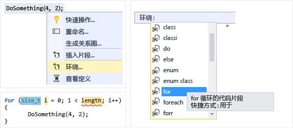
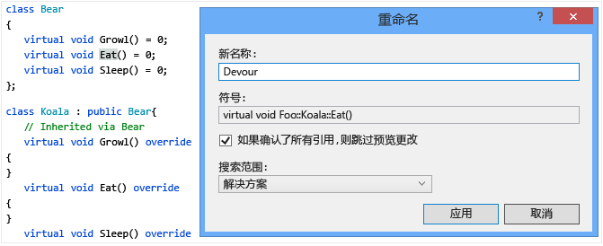
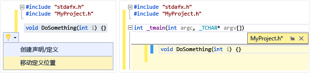
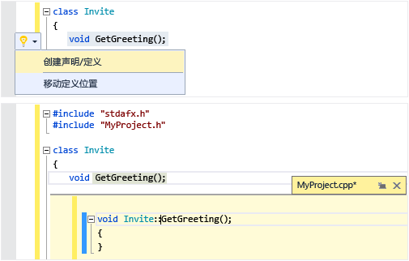
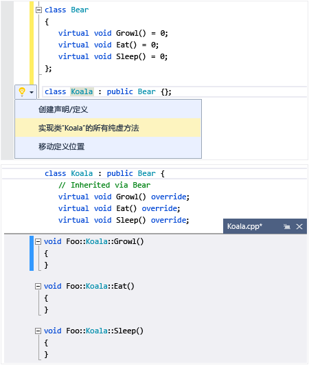
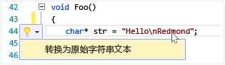
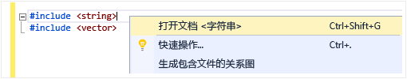
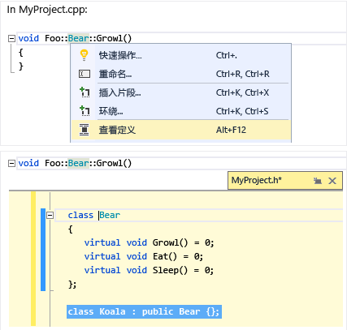
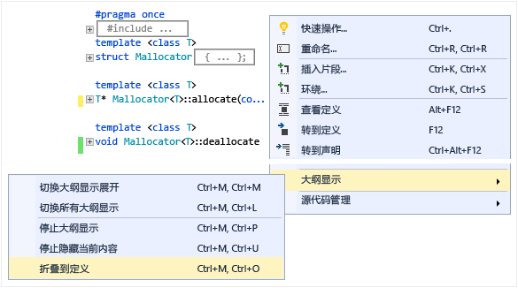
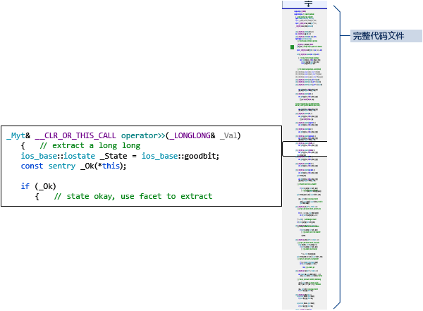

# 编写和重构代码 (C++)
[!INCLUDE[vs2017banner](../assembler/inline/includes/vs2017banner.md)]

Visual C\+\+ 代码编辑器和 IDE 提供许多编码帮助。  有些为 C\+\+ 所独有，有些实质上对于所有 Visual Studio 语言均相同。  启用和配置这些功能的选项位于文本编辑器 C\+\+ 高级对话框中（**“工具”&#124;“选项”&#124;“文本编辑器”&#124;“C\/C\+\+”&#124;“高级”**或者在**“快速启动”**中键入“C\+\+ Advanced”\)。  选择想要设置的选项之后，在焦点位于对话框上时按 **F1** 可获取更多帮助。  如需通用代码格式选项，请在**“快速启动”**中键入`“编辑器 C++”`。  
  
## 添加新代码  
 创建项目之后，可以开始在为你生成的文件中进行编码。  若要添加新文件，请右键单击解决方案资源管理器中的项目节点，然后选择**“添加”&#124;“新建”**。  
  
 若要设置缩进、括号补全和着色等格式选项，请在**“快速启动”**窗口中键入`“C++ 格式设置”`。  
  
### IntelliSense  
 IntelliSense 是一组提供有关成员、类型和函数重载的内联信息的功能的名称。  下图显示在你键入时出现的成员下拉列表。  可以按 tab 键将选定的项文本键入代码文件中。  
  
   
  
 有关完整信息，请参阅 [Visual C\+\+ Intellisense](../Topic/Visual%20C++%20Intellisense.md)。  
  
### 插入代码片段  
 代码片段是一段预定义的源代码。  在单个点上或在选定文本上右键单击以插入代码片段或用代码片段环绕选定文本。  下图显示用 for 循环环绕选定语句的三个步骤。  最终图像中的黄色突出显示是使用 tab 键访问的可编辑字段。  有关详细信息，请参阅[代码片段](../Topic/Code%20Snippets.md)。  
  
   
  
### 添加类  
 使用类向导从**“项目”**菜单添加新类。  
  
   
  
### 类向导  
 使用类向导修改或检查现有类，或添加新类。  有关详细信息，请参阅[用代码向导添加功能 \(C\+\+\)](../ide/adding-functionality-with-code-wizards-cpp.md)。  
  
   
  
## 重构  
 可在“快速操作”上下文菜单项下，或者通过单击编辑器中的[灯泡](../Topic/Perform%20quick%20actions%20with%20light%20bulbs.md)使用重构。  
  
### 重命名  
 重命名一个类型、函数或变量，无论它用在指定作用域中的什么位置。  下图中，`Eat` 方法将在派生类或基类中被重命名为 `Devour`。  
  
   
  
### 快速操作：移动定义位置  
 将一个或多个函数定义移到与代码文件具有相同名称的头文件中。  如果它尚不存在，则创建一个新标头。  将在查看窗口中内联显示所得定义。  
  
   
  
### 快速操作：创建声明\/定义  
 在关联的代码文件中为选定的标头声明创建一个或多个定义。  
  
   
  
### 快速操作：为类实现所有纯虚拟  
 为类中的所有继承虚拟函数快速生成空实现存根。  若要仅实现特定基类中的虚拟函数，只需在派生的类声明中突出显示该基类。  
  
   
  
### 转换为原始字符串文本  
 将光标置于字符串文本上时，可以右键单击并选择**“快速操作”&#124;“转换为原始字符串文本”**，从而将普通字符串转换为 C\+\+ 11 原始字符串文本。  
  
   
  
### 提取函数（Visual Studio 扩展）  
 使用提取函数功能（作为 [Visual Studio 库上的扩展](https://visualstudiogallery.msdn.microsoft.com/a081dc8c-c805-4589-9b8b-c2c309a05789)提供）将一段代码移到其自己的函数中，并用对该函数的调用替换该代码。  
  
   
  
## 导航和了解  
  
### QuickInfo  
 将鼠标悬停在变量上以查看其类型信息。  QuickInfo  
  
   
  
### 打开文档（导航至标头）  
 右键单击 `#include` 指令中的标头名称，然后打开头文件。  
  
   
  
### 查看定义  
 将鼠标悬停在变量或函数声明上，右键单击，然后选择**“查看定义”**以查看其定义的内联视图。  有关详细信息，请参阅[查看定义 \(Alt\+F12\)](../Topic/How%20to:%20View%20and%20Edit%20Code%20by%20Using%20Peek%20Definition%20\(Alt+F12\).md)。  
  
   
  
### 转到定义  
 将鼠标悬停在变量或函数声明上，右键单击，然后选择**“转到定义”**以打开定义对象的文档。  
  
### 查看调用层次结构  
 右键单击任意函数调用并查看它调用的所有函数和所有调用它的函数的递归列表。  列表中的每个函数都能以相同方式展开。  有关详细信息，请参阅[调用层次结构](../Topic/Call%20Hierarchy.md)。  
  
   
  
### 切换标题\/代码文件  
 右键单击并选择“切换标头\/代码文件”，以便在头文件及其关联代码文件之间来回切换。  
  
### 大纲  
 右键单击源代码文件中的任意位置，然后选择**“大纲”**以折叠或展开定义和\/或自定义区域，以便更轻松地仅浏览你感兴趣的部分。  有关详细信息，请参阅[大纲显示](../Topic/Outlining.md)。  
  
   
  
### 滚动条映射模式  
 滚动条映射模式使你能快速滚动和浏览整个代码文件，而无需实际离开当前位置。  或者单击代码图上的任意位置，以直接转至该位置。  
  
   
  
### 生成包含文件的关系图  
 右键单击项目中的代码文件，然后选择**“生成包含文件的关系图”**以查看显示哪些文件被其他文件包含的关系图。  
  
   
  
### F1 帮助  
 将光标置于任意类型、关键字或函数的上方或后面，然后按 F1，以便直接转到相关的 MSDN 参考主题。  F1 也适用于错误列表和许多对话框中的项。  
  
### 快速启动  
 若要轻松地导航至 Visual Studio 中的任意窗口或工具，只需在 UI 右上角的“快速启动”窗口中键入其名称即可。  “自动完成”列表将在你键入时进行筛选。  
  
 