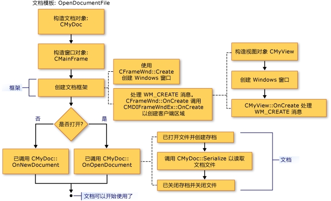

# 创建新文档、窗口和视图
下列各图概述了文档、视图和框架窗口的创建过程。 其他关注参与对象的文章将提供更多详细信息。  
  
 在完成此过程之后，协同对象将存在并且将存储指向彼此的指针。 下列各图显示了对象的创建顺序。 您可以遵循各图之间的顺序。  
  
   
文档创建顺序  
  
   
框架窗口创建顺序  
  
   
视图创建顺序  
  
 有关框架如何初始化新文档、 视图和框架窗口对象的信息，请参阅类[CDocument](../mfc/reference/cdocument-class.md)， [CView](../mfc/reference/cview-class.md)， [CFrameWnd](../mfc/reference/cframewnd-class.md)， [CMDIFrameWnd](../mfc/reference/cmdiframewnd-class.md)，和[CMDIChildWnd](../mfc/reference/cmdichildwnd-class.md) MFC 库参考中。 另请参阅[技术说明 22](../mfc/tn022-standard-commands-implementation.md)，其中解释了在创建和初始化过程的框架的标准命令，为其讨论下进一步`New`和**打开**项上**文件**菜单。  
  
##   初始化你自己添加到这些类  
 上面各图还建议了您可重写成员函数以初始化应用程序对象的位置。 视图类中 `OnInitialUpdate` 的重写是最适合初始化视图的位置。 `OnInitialUpdate` 调用将在创建框架窗口并且框架窗口中的视图附加到其文档之后立即出现。 例如，如果您的视图是滚动视图（派生自 `CScrollView` 而不是 `CView`），则您应基于 `OnInitialUpdate` 重写中的文档大小设置视图大小。 (在描述中的类描述了此过程[CScrollView](../mfc/reference/cscrollview-class.md)。)您可以重写**CDocument**成员函数`OnNewDocument`和`OnOpenDocument`提供的文档的应用程序特定初始化。 通常，您必须重写二者，因为文档可通过两种方式创建。  
  
 在大多数情况下，您的重写应调用基类版本。 有关详细信息，请参阅类的命名的成员函数[CDocument](../mfc/reference/cdocument-class.md)， [CView](../mfc/reference/cview-class.md)， [CFrameWnd](../mfc/reference/cframewnd-class.md)，和[CWinApp](../mfc/reference/cwinapp-class.md) MFC 中库参考。  
  
## 请参阅  
 [文档模板和文档/视图创建过程](../mfc/document-templates-and-the-document-view-creation-process.md)   
 [文档模板创建](../mfc/document-template-creation.md)   
 [文档/视图创建](../mfc/document-view-creation.md)   
 [MFC 对象之间的关系](../mfc/relationships-among-mfc-objects.md)

