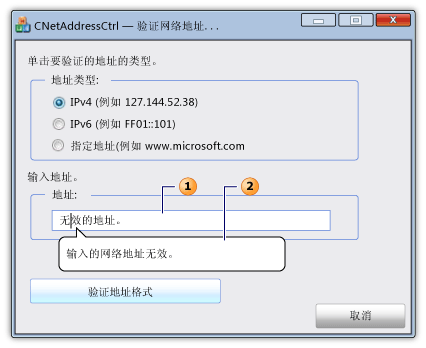

# <a name="cnetaddressctrl-class"></a>CNetAddressCtrl 类

`CNetAddressCtrl` 类表示网络地址控件，可使用此控件输入和验证 IPv4、IPv6 与命名的 DNS 地址的格式。

## <a name="syntax"></a>语法

```
class CNetAddressCtrl : public CEdit
```

## <a name="members"></a>成员

### <a name="public-constructors"></a>公共构造函数

|名称|描述|
|----------|-----------------|
|[CNetAddressCtrl::CNetAddressCtrl](#cnetaddressctrl)|构造 `CNetAddressCtrl` 对象。|

### <a name="public-methods"></a>公共方法

|名称|描述|
|----------|-----------------|
|[CNetAddressCtrl::Create](#create)|使用指定的样式创建网络地址控件，并将其附加到当前`CNetAddressCtrl`对象。|
|[CNetAddressCtrl::CreateEx](#createex)|使用指定的扩展样式创建网络地址控件，并将其附加到当前`CNetAddressCtrl`对象。|
|[CNetAddressCtrl::DisplayErrorTip](#displayerrortip)|当用户输入不受支持的网络地址对于当前的网络地址控件中显示错误气球状提示。|
|[CNetAddressCtrl::GetAddress](#getaddress)|检索与当前的网络地址控件关联的网络地址的已验证和已分析表示形式。|
|[CNetAddressCtrl::GetAllowType](#getallowtype)|检索当前的网络地址控件可以支持的网络地址的类型。|
|[CNetAddressCtrl::SetAllowType](#setallowtype)|设置当前的网络地址控件可以支持的网络地址的类型。|

## <a name="remarks"></a>备注

网络地址控件验证用户输入的地址的格式正确。 该控件不会实际连接到的网络地址。 [CNetAddressCtrl::SetAllowType](#setallowtype)方法指定的地址的一个或多个类型的[CNetAddressCtrl::GetAddress](#getaddress)方法可以分析和验证。 IPv4、 IPv6 或已命名的服务器、 网络、 主机或广播的消息目标地址的形式可以是一个地址。 如果该地址的格式不正确，则可以使用[CNetAddressCtrl::DisplayErrorTip](#displayerrortip)方法以显示信息提示消息框，以图形方式指向网络地址控件的文本框时显示一个预定义错误消息。

`CNetAddressCtrl`类派生自[CEdit](../../mfc/reference/cedit-class.md)类。 因此，网络地址控件提供了对 Windows 编辑控件的所有消息的访问。

下图描绘了一个对话框，其中包含一个网络地址控件。 文本框 （1） 的网络地址控件包含一个无效的网络地址。 如果网络地址无效，将显示信息提示消息 (2)。



## <a name="example"></a>示例

下面的代码示例是一个对话框，验证网络地址的一部分。 三个单选按钮的事件处理程序指定的网络地址可以是下列三种地址类型。 用户在文本框中的网络控件中，输入的地址，然后按下按钮以验证地址。 如果地址是有效的被显示一条成功消息;否则，显示预定义的信息提示错误消息。

[!code-cpp[NVC_MFC_CNetAddressCtrl_s1#1](../../mfc/reference/codesnippet/cpp/cnetaddressctrl-class_1.cpp)]

## <a name="example"></a>示例

下面的代码示例对话框标头文件中定义[NC_ADDRESS](/windows/desktop/api/shellapi/ns-shellapi-tagnc_address)并[NET_ADDRESS_INFO](/windows/desktop/shell/hkey-type)变量所需的[CNetAddressCtrl::GetAddress](#getaddress)方法。

[!code-cpp[NVC_MFC_CNetAddressCtrl_s1#2](../../mfc/reference/codesnippet/cpp/cnetaddressctrl-class_2.h)]

## <a name="inheritance-hierarchy"></a>继承层次结构

[CObject](../../mfc/reference/cobject-class.md)

[CCmdTarget](../../mfc/reference/ccmdtarget-class.md)

[CWnd](../../mfc/reference/cwnd-class.md)

[CEdit](../../mfc/reference/cedit-class.md)

`CNetAddressCtrl`

## <a name="requirements"></a>要求

**标头：** afxcmn.h

在 Windows Vista 及更高版本支持此类。

此类的其他要求中所述[生成要求的 Windows Vista 公共控件](../../mfc/build-requirements-for-windows-vista-common-controls.md)。

##  <a name="cnetaddressctrl"></a>  CNetAddressCtrl::CNetAddressCtrl

构造 `CNetAddressCtrl` 对象。

```
CNetAddressCtrl();
```

### <a name="remarks"></a>备注

使用[CNetAddressCtrl::Create](#create)或[CNetAddressCtrl::CreateEx](#createex)方法以创建网络控制并将其附加到`CNetAddressCtrl`对象。

##  <a name="create"></a>  CNetAddressCtrl::Create

使用指定的样式创建网络地址控件，并将其附加到当前`CNetAddressCtrl`对象。

```
virtual BOOL Create(
    DWORD dwStyle,
    const RECT& rect,
    CWnd* pParentWnd,
    UINT nID);
```

### <a name="parameters"></a>参数

|参数|描述|
|---------------|-----------------|
|*dwStyle*|[in]要应用于控件的样式的按位组合。 有关详细信息，请参阅[编辑样式](../../mfc/reference/styles-used-by-mfc.md#edit-styles)。|
|*rect*|[in]对引用[RECT](/previous-versions/dd162897\(v=vs.85\))结构，其中包含的位置和大小的控件。|
|*pParentWnd*|[in]指向的非 null 指针[CWnd](../../mfc/reference/cwnd-class.md)是控件的父窗口的对象。|
|*nID*|[in]控件的 ID。|

### <a name="return-value"></a>返回值

如果此方法成功，则为 TRUE否则为 FALSE。

##  <a name="createex"></a>  CNetAddressCtrl::CreateEx

使用指定的扩展样式创建网络地址控件，并将其附加到当前`CNetAddressCtrl`对象。

```
virtual BOOL CreateEx(
    DWORD dwExStyle,
    DWORD dwStyle,
    const RECT& rect,
    CWnd* pParentWnd,
    UINT nID);
```

### <a name="parameters"></a>参数

|参数|描述|
|---------------|-----------------|
|*dwExStyle*|[in]若要应用于控件的扩展样式的按位组合 (OR)。 有关详细信息，请参阅*dwExStyle*的参数[CreateWindowEx](/windows/desktop/api/winuser/nf-winuser-createwindowexa)函数。|
|*dwStyle*|[in]按位组合 (OR) 要应用于控件的样式。 有关详细信息，请参阅[编辑样式](../../mfc/reference/styles-used-by-mfc.md#edit-styles)。|
|*rect*|[in]对引用[RECT](/previous-versions/dd162897\(v=vs.85\))结构，其中包含的位置和大小的控件。|
|*pParentWnd*|[in]指向的非 null 指针[CWnd](../../mfc/reference/cwnd-class.md)是控件的父窗口的对象。|
|*nID*|[in]控件的 ID。|

### <a name="return-value"></a>返回值

如果此方法成功，则为 TRUE否则为 FALSE。

##  <a name="displayerrortip"></a>  CNetAddressCtrl::DisplayErrorTip

与当前的网络地址控件相关联的气球状提示中显示一条错误消息。

```
HRESULT DisplayErrorTip();
```

### <a name="return-value"></a>返回值

值`S_OK`如果此方法成功; 否则为错误代码。

### <a name="remarks"></a>备注

使用[CNetAddressCtrl::SetAllowType](#setallowtype)方法，以指定的地址的当前网络地址控件可以支持的类型。 使用[CNetAddressCtrl::GetAddress](#getaddress)方法来验证和分析用户输入的网络地址。 使用[CNetAddressCtrl::DisplayErrorTip](#displayerrortip)方法来显示错误消息信息提示，如果[CNetAddressCtrl::GetAddress](#getaddress)方法未成功。

此消息调用[NetAddr_DisplayErrorTip](/windows/desktop/api/shellapi/nf-shellapi-netaddr_displayerrortip)宏，Windows SDK 中所述。 该宏将发送`NCM_DISPLAYERRORTIP`消息。

##  <a name="getaddress"></a>  CNetAddressCtrl::GetAddress

检索与当前的网络地址控件关联的网络地址的已验证和已分析表示形式。

```
HRESULT GetAddress(PNC_ADDRESS pAddress) const;
```

### <a name="parameters"></a>参数

*pAddress*<br/>
[in、 out]指向[NC_ADDRESS](/windows/desktop/api/shellapi/ns-shellapi-tagnc_address)结构。  设置*pAddrInfo*到的地址的此结构的成员[NET_ADDRESS_INFO](/windows/desktop/shell/hkey-type)结构，然后再 GetAddress 方法调用。

### <a name="return-value"></a>返回值

如果此方法成功，则为 S_OK 值否则为 COM 错误代码。 有关可能的错误代码的详细信息，请参阅的返回值部分[NetAddr_GetAddress](/windows/desktop/api/shellapi/nf-shellapi-netaddr_getaddress)宏。

### <a name="remarks"></a>备注

如果此方法成功， [NET_ADDRESS_INFO](/windows/desktop/shell/hkey-type)结构包含有关网络地址的其他信息。

使用[CNetAddressCtrl::SetAllowType](#setallowtype)方法，以指定类型的当前网络地址控件可以支持的地址。 使用[CNetAddressCtrl::GetAddress](#getaddress)方法来验证和分析用户输入的网络地址。 使用[CNetAddressCtrl::DisplayErrorTip](#displayerrortip)方法来显示错误消息信息提示，如果[CNetAddressCtrl::GetAddress](#getaddress)方法未成功。

此方法将调用[NetAddr_GetAddress](/windows/desktop/api/shellapi/nf-shellapi-netaddr_getaddress)宏，Windows SDK 中所述。 该宏将 NCM_GETADDRESS 消息发送。

##  <a name="getallowtype"></a>  CNetAddressCtrl::GetAllowType

检索当前的网络地址控件可以支持的网络地址的类型。

```
DWORD GetAllowType() const;
```

### <a name="return-value"></a>返回值

网络地址控件可以支持的按位组合 (OR) 的标志，指定类型的地址。 有关详细信息，请参阅[NET_STRING](/windows/desktop/shell/net-string)。

### <a name="remarks"></a>备注

此消息调用[NetAddr_GetAllowType](/windows/desktop/api/shellapi/nf-shellapi-netaddr_getallowtype)宏，Windows SDK 中所述。 该宏将 NCM_GETALLOWTYPE 消息发送。

##  <a name="setallowtype"></a>  CNetAddressCtrl::SetAllowType

设置当前的网络地址控件可以支持的网络地址的类型。

```
HRESULT SetAllowType(DWORD dwAddrMask);
```

### <a name="parameters"></a>参数

|参数|描述|
|---------------|-----------------|
|*dwAddrMask*|[in]网络地址控件可以支持的按位组合 (OR) 的标志，指定类型的地址。 有关详细信息，请参阅[NET_STRING](/windows/desktop/shell/net-string)。|

### <a name="return-value"></a>返回值

如果此方法成功，则为 S_OK否则为 COM 错误代码。

### <a name="remarks"></a>备注

使用[CNetAddressCtrl::SetAllowType](#setallowtype)方法，以指定的地址的当前网络地址控件可以支持的类型。 使用[CNetAddressCtrl::GetAddress](#getaddress)方法来验证和分析用户输入的网络地址。 使用[CNetAddressCtrl::DisplayErrorTip](#displayerrortip)方法来显示错误消息信息提示，如果[CNetAddressCtrl::GetAddress](#getaddress)方法未成功。

此消息调用[NetAddr_SetAllowType](/windows/desktop/api/shellapi/nf-shellapi-netaddr_setallowtype)宏，Windows SDK 中所述。 该宏将 NCM_SETALLOWTYPE 消息发送。

## <a name="see-also"></a>请参阅

[CNetAddressCtrl 类](../../mfc/reference/cnetaddressctrl-class.md)<br/>
[层次结构图](../../mfc/hierarchy-chart.md)<br/>
[CEdit 类](../../mfc/reference/cedit-class.md)
