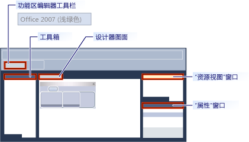

# <a name="ribbon-designer-mfc"></a>功能区设计器 (MFC)

功能区设计器可用于在 MFC 应用程序中创建和自定义功能区。 功能区是一种将命令整理成逻辑组的用户界面 (UI) 元素。 这些组显示在窗口顶部条带中的独立选项卡上。 功能区取代了菜单栏和工具栏。 功能区可以显著提高应用程序的可用性。 有关详细信息，请参阅[功能区](/windows/desktop/uxguide/cmd-ribbons)。 下图展示了一个功能区。


在早期版本的 Visual Studio 中，功能区必须通过编写代码，如使用 MFC 功能区类创建[CMFCRibbonBar 类](../mfc/reference/cmfcribbonbar-class.md)。 在 Visual Studio 2010 及更高版本，功能区设计器提供了有关生成功能区的替代方法。 首先，创建功能区并将其自定义为资源。 然后从 MFC 应用程序中的代码加载功能区资源。 你甚至可以将功能区资源和 MFC 功能区类一起使用。 例如，可以创建功能区资源，并以编程方式将添加更多元素到它在运行时通过使用代码。

## <a name="understanding-the-ribbon-designer"></a>了解功能区设计器

功能区设计器创建功能区并将其作为资源进行存储。 创建功能区资源时，功能区设计器将执行以下三项操作：

- 在项目资源定义脚本 (*.rc) 中添加一个条目。 在以下示例中，IDR_RIBBON 是标识功能区资源的唯一名称，RT_RIBBON_XML 是资源类型，ribbon.mfcribbon 毫秒的延迟是资源文件的名称。

```
    IDR_RIBBON RT_RIBBON_XML      "res\\ribbon.mfcribbon-ms"
```

- 将命令 ID 的定义添加到 resource.h。

```
#define IDR_RIBBON            307
```

- 创建一个包含 XML 代码的功能区资源文件 (*.mfcribbon-ms)，该代码用于定义功能区的按钮、控件和属性。 对功能区设计器中功能区的更改将以 XML 形式存储在资源文件中。 下面的代码示例显示了一部分的内容\*.mfcribbon-ms 文件：

```
<RIBBON_BAR>
<ELEMENT_NAME>RibbonBar</ELEMENT_NAME>
<IMAGE>
<ID>
<NAME>IDB_BUTTONS</NAME>
<VALUE>113</VALUE>
</ID>
```

若要在 MFC 应用程序中使用的功能区资源，加载资源，通过调用[cmfcribbonbar:: Loadfromresource](../mfc/reference/cmfcribbonbar-class.md#loadfromresource)。

## <a name="creating-a-ribbon-by-using-the-ribbon-designer"></a>使用功能区设计器创建功能区

可通过两种方式向 MFC 项目添加功能区资源：

- 创建 MFC 应用程序，并配置 MFC 项目向导以创建功能区。 有关详细信息，请参阅[演练： 创建功能区应用程序使用 MFC](../mfc/walkthrough-creating-a-ribbon-application-by-using-mfc.md)。

- 在现有 MFC 项目中，创建功能区资源并加载该资源。 有关详细信息，请参阅[演练： 更新 MFC 自由曲线应用程序 (第 1 部分)](../mfc/walkthrough-updating-the-mfc-scribble-application-part-1.md)。

如果你的项目已经有手动编码的功能区，MFC 提供一些功能，可用于将现有功能区转换为功能区资源。 有关详细信息，请参阅[如何： 将现有 MFC 功能区转换为功能区资源](../mfc/how-to-convert-an-existing-mfc-ribbon-to-a-ribbon-resource.md)。

> [!NOTE]
>  不能在基于对话框的应用程序中创建功能区。 有关详细信息，请参阅[应用程序类型、 MFC 应用程序向导](../mfc/reference/application-type-mfc-application-wizard.md)。

## <a name="customizing-ribbons"></a>自定义功能区

要在功能区设计器中打开功能区，请双击资源视图中的功能区资源。 在设计器中，可以添加、删除和自定义功能区、“应用程序”按钮或快速访问工具栏上的元素。 另外还可以将事件链接到（例如，按钮单击事件和菜单事件）到应用程序中的某个方法。

下图展示了功能区设计器中的各种组件。



- **工具箱：** 包含的控件，可拖动到设计器图面。

- **设计器图面：** 包含功能区资源的可视表示形式。

- **属性窗口：** 列出了在设计器图面选择的项的属性。

- **资源视图窗口：** 显示在项目中包含功能区资源的资源。

- **功能区编辑器工具栏：** Contains 命令，使您预览功能区，并更改其可视主题。

以下主题介绍如何使用功能区设计器中的功能：

- [如何：自定义应用程序按钮](../mfc/how-to-customize-the-application-button.md)

- [如何：自定义快速访问工具栏](../mfc/how-to-customize-the-quick-access-toolbar.md)

- [如何：添加功能区控件和事件处理程序](../mfc/how-to-add-ribbon-controls-and-event-handlers.md)

- [如何：从 MFC 应用程序中加载功能区资源](../mfc/how-to-load-a-ribbon-resource-from-an-mfc-application.md)

## <a name="definitions-of-ribbon-elements"></a>功能区元素的定义


- **应用程序按钮：** 出现在功能区的左上角的按钮。 “应用程序”按钮取代“文件”菜单，即使在功能区最小化时也可见。 单击该按钮时，将显示一个包含命令列表的菜单。

- **快速访问工具栏：** 经常显示一个小型的可自定义工具栏使用的命令。

- **类别**： 表示功能区选项卡的内容的逻辑分组。

- **类别默认按钮：** 功能区最小化时显示在功能区按钮。 单击该按钮时，类别将以菜单的形式重新出现。

- **面板：** 显示的一组相关控件的功能区栏区域。 每个功能区类别都包含一个或多个功能区面板。

- **功能区元素：** 面板中的控件，例如，按钮和组合框。 若要查看功能区上可以承载各种控件，请参阅[RibbonGadgets 示例： 功能区的小工具应用程序](../visual-cpp-samples.md)。

## <a name="see-also"></a>请参阅

[用户界面元素](../mfc/user-interface-elements-mfc.md)<br/>
[使用资源文件](../windows/working-with-resource-files.md)

