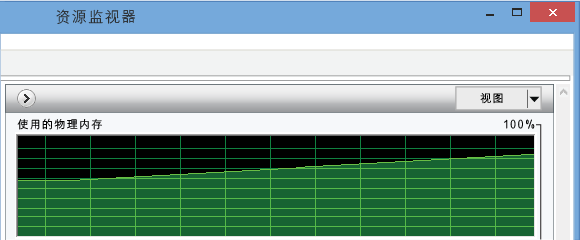
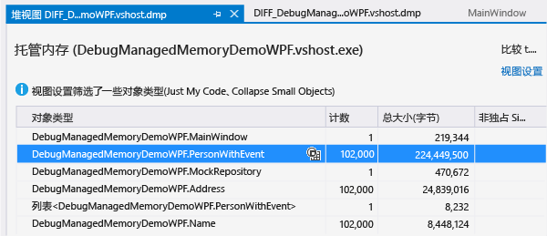
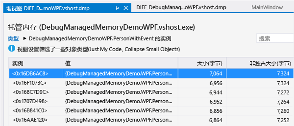
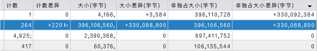

# 分析 .NET Framework 内存问题
通过使用 Visual Studio 托管内存分析程序，在 .NET Framework 代码中查找内存泄漏和低效内存使用。  目标代码的最低 .NET Framework 版本为 .NET Framework 4.5。  
  
 内存分析工具在应用内存中的对象副本的*附带堆数据的转储文件*中分析信息。  从 Visual Studio IDE 或通过使用其他系统工具，你可以收集转储 \(.dmp\) 文件。  
  
-   你可以分析单个快照以了解有关内存使用的对象类型的相对影响，并在你的应用中查找低效使用内存的代码。  
  
-   你还可以比较 \(*diff*\) 一个应用的两个快照，以便在你的代码中查找导致内存使用随时间增加的区域。  
  
 有关托管内存分析程序的演练，请参阅“Visual Studio ALM \+ Team Foundation Server”博客上的[使用 Visual Studio 2013 诊断生产中的 .NET 内存问题](http://blogs.msdn.com/b/visualstudioalm/archive/2013/06/20/using-visual-studio-2013-to-diagnose-net-memory-issues-in-production.aspx)。  
  
##   内容  
 [.NET Framework 应用中的内存使用](#BKMK_Memory_use_in__NET_Framework_apps)  
  
 [在应用中标识内存问题](#BKMK_Identify_a_memory_issue_in_an_app)  
  
 [收集内存快照](#BKMK_Collect_memory_snapshots)  
  
 [分析内存使用](#BKMK_Analyze_memory_use)  
  
##   .NET Framework 应用中的内存使用  
 .NET Framework 为垃圾回收运行时，这样在大多数应用中，内存使用不会成为问题。  但在长时间运行的应用程序中（如 Web 服务和应用程序），以及在只有有限内存的设备中，对象在内存中的累积会影响应用以及运行应用的设备的性能。  如果垃圾回收器运行过于频繁，或者如果强制操作系统在 RAM 和磁盘之间移动内存，则过多占用内存会停止应用程序和资源所在的计算机。  在最坏情况下，应用会因“内存不足”异常而崩溃。  
  
 .NET *托管堆*是一个虚拟内存区域，在其中存储由应用创建的引用对象。  对象的生存期由垃圾收集器 \(GC\) 管理。  垃圾收集器使用引用以跟踪占用内存块的对象。  当创建对象并将其分配到变量时，就会创建一个引用。  单个对象可以具有多个引用。  例如，对一个对象的其他引用可以通过将该对象添加到类、集合或其他数据结构来创建，也可以通过将该对象分配给第二个变量来创建。  创建引用的一个不太明显的方式是通过一个对象将处理程序添加到另一个对象的事件。  在这种情况下，第二个对象保留对第一个对象的引用，直到该处理程序被显式删除或第二个对象被销毁。  
  
 对于每个应用程序，GC 维护跟踪由应用程序所引用的对象的引用树。  *引用树*具有一组根，其中包括全局和静态对象，以及相关联的线程堆栈和动态实例化的对象。  如果一个对象具有至少一个保存对其引用的父对象，则该对象为根对象。  只有当应用程序中的其他对象或变量都不具有对它的引用时，GC 才能回收对象的内存。  
  
  [内容](#BKMK_Contents)  
  
##   在应用中标识内存问题  
 内存问题的最明显症状是应用的性能，尤其是如果随着时间的推移性能降低。  当你的应用运行时，其他应用的性能下降，也可能表示存在内存问题。  如果你怀疑存在内存问题，请使用类似于任务管理器或 [Windows 性能监视器](http://technet.microsoft.com/library/cc749249.aspx)的工具进行进一步调查。  例如，查看无法解释为内存泄漏可能来源的内存总大小的增长：  
  
   
  
 你可能还会注意到内存峰值，它们比就你所知的代码建议的值大，可能指向某个过程内的低效内存使用：  
  
   
  
##   收集内存快照  
 内存分析工具分析包含堆信息的*转储文件*中的信息。  你可以在 Visual Studio 中创建转储文件或者你可以从 [Windows Sysinternals](http://technet.microsoft.com/sysinternals/dd996900.aspx) 使用类似于 [ProcDump](http://technet.microsoft.com/sysinternals) 的工具。  请参阅 Visual Studio 调试器团队博客上的[什么是转储，我该如何创建转储？](http://blogs.msdn.com/b/debugger/archive/2009/12/30/what-is-a-dump-and-how-do-i-create-one.aspx)。  
  
> [!NOTE]
>  大部分工具可以收集附带或不附带完整堆内存数据的转储信息。  Visual Studio 内存分析程序需要完整的堆信息。  
  
 **从 Visual Studio 收集转储**  
  
1.  你可以针对从 Visual Studio 项目开始的进程创建一个转储文件，或者也可以将调试器附加到正在运行的进程。  请参阅[附加到运行的进程](../Topic/Attach%20to%20Running%20Processes%20with%20the%20Visual%20Studio%20Debugger.md)。  
  
2.  停止执行。  当你在**“调试”**菜单上选择**“全部中断”**时，或者在异常或断点发生时，调试器停止  
  
3.  在**“调试”**菜单上，选择**“将转储另存为”**。  在**“将转储另存为”**对话框中，指定位置并且确保在**“保存类型”**列表中选中**“附带堆信息的小型转储”**（默认值）。  
  
 **比较两个内存快照**  
  
 若要分析应用内存使用中的增长，请从该应用的单个实例收集两个转储文件。  
  
  [内容](#BKMK_Contents)  
  
##   分析内存使用  
 [筛选对象列表](#BKMK_Filter_the_list_of_objects) **&#124;** [从单个快照中分析内存数据](#BKMK_Analyze_memory_data_in_from_a_single_snapshot) **&#124;** [比较两个内存快照](#BKMK_Compare_two_memory_snapshots)  
  
 若要针对内存使用问题分析转储文件：  
  
1.  在 Visual Studio 中，依次选择**“文件”**、**“打开”**并且指定转储文件。  
  
2.  在**“小型转储文件摘要”**页面上，选择**“调试托管内存”**。  
  
       
  
 内存分析程序启动调试会话以分析文件并且在“堆视图”页面上显示结果：  
  
  [内容](#BKMK_Contents)  
  
###   筛选对象列表  
 默认情况下，内存分析程序在内存快照中筛选对象列表，以便只显示用户代码的类型和实例，并且只显示那些总包含大小超过总堆大小阈值百分比的类型。  你可以在**“视图设置”**列表中更改这些选项：  
  
|||  
|-|-|  
|**启用“仅我的代码”**|“仅我的代码”将隐藏最常用的系统对象，以便只有你创建的类型显示在列表中。   你还可以在 Visual Studio 的**“选项”**对话框中设置“仅我的代码”选项。  在**“调试”**菜单上，选择**“选项和设置”**。  在**“调试”**\/**“常规”**选项卡中，选择或清除**“仅我的代码”**。|  
|**隐藏小型对象**|**“折叠小对象”**将隐藏总包含大小小于总堆大小的 0.5% 的所有类型。|  
  
 通过在**“搜索”**框中输入字符串，你还可以筛选类型列表。  该列表只显示那些名称中包含字符串的类型。  
  
  [内容](#BKMK_Contents)  
  
###   从单个快照中分析内存数据  
 Visual Studio 启动新的调试会话以分析文件，并且在“堆视图”窗口中显示内存数据。  
  
   
  
  [内容](#BKMK_Contents)  
  
#### 对象类型表  
 上表列出了在内存中保留的对象的类型。  
  
-   **“计数”**显示了在快照中的类型的实例数目。  
  
-   **“大小（字节）”**为该类型的所有实例的大小，不包括其保留对象引用的大小。  此  
  
-   **“非独占大小（字节）”**包括引用对象的大小。  
  
 你可以在**“对象类型”**列中选择实例图标 \(\) 以查看该类实例的列表。  
  
#### 实例表  
   
  
-   **“实例”**为对象的内存位置，该对象充当对象的对象标识符  
  
-   **“值”**显示了值类型的实际值。  你可以悬停在引用类型的名称上以便在数据提示中查看其数据值。  
  
       
  
-   **“大小（字节）”**为该对象的大小，不包括其保留对象引用的大小。  此  
  
-   **“非独占大小（字节）”**包括引用对象的大小。  
  
 默认情况下，按**“非独占大小（字节）”**对类型和实例进行排序。  在列表中选择一个列标题以更改排序顺序。  
  
#### 根路径  
  
-   对于从**“对象类型”**表选择的类型，**“根路径”**表显示了针对所有该类型的对象指向根对象的唯一类型层次结构，以及对在层次结构中其上面的类型引用的数目。  
  
-   对于从类型实例选择的对象，**“根路径”**显示了保留对该实例引用的实际对象图。  你可以悬停在对象的名称上以便在数据提示中查看其数据值。  
  
#### 引用类型\/引用对象  
  
-   对于从**“对象类型”**表选择的类型，**“引用类型”**选项卡显示了由选中类型的所有对象所保留的引用类型的大小和数目。  
  
-   对于类型的选中实例，**“引用对象”**显示了由选中实例所保存的对象。  你可以悬停在该名称上以便在数据提示中查看其数据值。  
  
 **循环引用**  
  
 对象可以引用直接或间接保留对第一个对象引用的第二个对象。  当内存分析程序遇到此情况时，它将停止展开引用路径并且将**“\[检测到循环\]”**批注添加到第一个对象的列表并且停止。  
  
 **根类型**  
  
 内存分析程序将批注添加到描述要保留的引用类型的根对象：  
  
|批注|描述|  
|--------|--------|  
|**“静态变量”** `VariableName`|静态变量。  `VariableName` 是变量的名称。|  
|**终结句柄**|来自终结器队列的引用|  
|**局部变量**|局部变量。|  
|**强句柄**|来自对象句柄表的强引用的句柄。|  
|**异步。  固定句柄**|来自对象句柄表的异步固定对象。|  
|**依赖句柄**|来自对象句柄表的依赖对象。|  
|**固定句柄**|来自对象句柄表的固定强引用。|  
|**RefCount 句柄**|来自对象句柄表的引用计数的对象。|  
|**SizedRef 句柄**|在垃圾回收时间保留所有对象和对象根的集体闭合的近似大小的强句柄。|  
|**固定局部变量**|固定局部变量。|  
  
###   比较两个内存快照  
 你可以比较进程的两个转储文件以查找可能导致内存泄漏的原因。  第一个（早期）和第二个（晚期）文件的收集之间的间隔应足够大，（才能使）泄漏对象数目的增长显而易见。  若要比较两个文件：  
  
1.  打开第二个转储文件，然后在**“小型转储文件摘要”**页面上选择**“调试托管内存”**。  
  
2.  在内存分析报告页面上，打开**“选择基线”**列表，然后选择**“浏览”**以指定第一个转储文件。  
  
 分析程序将列添加到报告的顶部窗格，该报告显示了类型的**“计数”**、**“大小”**和**“非独占大小”**与在早期快照中的那些值之间的区别。  
  
   
  
 还会将**“引用计数差异”**列添加到**“根路径”**表。  
  
  [内容](#BKMK_Contents)  
  
## 请参阅  
 [VS ALM TFS 博客：使用 Visual Studio 2013 来诊断生产中的 .NET 内存问题](http://blogs.msdn.com/b/visualstudioalm/archive/2013/06/20/using-visual-studio-2013-to-diagnose-net-memory-issues-in-production.aspx)   
 [第 9 频道 &#124; Visual Studio 电视节目 &#124; 托管内存分析](http://channel9.msdn.com/Series/Visual-Studio-2012-Premium-and-Ultimate-Overview/Managed-Memory-Analysis)   
 [第 9 频道 &#124; Visual Studio 工具箱 &#124; Visual Studio 2013 中的托管内存分析](http://channel9.msdn.com/Shows/Visual-Studio-Toolbox/Managed-Memory-Analysis-in-Visual-Studio-2013)