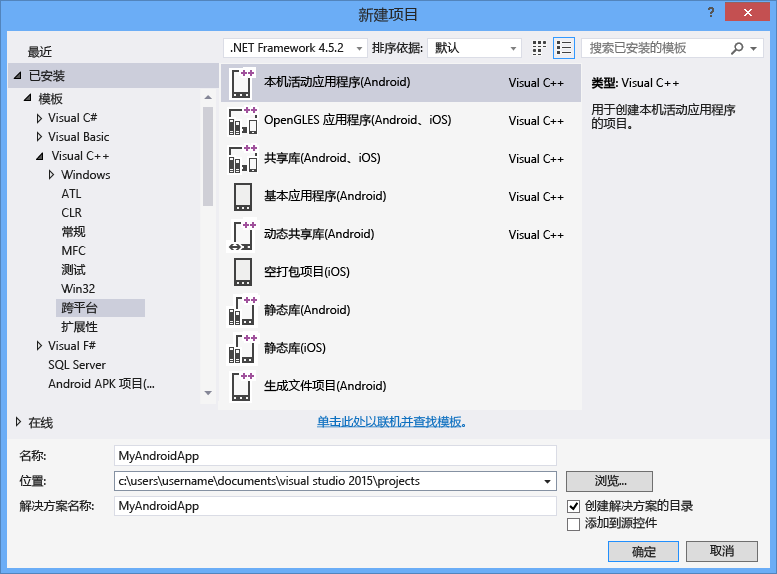

# 使用 Visual C++ 生成跨平台应用
可以通过使用适用于跨平台移动开发的 Visual C\+\+ 构建用于 Android、iOS 和 Windows 设备的跨平台代码。  这是在 Visual Studio 2015 中可用的一项可选功能，Visual Studio 2015 通过使用 Visual C\+\+ 实现适用于 iOS、Android 和 Windows 的跨平台代码开发。  
  
 可以使用 Visual Studio 生成适用于经典 Windows 应用程序、Windows 通用应用、iOS 和 Android 平台的标准 C\+\+ 代码共享库。  可仅使用 Visual C\+\+ 和集成到 Visual Studio 中的第三方工具构建适用于 Windows 和 Android 平台的本机应用。  如果具有 Mac 计算机，则可以使用 Visual Studio 创建和调试适用于 iOS 应用的代码，iOS 应用是在 Mac 上生成和部署的。  
  
> [!NOTE]
>  现成的用于跨平台移动开发的 Visual C\+\+ 支持 Android API 级别 19 和 21（针对 Android 4.4 和 5.0）。  使用 SDK 管理器可以安装其他 API 级别。  Visual Studio C\+\+ Android 调试器要求目标仿真程序或设备至少运行 Android API 级别 17（版本 4.2）或更高版本。  
  
 本文介绍如何在 Visual Studio 2015 中使用用于跨平台移动开发的 Visual C\+\+ 创建跨平台应用：  
  
 [要求](#req)   
 [获取工具](#GetTools)  
 [创建新的 Android 本机活动项目](#Create)  
 [生成并运行 Android 本机活动应用](#BuildHello)  
  
##   要求  
  
-   有关安装要求，请参阅 [Visual Studio 2015 系统要求](https://www.visualstudio.com/visual-studio-2015-system-requirements-vs)。  
  
    > [!IMPORTANT]
    >  如果使用的是 Windows 7 或 Windows Server 2008 R2，则可以针对经典 Windows 应用程序、Android Native Activity 应用和代码库以及适用于 iOS 的应用和代码库开发代码，但不能针对 Windows 应用商店应用或通用 Windows 应用开发代码。  
  
 若要为特定的设备平台创建应用，还需要满足一些附加要求：  
  
-   适用于 Android 的 Visual Studio 仿真程序和 Windows Phone 仿真程序需要可以运行 Hyper\-V 的计算机。  有关详细信息，请参阅仿真程序的[系统要求](http://msdn.microsoft.com/zh-cn/4d5bb438-231a-4cd2-84b7-e9660b0e3baf)。  
  
-   Android SDK 附带的 x86 Android 仿真程序在可以运行 Intel HAXM 驱动程序的计算机上工作性能最好。  此驱动程序需要具有 VT\-x 和执行禁用位支持的 Intel x64 处理器。  有关详细信息，请参阅 [Intel® 硬件加速执行管理器安装说明 \- Microsoft Windows](http://go.microsoft.com/fwlink/p/?LinkId=536385)。  
  
-   构建适用于 iOS 的应用需要 iOS 开发人员计划帐户和可以运行 Xcode 6 的 Mac 计算机。  
  
##   获取工具  
 用于跨平台移动开发的 Visual C\+\+ 是包含在 Visual Studio 2015 中的可选组件。  若要获取 Visual Studio，请转到 [Visual Studio 2015 下载](http://go.microsoft.com/fwlink/?linkid=517106)页面，并下载 Visual Studio 2015。  
  
 Visual Studio 2015 的安装程序包括支持跨平台移动开发的选项。  这包括安装 Visual C\+\+ 移动开发的选项以及以下常用工具和软件开发工具包。  大多数这些选项都是跨平台支持所需的开放源代码软件。  
  
-   Android 生成过程需要用到 Android 本机开发工具包（R10E，32 位）。  
  
-   Android 生成过程需要 Android SDK、Apache Ant 和 Java SE 开发工具包。  
  
-   Microsoft Visual Studio Emulator for Android 是 Android 开发的一个快速、可用的仿真程序。  
  
 有关详细的安装说明，请参阅[安装用于跨平台移动开发的 Visual C\+\+](../Topic/Install%20Visual%20C++%20for%20Cross-Platform%20Mobile%20Development.md)。  
  
 若要生成适用于 iOS 的代码，需要在 Mac 上设置和配置远程生成代理并在 Visual Studio 中连接到它。  有关详细的安装和配置说明，请参阅[安装并配置使用 iOS 进行生成的工具](../Topic/Install%20And%20Configure%20Tools%20to%20Build%20using%20iOS.md)。  
  
##   创建新的 Android 本机活动项目  
 你可以使用用于跨平台移动开发的 Visual C\+\+ 创建、生成、运行和调试使用 C\+\+ 的完整 Android 应用。  Visual Studio 包含一个用于 Android 本机活动项目的模板，可帮助你开始操作。  
  
 在此教程中，将首先创建一个新的项目，然后生成并运行默认应用。  
  
 在创建新项目前，请确保你已满足所有系统要求，并已安装了 Visual Studio 的用于跨平台移动开发的 isual C\+\+。  有关详细信息，请参阅[安装用于跨平台移动开发的 Visual C\+\+](../Topic/Install%20Visual%20C++%20for%20Cross-Platform%20Mobile%20Development.md)。  
  
#### 创建新项目  
  
1.  打开 Visual Studio。  在菜单栏上，依次选择**“文件”**、**“新建”**、**“项目”**。  
  
2.  在**新项目**对话框中，在**模板**下，选择 **Visual C\+\+**、**跨平台**，然后选择**本机活动应用程序 \(Android\)** 模板。  
  
3.  为应用命名（例如 `MyAndroidApp`），然后选择**确认**。  
  
       
  
     Visual Studio 创建新的解决方案并打开解决方案资源管理器。  
  
 新的 Android 本机活动应用解决方案包括两个项目：  
  
-   **MyAndroidApp.NativeActivity** 包含应用的引用和粘合代码，以作为本机活动在 Android 上运行。  粘合代码的入口点的实现位于 main.cpp。  预编译头位于 pch.h。  应用项目编译为一个由打包项目选取的共享库 \(.so\) 文件。  
  
-   **MyAndroidApp.Packaging** 可创建打包 \(.apk\) 文件，用于 Android 设备或仿真程序上的开发。  这包括在此设置清单属性的资源和 AndroidManifest.xml 文件。  它还包括控制 Ant 生成过程的 build.xml 文件。  默认情况下，它被设置为启动项目，因此可从 Visual Studio 直接部署和运行它。  
  
##   生成并运行 Android 本机活动应用  
 生成并运行由此模板生成的应用，以验证你的安装和设置。  默认情况下，模板将解决方案配置为“调试”，将解决方案平台配置为 x86，以便在 Microsoft Visual Studio Emulator for Android 上运行应用。  如果想要在其他目标上测试你的应用，可加载目标仿真程序或将设备连接到你的计算机。  
  
#### 生成并运行默认本机活动应用  
  
1.  在菜单栏上，依次选择**“生成”**、**“生成解决方案”**。  
  
     **“输出”**窗口显示解决方案中两个项目的生成过程的输出。  
  
2.  选择其中一个 VS Emulator 配置文件作为部署目标。  
  
     如果你已安装了其他仿真程序或连接了一个 Android 设备，则可在部署目标下拉列表中选择它们。  
  
3.  按下 F5 启动调试，或按下 Shift\+F5 来在不进行调试的情况下启动。  
  
     这就是默认应用在 Visual Studio Emulator for Android 中的样子。  
  
       
  
    > [!TIP]
    >  Visual Studio 启动仿真程序，需要几秒钟时间来加载和部署你的代码。  一旦你的应用启动，你可以设置断点，并使用调试器逐步调试代码，检查局部变量并监视值。  
  
4.  按下 Shift \+ F5 来停止调试。  
  
     仿真程序是一个继续运行的单独进程。  你可多次编辑、编译和部署代码到同一仿真程序。  
  
## 请参阅  
 [下载 Visual Studio 2015](http://go.microsoft.com/fwlink/?linkid=517106)