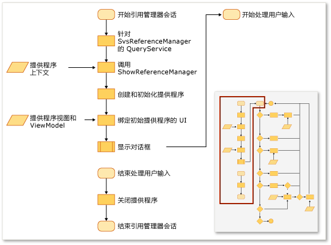
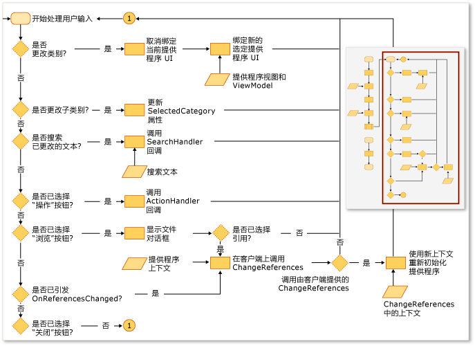

# 扩展引用管理器
可以通过 Visual Studio 扩展中的引用管理器将引用向项目添加引用。 在引用管理器出现之前，项目必须对它进行配置，以显示来自正确位置的数据。 例如，以 [!INCLUDE[net_v40_short](../misc/includes/net_v40_short_md.md)] 为目标的项目所填充的程序集必须来自与以 [!INCLUDE[net_v35_long](../misc/includes/net_v35_long_md.md)] 为目标的项目不同的文件夹。  
  
 通常使用来自下列提供程序的 ProviderContext 集合来配置引用管理器:  
  
-   <xref:Microsoft.VisualStudio.Shell.Interop.IVsAssemblyReferenceProviderContext>  
  
-   <xref:Microsoft.VisualStudio.Shell.Interop.IVsComReferenceProviderContext>  
  
-   <xref:Microsoft.VisualStudio.Shell.Interop.IVsFileReferenceProviderContext>  
  
-   <xref:Microsoft.VisualStudio.Shell.Interop.IVsProjectReferenceProviderContext>  
  
-   <xref:Microsoft.VisualStudio.Shell.Interop.IVsPlatformReferenceProviderContext>  
  
 客户端组件通过在名为 SVsReferenceManager 的 Visual Studio 服务上调用 ShowReferenceManager 方法来显示引用管理器。 IVsReferenceProviderContext 类的集合作为参数传递给此方法。 这些上下文确定哪些选项卡将显示于引用管理器对话框的左侧。 每个提供程序均包含此对话框的所有必要信息，这些信息用于填充和显示向项目添加引用所需的数据。  
  
 下图是对此过程的总结。  
  
   
  
   
  
## 创建自定义选项卡  
 若要添加自定义选项卡，则必须实现 IReferenceProvider、IVsReference 和 IVsReferenceProviderContext。  
  
#### 添加自定义选项卡  
  
1.  实现 IReferenceProvider 接口，然后通过 Managed Extensibility Framework \(MEF\) 将其导出供引用管理器使用。  
  
     引用管理器使用 ReferenceProvider 对象生成会在引用管理器中显示的项。 Microsoft.VisualStudio.ReferenceManager.Contracts.dll 中会定义该对象的接口。  
  
2.  实现 ProviderContext 对象。  
  
     引用管理器使用此对象的 GUID 属性使该上下文与提供程序相匹配。 引用管理器在初始化时，将向此提供程序传递通过 ShowReferenceManager 方法传入的 ProviderContext。 ProviderContext 应包含提供程序枚举 IVsReferences 所需的所有信息。  
  
3.  扩展 StandardReferenceProviderContext 类。  
  
     引用管理器将提供一些可用于开始操作的基类，例如 StandardReferenceProviderContext 类。 提供程序类可以扩展 StandardReferenceProvider，并且引用项可以扩展 StandardReferenceItem。  
  
 提供程序类可能与下例相似：  
  
```  
[Export(typeof(IReferenceProvider))] [ExportMetadata("Name", "AssemblyReferenceProvider")] [ExportMetadata("Guid", VSConstants.AssemblyReferenceProvider_string)] internal class AssemblyReferenceProvider : StandardReferenceProvider { }  
```  
  
 上下文类可能与下例相似：  
  
```  
  
[Export(typeof(IVsReferenceProviderContext))] [Export(typeof(IVsAssemblyReferenceProviderContext))] [Export("AssemblyReferenceProviderContext", typeof(IVsReferenceProviderContext))] [Export(VSConstants.AssemblyReferenceProvider_string, typeof(IVsReferenceProviderContext))] [PartCreationPolicy(System.ComponentModel.Composition.CreationPolicy.NonShared)] [ExportMetadata("Name", "AssemblyReferenceProviderContext")] [ExportMetadata("Guid", VSConstants.AssemblyReferenceProvider_string)] public class AssemblyReferenceProviderContext : StandardReferenceProviderContext<IVsAssemblyReference, AssemblyIdentity>, IVsAssemblyReferenceProviderContext { }  
```  
  
 对于引用项类，建议你实现 IWatchableReference 并且使类可序列化。 按照这种方法，不仅可以通过 ReferenceWatcher 服务自动同步对话框中各选项卡的项检查，还可以利用 StandardReferenceProvider 类中的缓存序列化方法：  
  
```  
[Serializable] public class StandardReferenceItem : IWatchableReference { }  
```  
  
 ReferenceProvider 类包含两种重要方法。 第一种方法是 Initialize，仅在将提供程序首次加载到对话框中时对其调用一次。 第二种方法是 SetContext，其在 Initialize 后立即调用该方法，但如果项目系统未能添加你所指定并尝试提交的任何引用，则还可以再次调用。  
  
> [!NOTE]
>  由于提供程序的持续时间为程序的持续时间，因此它们可以保存会话之间的状态；但如果用户关闭对话框，然后又快速重新打开，将会出现争用条件。  
  
## 替代选项卡枚举的现有源  
 某些提供程序上下文具有一个名为“Tabs”且类型为 uint 的属性。 此属性是一个位掩码，其值控制提供程序显示的选项卡。  例如，IVsAssemblyReferenceProviderContext 接口定义“选项卡”属性，可将其设置为以下值:  
  
```  
namespace Microsoft.VisualStudio.Shell.Interop { public enum __VSASSEMBLYPROVIDERTAB { TAB_ASSEMBLY_FRAMEWORK = 1, TAB_ASSEMBLY_EXTENSIONS = 2, TAB_ASSEMBLY_ALL = 3, } }  
```  
  
 IVsPlatformReferenceProviderContext 类具有类似的属性。 不能更改选项卡名，但可以控制用户选择选项卡时显示的标题文本。 可以通过以下方法控制 IVsAssemblyProviderContext 类上的此值：  
  
```  
void SetTabTitle(uint etabId, string szTabTitle);  
```  
  
## 替代“浏览”对话框中的筛选器  
 更改 IFileReferenceProviderContext 对象上 BrowseFilter 属性的值，便可向引用管理器中的“浏览”对话框提供自定义类型筛选器。  下面的示例演示本机代码中的这种方法：  
  
```  
  
// Holds a list of provider contexts CComSafeArray<LPUNKNOWN> spProviderContexts; // Creates the file reference context for Browse vsReferenceManager->CreateProviderContext(GUID_FileReferenceProvider, &pFileRefProviderContext)); // Sets the Browse filter pFileRefProviderContext->put_BrowseFilter(wszFilter); spProviderContexts.Add(pFileRefProviderContext); // Show the reference manager hr = srpRefMgr->ShowReferenceManager( spVsRefMgrUser, spProviderContexts, strTitle, HELPKEYWORD_AddReference, GUID_AssemblyReferenceProvider, wszFilter, m_bstrStartBrowse);  
```  
  
## 请参阅  
 [如何：使用引用管理器添加或移除引用](../Topic/How%20to:%20Add%20or%20Remove%20References%20By%20Using%20the%20Reference%20Manager.md)