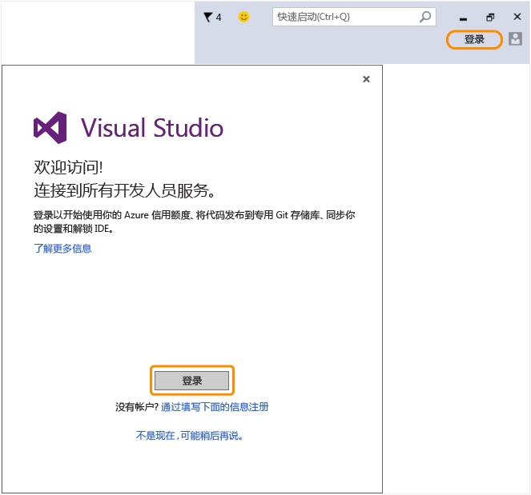

# 返回 Visual Studio 以使用新的 Microsoft 帐户登录到 IDE！
已成功创建 Microsoft 帐户。 返回到 Visual Studio，并在首次启动期间从欢迎使用向导登陆，或随时从 IDE 右上角登陆。  
  
 登录到 IDE 以开始使用你的 Azure 信用额度、将代码发布到专用 Git 存储库、同步你的设置和解锁 IDE。[了解更多](../Topic/Signing%20in%20to%20Visual%20Studio.md)有关全部可用开发人员服务的信息。  
  
 