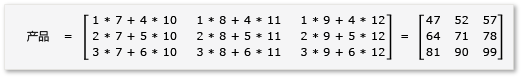
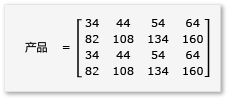

# 演练：矩阵乘法
[!INCLUDE[vs2017banner](../../assembler/inline/includes/vs2017banner.md)]

此分步演练演示如何使用 C\+\+ AMP 加速矩阵相乘的执行。  给出两个算法，一个不使用 tiling 另一个使用 tiling。  
  
## 系统必备  
 开始前  
  
-   读取 [C\+\+ AMP 概述](../../parallel/amp/cpp-amp-overview.md)。  
  
-   读取 [使用平铺](../../parallel/amp/using-tiles.md)。  
  
-   请确保在此计算机中安装了 [!INCLUDE[win7](../../build/includes/win7_md.md)], [!INCLUDE[win8](../../build/includes/win8_md.md)], [!INCLUDE[winsvr08_r2](../Token/winsvr08_r2_md.md)] 或 [!INCLUDE[winserver8](../../build/includes/winserver8_md.md)] 系统.  
  
### 创建项目  
  
1.  在 Visual Studio 的菜单栏上，依次选择**“文件”**、**“新建”**、**“项目”**。  
  
2.  在**“已安装”**的模板窗格下，选择**“Visual C\+\+”**。  
  
3.  选择 **空项目**, 在 **名称** 栏输入 `MatrixMultiply`，然后点击 **确定** 按钮.  
  
4.  选择**“下一步”**按钮。  
  
5.  在**“解决方案资源管理器”**中，打开**源文件**的快捷菜单，然后依次选择**“添加”**、**“新项目”**。  
  
6.  在 **添加新项目** 对话框中，选择 **C\+\+ 文件 \(.cpp\)**，在 **名称** 栏输入 `MatrixMultiply.cpp` ，然后点击 **添加** 按钮.  
  
## 不使用 tiling 的乘法  
 在本节中，请考虑两个矩阵 A 和 B相乘，定义如下：  
  
   
  
   
  
 A 是 3 x 2 矩阵，B 是 2 x 3 矩阵。  A 乘 B 的结果是下面的 3 x 3 矩阵。  该结果是由 A 的每个行元素与 B 的每个列元素相乘计算出来的。  
  
   
  
### 不使用 C\+\+ AMP  
  
1.  打开 MatrixMultiply.cpp 并使用下面的代码替换现有代码。  
  
    ```cpp  
  
    #include <iostream>  
  
    void MultiplyWithOutAMP() {  
  
        int aMatrix[3][2] = {{1, 4}, {2, 5}, {3, 6}};  
        int bMatrix[2][3] = {{7, 8, 9}, {10, 11, 12}};  
        int product[3][3] = {{0, 0, 0}, {0, 0, 0}, {0, 0, 0}};  
  
        for (int row = 0; row < 3; row++) {  
            for (int col = 0; col < 3; col++) {  
                // Multiply the row of A by the column of B to get the row, column of product.  
                for (int inner = 0; inner < 2; inner++) {  
                    product[row][col] += aMatrix[row][inner] * bMatrix[inner][col];  
                }  
                std::cout << product[row][col] << "  ";  
            }  
            std::cout << "\n";  
        }  
    }  
  
    void main() {  
        MultiplyWithOutAMP();  
        getchar();  
    }  
  
    ```  
  
     此算法是矩阵相乘定义的一个简单的实现。  它不使用任何并行或多线程的算法减少计算时间。  
  
2.  在菜单栏上，依次选择“文件”、“全部保存”。  
  
3.  选择F5键盘快捷键打开调试并验证输出是否正确。  
  
4.  点击 enter 键退出应用程序。  
  
### 使用 C\+\+ AMP  
  
1.  在 MatrixMultiply.cpp 中，在 `main` 方法之前加入下面的代码.  
  
    ```cpp  
  
    void MultiplyWithAMP() {  
        int aMatrix[] = { 1, 4, 2, 5, 3, 6 };  
        int bMatrix[] = { 7, 8, 9, 10, 11, 12 };  
        int productMatrix[] = { 0, 0, 0, 0, 0, 0, 0, 0, 0 };  
  
        array_view<int, 2> a(3, 2, aMatrix);  
        array_view<int, 2> b(2, 3, bMatrix);  
        array_view<int, 2> product(3, 3, productMatrix);  
  
        parallel_for_each(  
            product.extent,   
             [=](index<2> idx) restrict(amp) {  
                int row = idx[0];  
                int col = idx[1];  
                for (int inner = 0; inner < 2; inner++) {  
                    product[idx] += a(row, inner) * b(inner, col);  
                }  
            }  
        );  
  
        product.synchronize();  
  
        for (int row = 0; row < 3; row++) {  
            for (int col = 0; col < 3; col++) {  
                //std::cout << productMatrix[row*3 + col] << "  ";  
                std::cout << product(row, col) << "  ";  
            }  
            std::cout << "\n";  
        }  
    }  
  
    ```  
  
     AMP 代码类似于非 AMP 代码。  调用 `parallel_for_each` 为每一个元素在 `product.extent` 中开启了一个线程，并替换了以行列为基础的 `for` 循环.  在 `idx` 中每行和每列的元素的值是有效的.  您可以通过 `[]` 操作符以及一个索引值变量或 `()` 操作符以及行列值变量来访问 `array_view` 数组对象中的元素.  下面的示例演示这两个方法。  `array_view::synchronize` 方法复制了`product` 变量回退到 `productMatrix` 变量的值.  
  
2.  在 MatrixMultiply.cpp 顶部添加以下 `include` 和 `using` 语句。  
  
    ```cpp  
  
    #include <amp.h>  
    using namespace concurrency;  
  
    ```  
  
3.  修改 `main`方法以调用 `MultiplyWithAMP` 方法。  
  
    ```cpp  
  
    void main() {  
        MultiplyWithOutAMP();  
        MultiplyWithAMP();  
        getchar();  
    }  
  
    ```  
  
4.  选择F5键盘快捷键打开调试并验证输出是否正确。  
  
5.  点击空格键退出应用程序。  
  
## 使用 tiling 乘法  
 平铺（tiling）是一项将你的数据分成同等大小的子集的技术，被叫做 tiles.  当您使用平铺（tiling）时，会有三样改变。  
  
-   您可以创建 `tile_static` 变量。  访问 `tile_static` 空间中的数据要比访问全局空间中的数据快得多。  `tile_static` 变量的实例为每个平铺而创建，且平铺中的所有线程都可以访问该变量。  平铺（tiling）的主要好处是访问 `tile_static` 获得的高性能。  
  
-   你可以在特定一行代码中调用 [tile\_barrier::wait](../Topic/tile_barrier::wait%20Method.md) 方法停止一个平铺中的所有线程.  若非调用 `tile_barrier::wait` 使得一个平铺（tiling）中的所有的线程在它们继续执行之前停止，您将无法确保线程的运行顺序。  
  
-   您可以访问既与整个 `array_view` 对象相对的又与平铺（tiling）相对的线程的索引。  使用本地索引可使您的代码更易阅读和调试。  
  
 在矩阵求积中要利用平铺（tiling）的优势，你的算法必须将矩阵分块，然后将每一块数据复制到 `tile_static` 变量中，从而加快访问速度。  在下面的示例中，该矩阵被划分为同等大小的子矩阵。  结果由子矩阵相乘而获得。  两个矩阵及其乘机在此示例中为：  
  
   
  
   
  
   
  
 矩阵分为四个 2x2 矩阵，定义如下：  
  
   
  
   
  
 现在 A 和 B 的乘积可以如下编写和计算：  
  
   
  
 由于从矩阵 `a` 到 `h` 都是 2x2 矩阵，所以它们所有的积以及所有积的和都是 2x2 矩阵.  如果 A\*B 是 4x4 矩阵，它们的工作方式也是一样的。  为快速检验算法，计算乘积中第一行和第一列元素的值。  在此示例中，结果将是 `ae + bg` 中第一行和第一列的元素的值.  您只是需要为没个单元计算 `ae` 和 `bg` 第一列、第一行的值。  `ae` 的值为 `1*1 + 2*5 = 11`。  `bg` 的值为 `3*1 + 4*5 = 23`。  最终值为 `11 + 23 = 34`,是正确的结果.  
  
 实现此算法，代码如下：  
  
-   在 `parallel_for_each` 调用中使用 `tiled_extent` 对象替换 `extent` 对象。  
  
-   在 `parallel_for_each` 调用中使用 `tiled_index` 对象替换 `index` 对象。  
  
-   创建 `tile_static` 变量以保存子矩阵.  
  
-   使用 `tile_barrier::wait` 方法停止进行子矩阵求积的线程.  
  
### 使用 AMP 和 tiling  
  
1.  在 MatrixMultiply.cpp 中，在 `main` 方法之前加入下面的代码.  
  
    ```cpp  
  
    void MultiplyWithTiling()  
    {  
        // The tile size is 2.  
        static const int TS = 2;  
  
        // The raw data.  
        int aMatrix[] =       { 1, 2, 3, 4, 5, 6, 7, 8, 1, 2, 3, 4, 5, 6, 7, 8 };  
        int bMatrix[] =       { 1, 2, 3, 4, 5, 6, 7, 8, 1, 2, 3, 4, 5, 6, 7, 8 };  
        int productMatrix[] = { 0, 0, 0, 0, 0, 0, 0, 0, 0, 0, 0, 0, 0, 0, 0, 0 };  
  
        // Create the array_view objects.  
        array_view<int, 2> a(4, 4, aMatrix);  
        array_view<int, 2> b(4, 4, bMatrix);  
        array_view<int, 2> product(4, 4, productMatrix);  
  
        // Call parallel_for_each by using  2x2 tiles.  
        parallel_for_each(product.extent.tile< TS, TS >(),  
            [=] (tiled_index< TS, TS> t_idx) restrict(amp)   
            {  
                // Get the location of the thread relative to the tile (row, col) and the entire array_view (rowGlobal, colGlobal).  
                int row = t_idx.local[0];   
                int col = t_idx.local[1];  
                int rowGlobal = t_idx.global[0];  
                int colGlobal = t_idx.global[1];  
                int sum = 0;  
  
                // Given a 4x4 matrix and a 2x2 tile size, this loop executes twice for each thread.  
                // For the first tile and the first loop, it copies a into locA and e into locB.  
                // For the first tile and the second loop, it copies b into locA and g into locB.  
                for (int i = 0; i < 4; i += TS) {  
                    tile_static int locA[TS][TS];  
                    tile_static int locB[TS][TS];  
                    locA[row][col] = a(rowGlobal, col + i);  
                    locB[row][col] = b(row + i, colGlobal);  
                    // The threads in the tile all wait here until locA and locB are filled.  
                    t_idx.barrier.wait();  
  
                    // Return the product for the thread. The sum is retained across  
                    // both iterations of the loop, in effect adding the two products  
                    // together, for example, a*e.  
                    for (int k = 0; k < TS; k++) {  
                        sum += locA[row][k] * locB[k][col];  
                    }  
  
                    // All threads must wait until the sums are calculated. If any threads  
                    // moved ahead, the values in locA and locB would change.        
                    t_idx.barrier.wait();  
                    // Now go on to the next iteration of the loop.            
                }  
  
                // After both iterations of the loop, copy the sum to the product variable by using the global location.  
                product[t_idx.global] = sum;  
        });  
  
            // Copy the contents of product back to the productMatrix variable.  
            product.synchronize();  
  
            for (int row = 0; row < 4; row++) {  
            for (int col = 0; col < 4; col++) {  
                // The results are available from both the product and productMatrix variables.  
                //std::cout << productMatrix[row*3 + col] << "  ";  
                std::cout << product(row, col) << "  ";  
            }  
            std::cout << "\n";  
        }  
  
    }  
  
    ```  
  
     此示例与不死用 tiling 的示例有明显差异。  代码使用以下概念步骤：  
  
    1.  将 `a` 中的 tile\[0,0\] 元素复制到 `locA` 中.  将 `b` 中的 tile\[0,0\] 元素复制到 `locB` 中.  注意到 `product` 是 tiled，与 `a` 和 `b` 不同.  因此您使用全局索引访问 `a, b`, 和 `product`.  调用 `tile_barrier::wait` 是至关重要的.  它将在 `locA` 以及 `locB` 都被填满时停止平铺（tile）中的线程.  
  
    2.  计算 `locA` 和 `locB` 的积并将结果存储到 `product` 中.  
  
    3.  将 `a` 中的 tile\[0,1\] 元素复制到 `locA` 中.  将 `b` 中的 tile\[1,0\] 元素复制到 `locB` 中.  
  
    4.  计算 `locA` 和 `locB` 的乘积并将其结果与 `product` 相加并存储到 product 中.  
  
    5.  tile\[0,0\] 求积完成。  
  
    6.  用同样方法计算其余 4 个 tiles.  没有特定的标示可以确定平铺（tiles）和线程的执行顺序。  在每个执行的线程中为每个平铺（tile）创建合适的 `tile_static` 变量，并调用 `tile_barrier::wait` 控制程序的运行.  
  
    7.  当严密检验算法时，您将注意到每个子矩阵被加载到 `tile_static` 内存中两次.  其中数据传输确实耗时。  然而，一旦数据已经存储在 `tile_static` 内存，访问该数据是非常快的.   由于计算结果时需要重复访问子矩阵的值，将得到一个整体性能的提升。  对于每个算法，找到最优算法和分块大小的试验是必须的。  
  
         在非 AMP 和非平铺（tile）示例中，需要从全局存储中访问 A 和 B 的每个元素 4 次才能计算出结果。  在平铺（tile）示例中，A 和 B 的每个元素需要从全局存储中访问 2 次以及从 `tile_static` 存储中访问4次才能计算出结果。  这不能获得性能的显著提高。  但是，如果 A 和 B 是 1024x1024 矩阵和分块大小为 16，性能将显著提高。  在此示例中，A 和 B 的每个元素将被复制到 `tile_static` 内存中 16 次并从 `tile_static` 内存中访问 1024 次。  
  
2.  像给出的一样调用 `MultiplyWithTiling` 方法，修改 main 方法。  
  
    ```cpp  
  
    void main() {  
        MultiplyWithOutAMP();  
        MultiplyWithAMP();  
        MultiplyWithTiling();  
        getchar();  
    }  
  
    ```  
  
3.  点击 Ctrl\+F5 键盘快捷方式打开调试并验证输出是否正确。  
  
4.  点击空格键退出应用程序。  
  
## 请参阅  
 [C\+\+ AMP \(C\+\+ Accelerated Massive Parallelism\)](../../parallel/amp/cpp-amp-cpp-accelerated-massive-parallelism.md)   
 [演练：调试 C\+\+ AMP 应用程序](../../parallel/amp/walkthrough-debugging-a-cpp-amp-application.md)