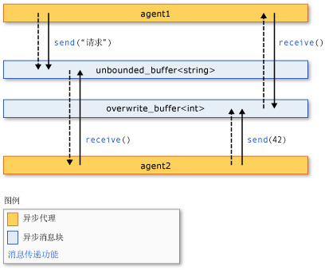

# <a name="asynchronous-agents-library"></a>异步代理库
异步代理库 (或仅仅称为*代理库*) 提供编程模型，你可以提高启用并发的应用程序开发的可靠性。 代理库是一个 c + + 模板库，以促进基于参与者的编程模型和进程内消息传递用于粗粒度数据流和管道任务。 代理库基于并发运行时的计划和资源管理组件。  
  
## <a name="programming-model"></a>编程模型  
 代理库通过让你通过基于数据流而不是控制流的异步通信模型连接隔离的组件提供替代项为共享状态。 *数据流*指编程模型进行计算的所有必需的数据时都可用;*控制流*指按预设的顺序进行计算的编程模型。  
  
 数据流编程模型与*消息传递*这一概念相关，其中程序的独立组件通过发送消息相互通信。  
  
 代理库由三个组件组成：*异步代理*，*异步消息块*，和*消息传递函数*。 代理维护状态，并使用消息块和消息传递函数与另一个以及与外部组件进行通信。 消息传递函数使代理能够发送和接收消息与其他外部组件。 异步消息块存放消息，并使代理能够以同步方式进行通信。  
  
 下图显示了两个代理使用消息块和消息传递函数进行通信。 此图中，`agent1`发送一条消息到`agent2`使用[concurrency:: send](reference/concurrency-namespace-functions.md#send)函数和[concurrency:: unbounded_buffer](reference/unbounded-buffer-class.md)对象。 `agent2` 使用[concurrency:: receive](reference/concurrency-namespace-functions.md#receive)函数读取消息。 `agent2` 使用相同的方法将消息发送到`agent1`。 虚线的箭头表示代理之间的数据流。 实线箭头将代理连接到它们写入或读取的消息块。  
  
   
  
 实现此图中的代码示例是在本主题后面所示。  
  
 代理编程模型具有几大优势，其他并发和同步机制，例如，事件。 一个优点是，使用消息传递来传输对象之间的状态更改，你可以隔离对共享资源的访问，从而提高可伸缩性。 消息传递到一个优点是它会绑定到数据而不是绑定到外部同步对象的同步。 这样可简化组件间的数据传输，并可以消除在应用程序的编程错误。  
  
## <a name="when-to-use-the-agents-library"></a>何时使用代理库  
 当你有必须相互之间进行异步通信的多个操作，请使用代理库。 消息块和消息传递函数可使你无需同步机制，例如锁编写并行应用程序。 这样，你专注于应用程序逻辑。  
  
 代理编程模型通常用于创建*数据管线*或*网络*。 数据管道是一系列组件，其中每个执行一个参与更大目标的特定任务。 在其他组件中接收消息时，在数据流管道中的每个组件执行工作。 该工作的结果传递给管道或网络中的其他组件。 组件可以使用更细化的并发功能从其他库，例如，[并行模式库 (PPL)](../../parallel/concrt/parallel-patterns-library-ppl.md)。  
  
## <a name="example"></a>示例  
 下面的示例实现本主题前面的以下图示。  
  
 [!code-cpp[concrt-basic-agents#1](../../parallel/concrt/codesnippet/cpp/asynchronous-agents-library_1.cpp)]  
  
 该示例产生下面的输出：  
  
```Output  
agent1: sending request...  
agent2: received 'request'.  
agent2: sending response...  
agent1: received '42'.  
```  
  
 以下主题描述了此示例中使用的功能。  
  
## <a name="related-topics"></a>相关主题  
 [异步代理](../../parallel/concrt/asynchronous-agents.md)  
 介绍在解决更大的计算任务的异步代理角色。  
  
 [异步消息块](../../parallel/concrt/asynchronous-message-blocks.md)  
 描述由代理库提供的各种消息块类型。  
  
 [消息传递函数](../../parallel/concrt/message-passing-functions.md)  
 描述由代理库提供的各种消息传递例程。  
  
 [如何：实现各种制造者-使用者模式](../../parallel/concrt/how-to-implement-various-producer-consumer-patterns.md)  
 描述如何在你的应用程序中实现制造者-使用者模式。  
  
 [如何：为 call 和 transformer 类提供工作函数](../../parallel/concrt/how-to-provide-work-functions-to-the-call-and-transformer-classes.md)  
 演示通过多种方法提供工作函数[concurrency:: call](../../parallel/concrt/reference/call-class.md)和[concurrency:: transformer](../../parallel/concrt/reference/transformer-class.md)类。  
  
 [如何：在数据管道中使用转换器](../../parallel/concrt/how-to-use-transformer-in-a-data-pipeline.md)  
 演示如何使用[concurrency:: transformer](../../parallel/concrt/reference/transformer-class.md)在数据管道中的类。  
  
 [如何：在已完成的任务之间选择](../../parallel/concrt/how-to-select-among-completed-tasks.md)  
 演示如何使用[concurrency:: choice](../../parallel/concrt/reference/choice-class.md)和[concurrency:: join](../../parallel/concrt/reference/join-class.md)类选择用于完成搜索算法的第一个任务。  
  
 [如何：定期发送消息](../../parallel/concrt/how-to-send-a-message-at-a-regular-interval.md)  
 演示如何使用[concurrency:: timer](../../parallel/concrt/reference/timer-class.md)类定期发送一条消息。  
  
 [如何：使用消息块筛选器](../../parallel/concrt/how-to-use-a-message-block-filter.md)  
 演示如何使用筛选器启用异步消息块接受或拒绝的消息。  
  
 [并行模式库 (PPL)](../../parallel/concrt/parallel-patterns-library-ppl.md)  
 描述如何在你的应用程序中使用各种并行模式，如并行算法。  
  
 [并发运行时](../../parallel/concrt/concurrency-runtime.md)  
 描述可以简化并发编程并包含相关主题链接的并发运行时。

