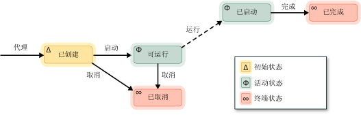

# 异步代理

*异步代理*(或仅*代理*) 是以异步方式与其他代理一起解决较大的计算任务的应用程序组件。 将代理视为具有设定的生命周期的任务。 例如，一个代理可能会读取输入/输出设备 （例如键盘、 文件在磁盘上或网络连接） 和另一个代理中的数据可能会对数据执行操作的变得可用。 第一个代理使用消息传递通知的第二个代理更多数据可用。 并发运行时任务计划程序提供一个有效的机制来启用代理来阻止和以协作方式运行，而无需效率较低的抢占。

代理库定义[concurrency:: agent](../../parallel/concrt/reference/agent-class.md)类来表示异步代理。 `agent` 是一个声明虚拟方法的抽象类[2&gt;concurrency::agent::run&lt;2}](reference/agent-class.md#run)。 `run`执行代理执行的任务的方法。 因为`run`是抽象的您必须实现此方法在每个类都派生自`agent`。

## 代理生命周期

代理具有设定的生命周期。 [Concurrency:: agent_status](reference/concurrency-namespace-enums.md#agent_status)枚举定义代理的各种状态。 下图是显示了代理如何从一个状态到另一个状态图。 在此图中，实线表示从应用程序; 调用的方法点线表示从运行时调用的方法。

下表描述了中的每个状态`agent_status`枚举。

|代理状态|描述|
|-----------------|-----------------|
|`agent_created`|代理已计划，不执行。|
|`agent_runnable`|在运行时计划用于执行代理。|
|`agent_started`|该代理已启动并正在运行。|
|`agent_done`|代理已完成。|
|`agent_canceled`|代理已被取消之前进入`started`状态。|

`agent_created` 是一个代理的初始状态`agent_runnable`并`agent_started`是活动状态，并`agent_done`和`agent_canceled`终止状态。

使用[concurrency::agent::status](reference/agent-class.md#status)方法来检索其中的当前状态`agent`对象。 尽管`status`方法是并发安全的代理的状态可能会发生变化时`status`方法返回。 例如，代理可能是在`agent_started`状态时调用`status`方法，但移动到`agent_done`之后状态`status`方法返回。

## 方法和功能

下表显示了一些重要的方法属于`agent`类。 有关所有详细信息`agent`类的方法，请参阅[agent 类](../../parallel/concrt/reference/agent-class.md)。

|方法|描述|
|------------|-----------------|
|[start](reference/agent-class.md#start)|计划`agent`对象的执行并将其设置为`agent_runnable`状态。|
|[run](reference/agent-class.md#run)|执行该任务是由执行任务`agent`对象。|
|[完成](reference/agent-class.md#done)|将移动到代理`agent_done`状态。|
|[取消](../../parallel/concrt/cancellation-in-the-ppl.md#cancel)|如果未启动代理，此方法取消执行代理，并将其设置为`agent_canceled`状态。|
|[status](reference/agent-class.md#status)|检索当前状态的`agent`对象。|
|[等待](reference/agent-class.md#wait)|等待`agent`输入对象`agent_done`或`agent_canceled`状态。|
|[wait_for_all](reference/agent-class.md#wait_for_all)|等待所有提供`agent`对象进入`agent_done`或`agent_canceled`状态。|
|[wait_for_one](reference/agent-class.md#wait_for_one)|等待至少一个提供`agent`对象进入`agent_done`或`agent_canceled`状态。|

创建代理对象后，调用[concurrency::agent::start](reference/agent-class.md#start)方法来执行计划。 运行时调用`run`方法后它计划代理并将其设置为`agent_runnable`状态。

在运行时不会管理异步代理引发的异常。 有关异常处理和代理的详细信息，请参阅[异常处理](../../parallel/concrt/exception-handling-in-the-concurrency-runtime.md)。

## 示例

有关演示如何创建基本的基于代理的应用程序的示例，请参阅[演练： 创建基于代理的应用程序](../../parallel/concrt/walkthrough-creating-an-agent-based-application.md)。

## 请参阅

[异步代理库](../../parallel/concrt/asynchronous-agents-library.md)

