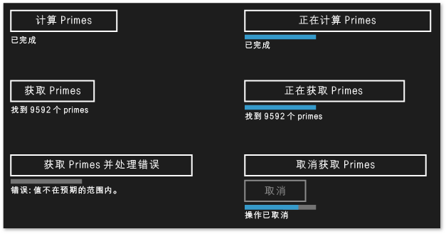
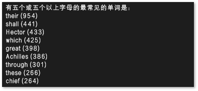

# 为 UWP 应用创建 c + + 异步操作

本文档介绍当你在通用 Windows 运行时（UWP）应用中使用任务类生成基于 Windows 线程池的异步操作时要记住的一些要点。

使用异步编程是 Windows 运行时应用程序模型中的一个关键组件，因为它可让应用程序保持对用户输入的响应。 可以启动长期运行的任务，而不必阻止 UI 线程，并且可以在以后接收任务的结果。 也可以在任务在后台运行时取消任务和接收进度通知。 文档[c + + 中的异步编程](/windows/uwp/threading-async/asynchronous-programming-in-cpp-universal-windows-platform-apps)提供了可在 Visual C++ 中创建 UWP 应用的异步模式的概述。 该文档讲授如何使用和创建异步 Windows 运行时操作链。 本部分介绍如何使用 ppltasks.h 中的类型生成可供另一个 Windows 运行时组件使用的异步操作，以及如何控制异步工作的执行方式。 还应考虑[在 Hilo （使用 c + + 和 xaml 的 Windows 应用商店应用）中读取异步编程模式和提示](/previous-versions/windows/apps/jj160321(v=win.10))，以了解我们如何在 Hilo （使用 c + + 和 xaml 的 Windows 运行时应用中使用任务类实现异步操作。

> [!NOTE]
> 可以在 UWP 应用中使用[并行模式库](../../parallel/concrt/parallel-patterns-library-ppl.md)（PPL）和[异步代理库](../../parallel/concrt/asynchronous-agents-library.md)。 但是，不能使用任务计划程序或资源管理器。 本文档介绍 PPL 提供的附加功能，这些功能仅适用于 UWP 应用，不适用于桌面应用。

## 要点

- 使用 [concurrency::create_async](reference/concurrency-namespace-functions.md#create_async) 来创建可供其他组件（可能用除 C++ 之外的语言编写）使用的异步操作。

- 使用 [concurrency::progress_reporter](../../parallel/concrt/reference/progress-reporter-class.md) 向调用您的异步操作的组件报告进程通知。

- 使用取消标记实现内部异步操作的取消。

- `create_async` 函数的行为取决于传递给它的工作函数的返回类型。 返回任务（ `task<T>` 或 `task<void>`）的工作函数在调用了 `create_async`的上下文中同步运行。 `T` **`void`** 在任意上下文中返回或运行的工作函数。

- 可以使用 [concurrency::task::then](reference/task-class.md#then) 方法创建一个可依次运行的任务链。 在 UWP 应用中，任务延续的默认上下文取决于该任务的构造方式。 如果是通过向任务构造函数传递异步操作，或通过传递可返回异步操作的 lambda 表达式创建的任务，那么此任务所有延续的默认上下文是当前上下文。 如果任务不是从异步操作构造的，则默认情况下会对任务的延续使用任意上下文。 可以用 [concurrency::task_continuation_context](../../parallel/concrt/reference/task-continuation-context-class.md) 类重写默认上下文。

## 本文档内容

- [创建异步操作](#create-async)

- [示例：创建 C++ Windows 运行时组件](#example-component)

- [控制执行线程](#exethread)

- [示例：使用 c + + 和 XAML 在 Windows 运行时应用中控制执行](#example-app)

##  创建异步操作

可以使用并行模式库 (PPL) 中的任务和延续模型定义后台任务以及上一任务完成时要运行的其他任务。 这个功能由 [concurrency::task](../../parallel/concrt/reference/task-class.md) 类提供。 有关此模型和 `task` 类的详细信息，请参阅 [Task Parallelism](../../parallel/concrt/task-parallelism-concurrency-runtime.md)的上下文中同步运行。

Windows 运行时是一种编程接口，可用于创建只在特殊操作系统环境中运行的 UWP 应用。 此类应用使用已授权的功能、数据类型和设备，并从 Microsoft Store 分发。 Windows 运行时由*应用程序二进制接口*（ABI）表示。 ABI 是一种基础二进制协定，它使 Windows 运行时 Api 可供 Visual C++ 等编程语言使用。

通过使用 Windows 运行时，你可以使用各种编程语言的最佳功能并将它们合并到一个应用中。 例如，可以在 JavaScript 中创建 UI，在 C++ 组件中执行计算密集型应用程序逻辑。 在后台执行这些计算密集型操作的能力是使 UI 保持响应状态的一个关键因素。 因为 `task` 类是 c + + 所特有的，所以必须使用 Windows 运行时接口将异步操作传达给其他组件（可能用除 c + + 之外的语言编写）。 Windows 运行时提供了四个接口，可用于表示异步操作：

[Windows::Foundation::IAsyncAction](/uwp/api/windows.foundation.iasyncaction) 
表示异步操作。

[Windows：： Foundation：： Iasyncactionwithprogress<tprogress>\<TProgress>](/uwp/api/windows.foundation.iasyncactionwithprogress-1) 
表示报告进度的异步操作。

[Windows：： Foundation：： Iasyncoperation<tresult>\<TResult>](/uwp/api/windows.foundation.iasyncoperation-1) 
表示返回结果的异步操作。

[Windows：： Foundation：： IAsyncOperationWithProgress\<TResult, TProgress>](/uwp/api/windows.foundation.iasyncoperationwithprogress-2) 
表示返回结果并报告进度的异步操作。

*操作*的概念是指异步任务不生成值（可考虑返回的函数 **`void`** ）。 *操作* 的概念是指异步任务确实会生成值。 *进程* 的概念是指任务可以向调用方报告进程消息。 JavaScript、.NET Framework 和 Visual C++ 均提供自己的方式来创建这些接口的实例，以便跨 ABI 边界使用。 对于 Visual C++，PPL 提供 [concurrency::create_async](reference/concurrency-namespace-functions.md#create_async) 函数。 此函数创建一个 Windows 运行时异步操作或表示任务完成的操作。 `create_async`函数采用一个工作函数（通常是 lambda 表达式），在内部创建一个 `task` 对象，并将该任务包装到四个异步 Windows 运行时接口之一中。

> [!NOTE]
> `create_async`仅在必须创建可从另一语言或另一个 Windows 运行时组件访问的功能时使用。 当知道操作是由 C++ 代码在同一组件中生成和使用时，可以直接使用 `task` 类。

`create_async` 的返回类型由其参数的类型决定。 例如，如果工作函数不返回值并且不报告进度，则 `create_async` 返回 `IAsyncAction`。 如果工作函数不返回值，但还会报告进度，则 `create_async` 返回 `IAsyncActionWithProgress`。 若要报告进度，请提供 [concurrency::progress_reporter](../../parallel/concrt/reference/progress-reporter-class.md) 对象作为工作函数的参数。 报告进度的能力使您能够报告已执行的工作量和仍然剩余的工作量（比如以百分比表示）。 还可以使您在结果可用时报告结果。

`IAsyncAction`、 `IAsyncActionWithProgress<TProgress>`、 `IAsyncOperation<TResult>`和 `IAsyncActionOperationWithProgress<TProgress, TProgress>` 接口均提供可以使您取消异步操作的 `Cancel` 方法。 `task` 类与取消标记一起使用。 当使用取消标记来取消工作时，运行时不会启动订阅此标记的新工作。 已处于活动状态的工作会监控其取消标记并在可能时停止。 文档 [Cancellation in the PPL](cancellation-in-the-ppl.md)中更详细地介绍了这种机制。 可以通过两种方式将任务取消与 Windows 运行时 `Cancel` 方法连接。 首先，可以定义传递给 `create_async` 的工作函数以采用 [concurrency::cancellation_token](../../parallel/concrt/reference/cancellation-token-class.md) 对象。 `Cancel`调用方法时，将取消此取消标记，并将常规取消规则应用于 `task` 支持调用的基础对象 `create_async` 。 如果没有提供 `cancellation_token` 对象，则基础 `task` 对象会隐式定义一个。 在需要以协作方式响应工作函数中的取消时，可定义一个 `cancellation_token` 对象。 部分[示例：使用 c + + 和 xaml 在 Windows 运行时应用中控制执行](#example-app)的示例演示如何使用 c # 和 XAML （使用自定义的 Windows 运行时 c + + 组件）在通用 WINDOWS 平台（UWP）应用中执行取消操作。

> [!WARNING]
> 在任务延续链中，当取消标记被取消时，请始终清理状态，然后调用[concurrency：： cancel_current_task](reference/concurrency-namespace-functions.md#cancel_current_task) 。 如果是提早返回而不是调用 `cancel_current_task`，则操作将转换为已完成状态而非已取消状态。

下表总结了在应用程序中可用于定义异步操作的组合。

|创建此 Windows 运行时接口|请从 `create_async`返回此类型|将这些参数类型传递给您的工作函数以使用隐式取消标记|将这些参数类型传递给您的工作函数以使用显式取消标记|
|----------------------------------------------------------------------------------|------------------------------------------|--------------------------------------------------------------------------------------------|--------------------------------------------------------------------------------------------|
|`IAsyncAction`|**`void`** 或`task<void>`|（无）|(`cancellation_token`)|
|`IAsyncActionWithProgress<TProgress>`|**`void`** 或`task<void>`|(`progress_reporter`)|(`progress_reporter`, `cancellation_token`)|
|`IAsyncOperation<TResult>`|`T` 或 `task<T>`|（无）|(`cancellation_token`)|
|`IAsyncActionOperationWithProgress<TProgress, TProgress>`|`T` 或 `task<T>`|(`progress_reporter`)|(`progress_reporter`, `cancellation_token`)|

可以从传递给 `task` 函数的工作函数返回一个值或一个 `create_async` 对象。 这些变体会产生不同的行为。 当返回一个值时，工作函数会包装到 `task` 中，以使其可在后台线程上运行。 此外，基础 `task` 使用隐式取消标记。 相反，如果返回 `task` 对象，则工作函数会同步运行。 因此，如果返回 `task` 对象，请确保工作函数中的任何较长操作作为任务运行，以使应用程序能够保持响应状态。 此外，基础 `task` 不使用隐式取消标记。 因此，在从 `cancellation_token` 返回 `task` 对象时，如果需要取消支持，则需定义工作函数以采用 `create_async`对象。

下面的示例演示了创建 `IAsyncAction` 可由另一个 Windows 运行时组件使用的对象的各种方法。

[!code-cpp[concrt-windowsstore-primes#100](../../parallel/concrt/codesnippet/cpp/creating-asynchronous-operations-in-cpp-for-windows-store-apps_1.cpp)]

## 示例：创建 c + + Windows 运行时组件并从 C 使用它\#

假设某个应用使用 XAML 和 c # 定义 UI，使用 c + + Windows 运行时组件来执行计算密集型操作。 在此示例中，C++ 组件会计算给定范围中的哪些数字是质数。 为了说明这四个 Windows 运行时异步任务接口之间的差异，请在 Visual Studio 中创建一个**空的解决方案**并对其进行命名，开始 `Primes` 。 然后在解决方案中添加一个“Windows 运行时组件” **** 项目并命名为 `PrimesLibrary`。 将以下代码添加到生成的 C++ 标头文件中（本示例将 Class1.h 重命名为 Primes.h）。 每个 **`public`** 方法定义四个异步接口之一。 返回值的方法返回[Windows：： Foundation：：集合：： IVector \<int> ](/uwp/api/windows.foundation.collections.ivector-1)对象。 报告进度的方法生成的 **`double`** 值定义了已完成的整体工作的百分比。

[!code-cpp[concrt-windowsstore-primes#1](../../parallel/concrt/codesnippet/cpp/creating-asynchronous-operations-in-cpp-for-windows-store-apps_2.h)]

> [!NOTE]
> 按照约定，Windows 运行时中的异步方法名称通常以 "Async" 结尾。

将以下代码添加到生成的 C++ 标头文件中（本示例将 Class1.cpp 重命名为 Primes.cpp）。 `is_prime` 函数将确定其输入是否为质数。 剩余方法实现 `Primes` 类。 对 `create_async` 的每次调用将使用一个与调用它的方法兼容的签名。 例如，因为 `Primes::ComputePrimesAsync` 返回 `IAsyncAction`，提供给 `create_async` 的工作函数不返回值并且不采用 `progress_reporter` 对象作为其参数。

[!code-cpp[concrt-windowsstore-primes#2](../../parallel/concrt/codesnippet/cpp/creating-asynchronous-operations-in-cpp-for-windows-store-apps_3.cpp)]

每个方法首先执行验证以确保输入参数为非负值。 如果输入值为负，则方法会引发 [Platform::InvalidArgumentException](../../cppcx/platform-invalidargumentexception-class.md)。 本节后面部分会对错误处理进行说明。

若要从 UWP 应用中使用这些方法，请使用 Visual c # "**空白应用（XAML）** " 模板将另一个项目添加到 Visual Studio 解决方案中。 此示例将项目命名为 `Primes`。 然后，从 `Primes` 项目中将一个引用添加到 `PrimesLibrary` 项目中。

将以下代码添加到 MainPage.xaml。 此代码定义了 UI，因此可以调用 C++ 组件并显示结果。

[!code-xml[concrt-windowsstore-primes#3](../../parallel/concrt/codesnippet/xaml/creating-asynchronous-operations-in-cpp-for-windows-store-apps_4.xaml)]

将以下代码添加到 MainPage.xaml 中的 `MainPage` 类中。 此代码定义了一个 `Primes` 对象和按钮事件处理程序。

[!code-cs[concrt-windowsstore-primes#4](../../parallel/concrt/codesnippet/csharp/creating-asynchronous-operations-in-cpp-for-windows-store-apps_5.cs)]

这些方法使用 `async` 和 `await` 关键字在异步操作完成后更新 UI。 有关 UWP 应用中的异步编码的信息，请参阅[线程处理和异步编程](/windows/uwp/threading-async)。

`getPrimesCancellation` 和 `cancelGetPrimes` 方法协同工作以使用户能够取消操作。 当用户选择 "**取消**" 按钮时， `cancelGetPrimes` 方法会调用[IAsyncOperationWithProgress \<TResult, TProgress> ：： cancel](/uwp/api/windows.foundation.iasyncinfo.cancel)来取消操作。 管理基础异步操作的并发运行时引发了一个内部异常类型，该类型由 Windows 运行时捕获，以传达取消操作已完成。 有关取消模型的详细信息，请参阅[取消](../../parallel/concrt/cancellation-in-the-ppl.md)。

> [!IMPORTANT]
> 若要使 PPL 正确地向 Windows 运行时报告它已取消操作，请不要捕捉此内部异常类型。 这意味着也不应捕捉所有异常 (`catch (...)`)。 如果必须捕获所有异常，请重新引发异常以确保 Windows 运行时可以完成取消操作。

下图显示了选定每个选项后的 `Primes` 应用。

有关使用 `create_async` 创建可供其他语言使用的异步任务的示例，请参阅[Bing 地图行程优化器示例中的使用 c + +](/previous-versions/windows/apps/hh699891(v=vs.140))。

## 控制执行线程

Windows 运行时使用 COM 线程模型。 在此模型中，根据对象处理其同步的方式，对象被托管在不同的单元中。 线程安全对象托管在多线程单元 (MTA) 中。 必须通过单个线程访问的对象托管在单线程单元 (STA) 中。

在具有 UI 的应用程序中，ASTA（应用程序 STA）线程负责发送窗口消息而且它是进程中唯一可以更新 STA 托管的 UI 控件的线程。 这会产生两种后果。 第一种是，要使应用程序保持响应状态，所有占用大量 CPU 的操作和 I/O 操作都不应在 ASTA 线程上运行。 第二种是，来自后台线程的结果都必须封送回 ASTA 以更新 UI。 在 c + + UWP 应用程序中， `MainPage` 和其他 XAML 页面都在 ATSA 上运行。 因此，在 ASTA 中声明的任务延续默认情况下也会在此运行，因此您可以在延续主体中直接更新控件。 但是，如果在另一个任务中嵌套任务，则此嵌套任务中的任何延续都在 MTA 中运行。 因此，您需要考虑是否显式指定这些延续在什么上下文中运行。

从异步操作创建的任务（如 `IAsyncOperation<TResult>`），使用了特殊语义，可以帮助您忽略线程处理详细信息。 虽然操作可能会在后台线程上运行（或者它可能根本不由线程支持），但其延续在默认情况下一定会在启动了延续操作的单元上运行（换言之，从调用了 `task::then`的单元运行）。 可以使用 [concurrency::task_continuation_context](../../parallel/concrt/reference/task-continuation-context-class.md) 类来控制延续的执行上下文。 使用这些静态帮助器方法来创建 `task_continuation_context` 对象：

- 使用 [concurrency::task_continuation_context::use_arbitrary](reference/task-continuation-context-class.md#use_arbitrary) 指定延续在后台线程上运行。

- 使用 [concurrency::task_continuation_context::use_current](reference/task-continuation-context-class.md#use_current) 指定延续在调用了 `task::then`的线程上运行。

可以将 `task_continuation_context` 对象传递给 [task::then](reference/task-class.md#then) 方法以显式控制延续的执行上下文，或者可以将任务传递给另一单元，然后调用 `task::then` 方法以隐式控制执行上下文。

> [!IMPORTANT]
> 由于 UWP 应用的主 UI 线程在 STA 下运行，因此在该 STA 中创建的延续默认情况下在 STA 上运行。 相应地，在 MTA 中创建的延续将在 MTA 中运行。

下面一节介绍一种应用程序，该应用程序从磁盘读取一个文件，查找该文件中最常见的单词，然后在 UI 中显示结果。 最终操作（更新 UI）将在 UI 线程上发生。

> [!IMPORTANT]
> 此行为特定于 UWP 应用。 对于桌面应用程序，您无法控制延续的运行位置。 相反，计划程序会选择要运行每个延续的辅助线程。

> [!IMPORTANT]
> 对于在 STA 中运行的延续的主体，请不要调用 [concurrency::task::wait](reference/task-class.md#wait) 。 否则，运行时会引发 [concurrency::invalid_operation](../../parallel/concrt/reference/invalid-operation-class.md) ，原因是此方法阻止当前线程并可能导致应用停止响应。 但是，你可以调用 [concurrency::task::get](reference/task-class.md#get) 方法来接收基于任务的延续中的先行任务的结果。

## 示例：使用 c + + 和 XAML 在 Windows 运行时应用中控制执行

假设有一个 C++ XAML 应用程序，该应用程序从磁盘读取一个文件，在该文件中查找最常见的单词，然后在 UI 中显示结果。 若要创建此应用程序，请在 Visual Studio 中创建一个**空白应用（通用 Windows）** 项目并对其命名 `CommonWords` 。 在应用程序清单中，指定“文档库” **** 功能以使应用程序能够访问“文档”文件夹。 同时将文本 (.txt) 文件类型添加到应用程序清单的声明部分。 有关应用功能和声明的详细信息，请参阅[Windows 应用的打包、部署和查询](/windows/win32/appxpkg/appx-portal)。

更新 MainPage.xaml 中的 `Grid` 元素，以包含 `ProgressRing` 元素和 `TextBlock` 元素。 `ProgressRing` 指示操作正在进行， `TextBlock` 显示计算的结果。

[!code-xml[concrt-windowsstore-commonwords#1](../../parallel/concrt/codesnippet/xaml/creating-asynchronous-operations-in-cpp-for-windows-store-apps_6.xaml)]

将以下 `#include` 语句添加到*pch*。

[!code-cpp[concrt-windowsstore-commonwords#2](../../parallel/concrt/codesnippet/cpp/creating-asynchronous-operations-in-cpp-for-windows-store-apps_7.h)]

将以下方法声明添加到 `MainPage` 类 (MainPage.h)。

[!code-cpp[concrt-windowsstore-commonwords#3](../../parallel/concrt/codesnippet/cpp/creating-asynchronous-operations-in-cpp-for-windows-store-apps_8.h)]

将以下 **`using`** 语句添加到 MainPage。

[!code-cpp[concrt-windowsstore-commonwords#4](../../parallel/concrt/codesnippet/cpp/creating-asynchronous-operations-in-cpp-for-windows-store-apps_9.cpp)]

在 MainPage.cpp 中，实现 `MainPage::MakeWordList`、 `MainPage::FindCommonWords`和 `MainPage::ShowResults` 方法。 `MainPage::MakeWordList` 和 `MainPage::FindCommonWords` 执行计算密集型操作。 `MainPage::ShowResults` 方法在 UI 中显示计算的结果。

[!code-cpp[concrt-windowsstore-commonwords#5](../../parallel/concrt/codesnippet/cpp/creating-asynchronous-operations-in-cpp-for-windows-store-apps_10.cpp)]

修改 `MainPage` 构造函数，以创建一个在 UI 中显示荷马的 *伊利亚特* 一书中常见单词的延续任务链。 前两个延续任务会将文本拆分为单个词并查找常见词，这会非常耗时，因此将其显式设置为在后台运行。 最终延续任务（即更新 UI）不指定延续上下文，因此遵循单元线程处理规则。

[!code-cpp[concrt-windowsstore-commonwords#6](../../parallel/concrt/codesnippet/cpp/creating-asynchronous-operations-in-cpp-for-windows-store-apps_11.cpp)]

> [!NOTE]
> 此示例演示了如何指定执行上下文以及如何构成延续链。 回想一下，从异步操作创建的任务默认情况下在调用了 `task::then`的单元上运行其延续。 因此，此示例使用 `task_continuation_context::use_arbitrary` 来指定不涉及 UI 的操作在后台线程上执行。

下图显示 `CommonWords` 应用的结果。

在此示例中，可以支持取消操作，因为 `task` 支持的对象 `create_async` 使用了隐式取消标记。 如果您的任务需要以协作方式响应取消，则请定义您的工作函数以采用 `cancellation_token` 对象。 有关 PPL 中取消操作的详细信息，请参阅 [Cancellation in the PPL](cancellation-in-the-ppl.md)

## 另请参阅

[并发运行时](../../parallel/concrt/concurrency-runtime.md)
