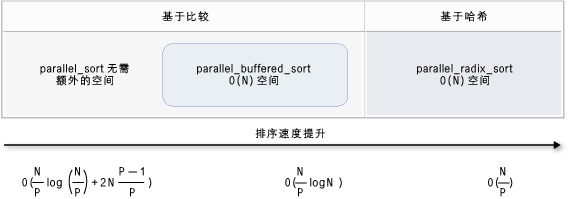

# <a name="parallel-algorithms"></a>并行算法

并行模式库（PPL）提供了同时对数据集合执行工作的算法。 这些算法类似于C++标准库提供的算法。

并行算法由并发运行时中的现有功能组成。 例如， [concurrency：:p arallel_for](reference/concurrency-namespace-functions.md#parallel_for)算法使用[concurrency：： structured_task_group](../../parallel/concrt/reference/structured-task-group-class.md)对象执行并行循环迭代。 给定`parallel_for`可用计算资源数量时，算法会以最佳方式对工作进行分区。

##  <a name="top"></a> 部分

- [Parallel_for 算法](#parallel_for)

- [Parallel_for_each 算法](#parallel_for_each)

- [Parallel_invoke 算法](#parallel_invoke)

- [Parallel_transform 和 parallel_reduce 算法](#parallel_transform_reduce)

    - [Parallel_transform 算法](#parallel_transform)

    - [Parallel_reduce 算法](#parallel_reduce)

    - [示例：并行执行映射和减少](#map_reduce_example)

- [分区工作](#partitions)

- [并行排序](#parallel_sorting)

    - [选择排序算法](#choose_sort)

##  <a name="parallel_for"></a>Parallel_for 算法

[Concurrency：:p arallel_for](reference/concurrency-namespace-functions.md#parallel_for)算法会重复执行相同的任务。 这些任务中的每一个都由迭代值参数化。 当某个循环体在该循环的迭代之间不共享资源时，此算法很有用。

`parallel_for`算法以最佳方式将任务分区以进行并行执行。 当工作负载不平衡时，此算法还会使用工作窃取算法和范围窃取来平衡这些分区。 当一个循环迭代以协作方式阻止时，运行时会将分配给当前线程的迭代范围重新分发给其他线程或处理器。 同样，当线程完成一定范围的迭代时，运行时会将其他线程的工作重新分配给该线程。 该`parallel_for`算法还支持*嵌套并行度*。 当一个并行循环包含另一个并行循环时，运行时将以一种高效的方式在循环主体之间协调处理资源。

`parallel_for` 算法有多个重载版本。 第一个版本采用开始值、结束值和工作函数（lambda 表达式、函数对象或函数指针）。 第二个版本采用一个起始值、一个结束值、一个要单步执行的值和一个工作函数。 此函数的第一个版本使用1作为步长值。 其余版本采用分区程序对象，使您能够指定 `parallel_for` 如何在线程之间对范围进行分区。 本文档中的[分区工作](#partitions)部分更详细地介绍了分区程序。

可以将多个`for`循环转换为`parallel_for`使用。 但是， `parallel_for`该算法在以下方面`for`与语句不同：

- 该`parallel_for` 算法`parallel_for`不按预先确定的顺序执行任务。

- 该`parallel_for`算法不支持任意终止条件。 当`parallel_for`迭代变量的当前值`last`小于时，该算法将停止。

- `_Index_type`类型参数必须是整型。 此整型类型可以是有符号或无符号。

- 循环迭代必须是转发。 如果`parallel_for` `_Step`参数小于1，则该算法将引发类型为[std：： invalid_argument](../../standard-library/invalid-argument-class.md)的异常。

- `parallel_for`算法的异常处理机制不同于`for`循环的异常处理机制。 如果并行循环主体中同时出现多个异常，则运行时会仅向调用`parallel_for`的线程传播其中一个异常。 此外，当一个循环迭代引发异常时，运行时不会立即停止整个循环。 相反，循环处于 "已取消" 状态，并且运行时放弃所有尚未启动的任务。 有关异常处理和并行算法的详细信息，请参阅[异常处理](../../parallel/concrt/exception-handling-in-the-concurrency-runtime.md)。

`parallel_for`尽管算法不支持任意终止条件，但你可以使用取消来停止所有任务。 有关取消的详细信息，请参阅[PPL 中的取消](cancellation-in-the-ppl.md)操作。

> [!NOTE]
>  负载均衡和对功能（如取消）的支持所产生的计划成本可能并不能克服并行执行循环体的好处，尤其是当循环体相对较小时。 您可以在并行循环中使用分区程序来尽量减少此开销。 有关详细信息，请参阅本文档后面的[分区工作](#partitions)。

### <a name="example"></a>示例

下面的示例演示`parallel_for`算法的基本结构。 此示例将并行显示 [1，5] 范围内的每个值。

[!code-cpp[concrt-parallel-for-structure#1](../../parallel/concrt/codesnippet/cpp/parallel-algorithms_1.cpp)]

此示例将生成以下示例输出：

```Output
1 2 4 3 5
```

`parallel_for`由于算法对每个项进行并行操作，因此将值打印到控制台的顺序会有所不同。

有关使用`parallel_for`算法的完整示例，请参阅[如何：编写一个 parallel_for 循环](../../parallel/concrt/how-to-write-a-parallel-for-loop.md)。

[[返回页首](#top)]

##  <a name="parallel_for_each"></a>Parallel_for_each 算法

[Concurrency：:p arallel_for_each](reference/concurrency-namespace-functions.md#parallel_for_each)算法对迭代容器执行任务，如C++标准库提供的并行容器。 它使用`parallel_for`算法使用的相同分区逻辑。

算法类似于C++标准库[std：： for_each](../../standard-library/algorithm-functions.md#for_each)算法，只不过`parallel_for_each`算法并发执行任务。 `parallel_for_each` 与其他并行算法一样`parallel_for_each` ，不按特定顺序执行任务。

`parallel_for_each`尽管算法适用于向前迭代器和随机访问迭代器，但它更适合随机访问迭代器。

### <a name="example"></a>示例

下面的示例演示`parallel_for_each`算法的基本结构。 此示例将在[std：： array](../../standard-library/array-class-stl.md)对象中并行打印每个值。

[!code-cpp[concrt-parallel-for-each-structure#1](../../parallel/concrt/codesnippet/cpp/parallel-algorithms_2.cpp)]

此示例将生成以下示例输出：

```Output
4 5 1 2 3
```

`parallel_for_each`由于算法对每个项进行并行操作，因此将值打印到控制台的顺序会有所不同。

有关使用`parallel_for_each`算法的完整示例，请参阅[如何：编写 parallel_for_each 循环](../../parallel/concrt/how-to-write-a-parallel-for-each-loop.md)。

[[返回页首](#top)]

##  <a name="parallel_invoke"></a>Parallel_invoke 算法

[Concurrency：:p arallel_invoke](reference/concurrency-namespace-functions.md#parallel_invoke)算法并行执行一组任务。 在每个任务完成前，它不会返回。 如果要同时执行多个独立任务，则此算法很有用。

`parallel_invoke`算法使用一系列工作函数（lambda 函数、函数对象或函数指针）作为其参数。 `parallel_invoke`算法重载以采用两个和十个参数。 传递给`parallel_invoke`的每个函数都必须采用零个参数。

与其他并行算法一样`parallel_invoke` ，不按特定顺序执行任务。 主题[任务并行](../../parallel/concrt/task-parallelism-concurrency-runtime.md)性介绍`parallel_invoke`算法如何与任务和任务组相关联。

### <a name="example"></a>示例

下面的示例演示`parallel_invoke`算法的基本结构。 此示例同时对三`twice`个局部变量调用函数，并将结果输出到控制台。

[!code-cpp[concrt-parallel-invoke-structure#1](../../parallel/concrt/codesnippet/cpp/parallel-algorithms_3.cpp)]

该示例产生下面的输出：

```Output
108 11.2 HelloHello
```

有关使用`parallel_invoke`算法的完整示例，请参阅[如何：使用 parallel_invoke 编写并行排序例程](../../parallel/concrt/how-to-use-parallel-invoke-to-write-a-parallel-sort-routine.md)和[如何：使用 parallel_invoke 来执行并行操作](../../parallel/concrt/how-to-use-parallel-invoke-to-execute-parallel-operations.md)。

[[返回页首](#top)]

##  <a name="parallel_transform_reduce"></a>Parallel_transform 和 parallel_reduce 算法

[Concurrency：:p arallel_transform](reference/concurrency-namespace-functions.md#parallel_transform)和[concurrency：:p arallel_reduce](reference/concurrency-namespace-functions.md#parallel_reduce)算法是C++标准库算法[std：： transform](../../standard-library/algorithm-functions.md#transform)和[std：：累积](../../standard-library/numeric-functions.md#accumulate)的并行版本。 并发运行时版本的行为与C++标准库版本相同，不同之处在于不确定操作顺序，因为操作顺序是并行执行的。 当您使用的集足够大，可从并行处理中获得性能和可扩展性优势时，请使用这些算法。

> [!IMPORTANT]
>  因为这些迭代器会生成稳定的内存地址，所以 `parallel_transform` 算法和 `parallel_reduce` 算法仅支持随机访问、双向和向前迭代器。 而且这些迭代器必须生成非 `const` 左值。

###  <a name="parallel_transform"></a>Parallel_transform 算法

您可以使用 `parallel transform` 算法执行许多数据并行化操作。 例如，你可以：

- 调整图像的亮度，并执行其他图像处理操作。

- 在两个向量之间求和或取点积，并对向量执行其他数值计算。

- 执行三维射线跟踪，其中每次迭代引用一个必须呈现的像素。

下面的示例显示用于调用 `parallel_transform` 算法的基本结构。 此示例通过两种方式对 std：：[vector](../../standard-library/vector-class.md)对象的每个元素取反。 第一种方法是使用 lambda 表达式。 第二种方法使用[std：：否定](../../standard-library/negate-struct.md)，后者派生自[std：： unary_function](../../standard-library/unary-function-struct.md)。

[!code-cpp[concrt-basic-parallel-transform#1](../../parallel/concrt/codesnippet/cpp/parallel-algorithms_4.cpp)]

> [!WARNING]
>  本示例演示 `parallel_transform` 的基本用法。 由于工作函数不会执行大量工作，因此本示例中不会有显著的性能提升。

`parallel_transform` 算法有两个重载。 第一个重载采用一个输入范围和一个一元函数。 该一元函数可以是采用一个自变量的 Lambda 表达式、一个函数对象或从 `unary_function` 派生的一个类型。 第二个重载采用两个输入范围和一个二元函数。 二元函数可以是采用两个自变量的 lambda 表达式、一个函数对象或从[std：： binary_function](../../standard-library/binary-function-struct.md)派生的类型。 下面的示例阐释了这些差异。

[!code-cpp[concrt-parallel-transform-vectors#2](../../parallel/concrt/codesnippet/cpp/parallel-algorithms_5.cpp)]

> [!IMPORTANT]
>  您为 `parallel_transform` 的输出提供的迭代器必须与输入迭代器完全重叠或根本不重叠。 如果输入迭代器和输出迭代器部分重叠，则此算法的行为是未指定的。

###  <a name="parallel_reduce"></a>Parallel_reduce 算法

当您具有满足关联属性的操作序列时，`parallel_reduce` 算法很有用。 （此算法不要求可交换属性。）以下是可以使用 `parallel_reduce` 执行的一些操作：

- 将矩阵的序列相乘以生成一个矩阵。

- 用矩阵序列乘以一个向量来生成一个向量。

- 计算字符串序列的长度。

- 将一个元素列表（例如字符串）组合为一个元素。

下面的基本示例演示如何使用 `parallel_reduce` 算法将一个字符串序列组合为一个字符串。 与 `parallel_transform` 的示例一样，此基本示例中不会有性能提升。

[!code-cpp[concrt-basic-parallel-reduce#1](../../parallel/concrt/codesnippet/cpp/parallel-algorithms_6.cpp)]

在许多情况下，你可以`parallel_reduce`将`parallel_for_each`算法的使用与[concurrency：：可组合](../../parallel/concrt/reference/combinable-class.md)类结合使用。

###  <a name="map_reduce_example"></a>实例并行执行映射和减少

*映射*操作将函数应用于序列中的每个值。 *化简*操作将序列的元素合并为一个值。 您可以使用C++标准库[std：： transform](../../standard-library/algorithm-functions.md#transform)和[std：：累积](../../standard-library/numeric-functions.md#accumulate)函数来执行映射和化简操作。 但是，对于许多问题，您可以使用 `parallel_transform` 算法并行执行映射操作，并使用 `parallel_reduce` 算法并行执行化简操作。

下面的示例将按串行方式计算质数和所需的时间与按并行方式计算质数和所需的时间进行比较。 映射阶段会将非质数值转换为 0，而化简阶段将对这些值求和。

[!code-cpp[concrt-parallel-map-reduce-sum-of-primes#1](../../parallel/concrt/codesnippet/cpp/parallel-algorithms_7.cpp)]

有关并行执行映射和减少操作的另一个示例，请参阅[如何：并行](../../parallel/concrt/how-to-perform-map-and-reduce-operations-in-parallel.md)执行映射和减少操作。

[[返回页首](#top)]

##  <a name="partitions"></a>分区工作

若要对数据源的操作进行并行化，一个重要的步骤是将源*分区*为多个可由多个线程并发访问的部分。 分区程序将指定并行算法应如何在线程之间对范围进行分区。 如本文档前面所述，PPL 使用的是默认分区机制，该默认分区机制创建初始工作负荷并在工作负荷不平衡时使用工作窃取算法和范围窃取来平衡这些分区。 例如，当某个循环迭代完成一个迭代范围时，运行时会将其他线程的工作重新分配给该线程。 但是，在某些方案中，你可能希望指定另一个更适用于你的问题的分区机制。

`parallel_for`、`parallel_for_each` 和 `parallel_transform` 算法提供采用一个附加参数 `_Partitioner` 的重载版本。 此参数定义了用于划分工作的分区程序类型。 以下是 PPL 定义的分区程序种类：

[concurrency::affinity_partitioner](../../parallel/concrt/reference/affinity-partitioner-class.md)<br/>
将工作划分为一个固定数量的范围（通常是可用于在循环中工作的辅助线程的数量）。 此分区程序类型与 `static_partitioner` 类似，但通过将范围映射到辅助线程的方式改善了缓存的关联。 当在相同数据集中多次执行一个循环（例如一个循环内的循环）且数据适合缓存时，此分区程序类型可提高性能。 此分区程序不完全参与取消。 它也不使用协作停滞语义，因此不能与具有前向依赖关系的并行循环一起使用。

[concurrency::auto_partitioner](../../parallel/concrt/reference/auto-partitioner-class.md)<br/>
将工作划分为一个初始数量的范围（通常是可用于在循环中工作的辅助线程的数量）。 当您不调用采用 `_Partitioner` 参数的重载的并行算法时，运行时默认使用此类型。 每个范围可以划分为子范围，从而实现负载平衡。 当一个工作范围完成时，运行时会将其他线程工作的子范围重新分配给该线程。 如果您的工作负荷不在另外一个类别下或者您需要完全支持取消或协作停滞，请使用该分区程序。

[concurrency::simple_partitioner](../../parallel/concrt/reference/simple-partitioner-class.md)<br/>
将工作划分到范围中，使每个范围至少拥有给定区块大小所指定的迭代的数目。 此分区程序类型加入了负载平衡；然而，运行时未将范围划分为子范围。 对于每个辅助，运行时将在 `_Chunk_size` 迭代完成后检查取消情况并执行负载平衡。

[concurrency::static_partitioner](../../parallel/concrt/reference/static-partitioner-class.md)<br/>
将工作划分为一个固定数量的范围（通常是可用于在循环中工作的辅助线程的数量）。 此分区程序类型可以提高性能，因为它不使用工作窃取，开销较小。 当一个并行循环的每次迭代执行固定和统一数量的工作而且您不需要支持取消或前向协作停滞时，请使用此分区程序类型。

> [!WARNING]
>  `parallel_for_each`和`parallel_transform`算法仅支持将随机访问迭代器（如 std：： [vector](../../standard-library/vector-class.md)）用于静态、简单和相关性分区程序的容器。 采用双向和向前迭代器的容器的使用会导致编译时错误。 默认分区程序 `auto_partitioner` 支持所有这三种迭代器类型。

通常，除 `affinity_partitioner` 外，这些分区程序的使用方式相同。 大多数分区程序类型不会维持状态，而且不会由运行时进行修改。 因此，如下例所示，您可以在调用站点创建这些分区程序对象。

[!code-cpp[concrt-static-partitioner#1](../../parallel/concrt/codesnippet/cpp/parallel-algorithms_8.cpp)]

但是，必须将 `affinity_partitioner` 对象作为非 `const` 左值引用传递，以便算法可以存储状态，以供未来循环重用。 下面的示例演示对数据集多次并行执行相同操作的基本应用程序。 因为数组有可能适合缓存，使用 `affinity_partitioner` 可以提高性能。

[!code-cpp[concrt-affinity-partitioner#1](../../parallel/concrt/codesnippet/cpp/parallel-algorithms_9.cpp)]

> [!CAUTION]
>  在修改依赖于协作停滞语义的现有代码以使用 `static_partitioner` 或 `affinity_partitioner` 时应谨慎。 这些分区程序类型不使用负载平衡或范围窃取，因此可能会更改应用程序的行为。

确定在任何给定方案中是否使用分区程序的最佳方式是：体验并度量操作在有代表性的负载和计算机配置下要花多长时间完成。 例如，如果是只有几个内核的多核计算机，静态分区可以让速度显著提升；但如果是内核相对较多的计算机，静态分区可能会导致速度降低。

[[返回页首](#top)]

##  <a name="parallel_sorting"></a>并行排序

PPL 提供以下三种排序算法： [concurrency：:p arallel_sort](reference/concurrency-namespace-functions.md#parallel_sort)、 [concurrency：:p arallel_buffered_sort](reference/concurrency-namespace-functions.md#parallel_buffered_sort)和[concurrency：:p arallel_radixsort](reference/concurrency-namespace-functions.md#parallel_radixsort)。 当您具有可受益于并行排序的数据集时，这些排序算法很有用。 具体而言，当您具有大型数据集时或使用需要消耗大量计算资源的比较操作对数据进行排序时，并行排序很有用。 每种算法都会就地对元素排序。

`parallel_sort` 和 `parallel_buffered_sort` 算法都是基于比较的算法。 即，它们按值来比较元素。 `parallel_sort` 算法没有其他内存要求，适用于通用排序。 算法`parallel_buffered_sort`的性能可以`parallel_sort`优于，但它需要 O （N）空间。

`parallel_radixsort` 算法是基于哈希的。 即，它使用整数键来对元素排序。 通过使用键，此算法可以直接计算元素的目标，而不是使用比较。 与`parallel_buffered_sort`类似，此算法需要 O （N）空间。

下表总结了三种并行排序算法的重要属性。

|算法|描述|排序机制|排序稳定性|内存要求|时间复杂性|迭代器访问|
|---------------|-----------------|-----------------------|--------------------|-------------------------|---------------------|---------------------|
|`parallel_sort`|通用的基于比较的排序。|基于比较（升序）|不稳定|无|O （（N/P） log （N/P） + 2N （（P-1）/P）|随机|
|`parallel_buffered_sort`|需要 O(N) 空间，基于比较的更快的通用排序。|基于比较（升序）|不稳定|需要额外的 O （N）空间|O （（N/P） log （N））|随机|
|`parallel_radixsort`|需要 O(N) 空间，基于整数键的排序。|基于哈希|Stable|需要额外的 O （N）空间|O （N/P）|随机|

下图用图形更形象地说明了三种并行排序算法的重要属性。



这些并行排序算法遵循取消和异常处理的规则。 有关并发运行时中的取消和异常处理的详细信息，请参阅[取消并行算法](../../parallel/concrt/cancellation-in-the-ppl.md#algorithms)和[异常处理](../../parallel/concrt/exception-handling-in-the-concurrency-runtime.md)。

> [!TIP]
>  这些并行排序算法支持移动语义。 可以定义一个移动赋值运算符，以使交换操作的出现更有效。 有关移动语义和移动赋值运算符的详细信息，请参阅[右值引用声明符： & &](../../cpp/rvalue-reference-declarator-amp-amp.md)和移动[构造函数和移动赋值C++运算符（）](../../cpp/move-constructors-and-move-assignment-operators-cpp.md)。 如果您不提供移动赋值运算符或交换函数，排序算法将使用复制构造函数。

下面的基本示例演示如何使用 `parallel_sort` 对 `vector` 值的 `int` 进行排序。 默认情况下`parallel_sort` ，使用[std：： less](../../standard-library/less-struct.md)来比较值。

[!code-cpp[concrt-basic-parallel-sort#1](../../parallel/concrt/codesnippet/cpp/parallel-algorithms_10.cpp)]

此示例演示如何提供自定义比较函数。 它使用[std：： complex：： real](../../standard-library/complex-class.md#real)方法对[std：：复数\<double >](../../standard-library/complex-double.md)值进行升序排序。

[!code-cpp[concrt-basic-parallel-sort#2](../../parallel/concrt/codesnippet/cpp/parallel-algorithms_11.cpp)]

此示例演示如何为 `parallel_radixsort` 算法提供哈希函数。 此示例对三维点排序。 根据这些点与参考点的距离对它们进行排序。

[!code-cpp[concrt-parallel-sort-points#1](../../parallel/concrt/codesnippet/cpp/parallel-algorithms_12.cpp)]

为了便于演示，本示例使用相对较小的数据集。 您可以增大向量的初始范围，体验较大数据集中性能的提升。

此示例使用 lambda 表达式作为哈希函数。 你还可以使用 std：：[hash 类](../../standard-library/hash-class.md)的内置实现之一，或定义你自己的专用化。 如本示例所示，您还可以使用自定义哈希函数对象：

[!code-cpp[concrt-parallel-sort-points#2](../../parallel/concrt/codesnippet/cpp/parallel-algorithms_13.cpp)]

[!code-cpp[concrt-parallel-sort-points#3](../../parallel/concrt/codesnippet/cpp/parallel-algorithms_14.cpp)]

哈希函数必须返回整数类型（[std：： is_integral：： value](../../standard-library/is-integral-class.md)必须为**true**）。 此整型必须可转换为类型 `size_t`。

###  <a name="choose_sort"></a>选择排序算法

在许多情况下，`parallel_sort` 会提供速度和内存性能的最佳平衡。 但是，当您增加数据集的大小、可用处理器的数量或比较函数的复杂性时，`parallel_buffered_sort` 或 `parallel_radixsort` 性能更佳。 确定在任何给定方案中使用哪种排序算法的最佳方式是：体验并度量在有代表性计算机配置下对典型数据排序需要多长时间。 在选择排序策略时请遵循以下准则。

- 数据集的大小。 在本文档中，一个*小型*数据集包含的元素少于1000个，*中间*数据集包含10000到100000个元素，一个*大型*数据集包含超过100000个元素。

- 您的比较函数或哈希函数所执行的工作量。

- 可用计算资源的量。

- 数据集的特征。 例如，一种算法对已完成近似排序的数据可能执行效果很好，但对完全未排序的数据执行效果就不那么好了。

- 区块的大小。 可选的 `_Chunk_size` 参数将指定算法在将整体排序细分成较小工作单元时何时从并行排序实现切换为串行排序实现。 例如，如果提供的是 512，算法会在工作单元包含 512 个或更少元素时切换到串行实现。 串行实现可以提高整体性能，因为它消除了并行处理数据所需的开销。

以并行方式对小型数据集排序可能不值得，即使是在您拥有大量的可用计算资源或您的比较函数或哈希函数执行相对大量的工作时。 您可以使用[std：： sort](../../standard-library/algorithm-functions.md#sort)函数对小型数据集进行排序。 （`parallel_sort`如果指定`sort`的块区大小大于数据集，则会`parallel_buffered_sort`调用;但是，必须分配 O （N）空间，因为锁争用或内存分配可能需要额外的时间。） `parallel_buffered_sort`

如果您必须节省内存或您的内存分配器容易出现锁争用问题，请使用 `parallel_sort` 对中型数据集排序。 `parallel_sort`不需要额外的空间;其他算法需要 O （N）个空格。

使用`parallel_buffered_sort`对中型数据集进行排序，并在应用程序满足额外的 O （N）空间要求时进行排序。 当您拥有大量的计算资源或高开销的比较函数或哈希函数时，`parallel_buffered_sort` 尤其有用。

使用`parallel_radixsort`可对大型数据集进行排序，并在应用程序满足额外的 O （N）空间要求时使用。 当等效的比较操作开销较大或两种操作开销都很大时，`parallel_radixsort` 尤其有用。

> [!CAUTION]
>  好的哈希函数的实现要求你知道数据集范围以及数据集中的每个元素如何转换为对应的无符号值。 由于哈希操作会处理无符号值，如果无法生成无符号哈希值，请考虑使用另外的排序策略。

下面的示例针对相同大小的随机数据集对 `sort`、`parallel_sort`、`parallel_buffered_sort` 和 `parallel_radixsort` 的性能进行比较。

[!code-cpp[concrt-choosing-parallel-sort#1](../../parallel/concrt/codesnippet/cpp/parallel-algorithms_15.cpp)]

在此示例中，假设在排序过程中可以接受分配 O （N）空间， `parallel_radixsort`在此计算机配置上执行此数据集的最佳方法。

[[返回页首](#top)]

## <a name="related-topics"></a>相关主题

|Title|说明|
|-----------|-----------------|
|[如何：编写 parallel_for 循环](../../parallel/concrt/how-to-write-a-parallel-for-loop.md)|演示如何使用`parallel_for`算法执行矩阵乘法。|
|[如何：编写 parallel_for_each 循环](../../parallel/concrt/how-to-write-a-parallel-for-each-loop.md)|演示如何使用`parallel_for_each`算法并行计算[std：： array](../../standard-library/array-class-stl.md)对象中质数的计数。|
|[如何：使用 parallel_invoke 来编写并行排序例程](../../parallel/concrt/how-to-use-parallel-invoke-to-write-a-parallel-sort-routine.md)|演示如何使用 `parallel_invoke` 算法提高双调排序算法的性能。|
|[如何：使用 parallel_invoke 来执行并行操作](../../parallel/concrt/how-to-use-parallel-invoke-to-execute-parallel-operations.md)|演示如何使用 `parallel_invoke` 算法提高对共享数据源执行多项操作的程序的性能。|
|[如何：并行执行映射和减少操作](../../parallel/concrt/how-to-perform-map-and-reduce-operations-in-parallel.md)|演示如何使用 `parallel_transform` 和 `parallel_reduce` 算法执行用于计算文件中单词出现次数的映射和化简操作。|
|[并行模式库 (PPL)](../../parallel/concrt/parallel-patterns-library-ppl.md)|介绍 PPL，它提供了一个强制性编程模型，可提高开发并发应用程序的可伸缩性和易用性。|
|[PPL 中的取消操作](cancellation-in-the-ppl.md)|说明 PPL 中取消操作的角色，如何取消并行工作，以及如何确定何时取消任务组。|
|[异常处理](../../parallel/concrt/exception-handling-in-the-concurrency-runtime.md)|说明并发运行时中的异常处理的角色。|

## <a name="reference"></a>参考

[parallel_for 函数](reference/concurrency-namespace-functions.md#parallel_for)

[parallel_for_each 函数](reference/concurrency-namespace-functions.md#parallel_for_each)

[parallel_invoke 函数](reference/concurrency-namespace-functions.md#parallel_invoke)

[affinity_partitioner 类](../../parallel/concrt/reference/affinity-partitioner-class.md)

[auto_partitioner 类](../../parallel/concrt/reference/auto-partitioner-class.md)

[simple_partitioner 类](../../parallel/concrt/reference/simple-partitioner-class.md)

[static_partitioner 类](../../parallel/concrt/reference/static-partitioner-class.md)

[parallel_sort 函数](reference/concurrency-namespace-functions.md#parallel_sort)

[parallel_buffered_sort 函数](reference/concurrency-namespace-functions.md#parallel_buffered_sort)

[parallel_radixsort 函数](reference/concurrency-namespace-functions.md#parallel_radixsort)
