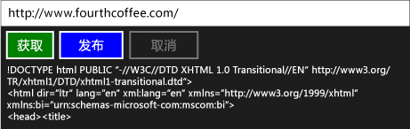

# 演练：使用任务和 XML HTTP 请求进行连接

此示例演示如何使用[IXMLHTTPRequest2](/windows/win32/api/msxml6/nn-msxml6-ixmlhttprequest2)和[IXMLHTTPRequest2 回调](/windows/win32/api/msxml6/nn-msxml6-ixmlhttprequest2callback)接口以及向通用 Windows 平台 （UWP） 应用中的 Web 服务发送 HTTP GET 和 POST 请求的任务。 通过将 `IXMLHTTPRequest2` 与任务组合在一起，你可以编写通过其他任务编写的代码。 例如，可以使用下载任务作为任务链的一部分。 工作取消时，下载任务也会响应。

> [!TIP]
> 您还可以使用 REST SDK C++使用C++应用或桌面C++应用执行来自 UWP 应用的 HTTP 请求。 有关详细信息，请参阅[C++ REST SDK（代号"卡萨布兰卡"）](https://github.com/Microsoft/cpprestsdk)。

有关任务的详细信息，请参阅[任务并行性](../../parallel/concrt/task-parallelism-concurrency-runtime.md)。 有关如何在 UWP 应用中使用任务的详细信息，请参阅[C++中的异步编程](/windows/uwp/threading-async/asynchronous-programming-in-cpp-universal-windows-platform-apps)，以及为[UWP 应用在C++创建异步操作](../../parallel/concrt/creating-asynchronous-operations-in-cpp-for-windows-store-apps.md)。

本文档首先演示如何创建 `HttpRequest` 及其支持类。 然后，它演示如何使用C++和 XAML 的 UWP 应用使用此类。

有关使用`IXMLHTTPRequest2`但不使用任务的示例，请参阅[快速入门：使用 XML HTTP 请求 （IXMLHTTPRequest2） 进行连接](/previous-versions/windows/apps/hh770550\(v=win.10\))。

> [!TIP]
> `IXMLHTTPRequest2`是`IXMLHTTPRequest2Callback`我们建议在 UWP 应用中使用的接口。 还可以调整此示例，以用于桌面应用程序。

## 先决条件

UWP 支持在 Visual Studio 2017 及更高版本中是可选的。 要安装它，请从 Windows "开始"菜单打开可视化工作室安装程序，然后选择正在使用的 Visual Studio 版本。 单击 **"修改"** 按钮，确保选中**UWP 开发**磁贴。 在 **"可选组件**"下，请确保**选中C++ UWP 工具**。 将 v141 用于 Visual Studio 2017 或 v142，用于 Visual Studio 2019。

## 定义 HttpRequest、HttpRequestBuffersCallback 和 HttpRequestStringCallback 类

当您使用 `IXMLHTTPRequest2` 接口通过 HTTP 创建 Web 请求时，可以实现 `IXMLHTTPRequest2Callback` 接口来接收服务器响应并对其他事件做出响应。 此示例定义了 `HttpRequest` 类来创建 Web 请求，并定义了 `HttpRequestBuffersCallback` 和 `HttpRequestStringCallback` 类来处理响应。 `HttpRequestBuffersCallback` 和 `HttpRequestStringCallback` 类支持 `HttpRequest` 类；在应用程序代码中您只能使用 `HttpRequest` 类。

`GetAsync` 类的 `PostAsync` 和 `HttpRequest` 方法可以使您分别启动 HTTP GET 和 POST 操作。 这些方法使用 `HttpRequestStringCallback` 类以便将服务器响应作为字符串读取。 `SendAsync` 和 `ReadAsync` 方法使您能够对区块中的大型内容进行流式处理。 这些方法各返回[并发：：任务](../../parallel/concrt/reference/task-class.md)表示操作。 `GetAsync` 和 `PostAsync` 方法将产生 `task<std::wstring>` 值，值中的 `wstring` 部分表示服务器的响应。 `SendAsync` 和 `ReadAsync` 方法将产生 `task<void>` 值；当发送和读取操作完成后这些任务将会完成。

由于`IXMLHTTPRequest2`接口以异步方式操作，因此此示例使用[并发：：task_completion_event](../../parallel/concrt/reference/task-completion-event-class.md)创建在回调对象完成或取消下载操作后完成的任务。 `HttpRequest` 类从此任务创建基于任务的延续以设置最终结果。 `HttpRequest` 类使用基于任务的延续来确保，即使在前面的任务产生错误或取消的情况下，延续任务也会运行。 有关基于任务的延续的详细信息，请参阅[任务并行性](../../parallel/concrt/task-parallelism-concurrency-runtime.md)

若要支持取消，`HttpRequest`、`HttpRequestBuffersCallback` 和 `HttpRequestStringCallback` 类将使用取消标记。 和 类使用[并发：：cancellation_token：register_callback](reference/cancellation-token-class.md#register_callback)方法使任务完成事件能够响应取消。 `HttpRequestStringCallback` `HttpRequestBuffersCallback` 此取消回调将中止下载。 有关取消的详细信息，请参阅[取消](../../parallel/concrt/exception-handling-in-the-concurrency-runtime.md#cancellation)。

### 定义 HttpRequest 类

1. 从主菜单中，选择 **"文件** > **新项目** > **"。**

1. 使用C++**空白应用（通用 Windows）** 模板创建空 XAML 应用项目。 此示例将项目命名为 `UsingIXMLHTTPRequest2`。

1. 在项目中添加一个名为 HttpRequest.h 的标头文件和一个名为 HttpRequest.cpp 的源文件。

1. 在 pch.h 中，添加此代码：

   [!code-cpp[concrt-using-ixhr2#1](../../parallel/concrt/codesnippet/cpp/walkthrough-connecting-using-tasks-and-xml-http-requests_1.h)]

1. 在 HttpRequest.h 中，添加此代码：

   [!code-cpp[concrt-using-ixhr2#2](../../parallel/concrt/codesnippet/cpp/walkthrough-connecting-using-tasks-and-xml-http-requests_2.h)]

1. 在 HttpRequest.cpp 中，添加此代码：

   [!code-cpp[concrt-using-ixhr2#3](../../parallel/concrt/codesnippet/cpp/walkthrough-connecting-using-tasks-and-xml-http-requests_3.cpp)]

## 在 UWP 应用中使用 HttpRequest 类

本节演示如何在`HttpRequest`UWP 应用中使用类。 应用程序会提供一个输入框，该输入框定义了一个 URL 资源、用于执行 GET 和 POST 操作的按钮命令和用于取消当前操作的按钮命令。

### 使用 HttpRequest 类

1. 在 MainPage.xaml 中，定义[堆栈面板](/uwp/api/windows.ui.xaml.controls.stackpanel)元素，如下所示。

   [!code-xml[concrt-using-ixhr2#A1](../../parallel/concrt/codesnippet/xaml/walkthrough-connecting-using-tasks-and-xml-http-requests_4.xaml)]

1. 在 MainPage.xaml.h 中，添加此 `#include` 指令：

   [!code-cpp[concrt-using-ixhr2#A2](../../parallel/concrt/codesnippet/cpp/walkthrough-connecting-using-tasks-and-xml-http-requests_5.h)]

1. 在 MainPage.xaml.h 中，将这些 `private` 成员变量添加到 `MainPage` 类中：

   [!code-cpp[concrt-using-ixhr2#A3](../../parallel/concrt/codesnippet/cpp/walkthrough-connecting-using-tasks-and-xml-http-requests_6.h)]

1. 在 MainPage.xaml.h 中，声明 `private` 方法 `ProcessHttpRequest`：

   [!code-cpp[concrt-using-ixhr2#A4](../../parallel/concrt/codesnippet/cpp/walkthrough-connecting-using-tasks-and-xml-http-requests_7.h)]

1. 在 MainPage.xaml.cpp 中，添加这些 `using` 语句：

   [!code-cpp[concrt-using-ixhr2#A5](../../parallel/concrt/codesnippet/cpp/walkthrough-connecting-using-tasks-and-xml-http-requests_8.cpp)]

1. 在 MainPage.xaml.cpp 中，实现 `GetButton_Click` 类的 `PostButton_Click`、`CancelButton_Click` 和 `MainPage` 方法。

   [!code-cpp[concrt-using-ixhr2#A6](../../parallel/concrt/codesnippet/cpp/walkthrough-connecting-using-tasks-and-xml-http-requests_9.cpp)]

   > [!TIP]
   > 如果应用不需要取消支持，请传递[并发：cancellation_token：：：无](reference/cancellation-token-class.md#none)到`HttpRequest::GetAsync`和 方法`HttpRequest::PostAsync`。

1. 在 MainPage.xaml.cpp 中，实现 `MainPage::ProcessHttpRequest` 方法。

   [!code-cpp[concrt-using-ixhr2#A7](../../parallel/concrt/codesnippet/cpp/walkthrough-connecting-using-tasks-and-xml-http-requests_10.cpp)]

1. 在项目属性中，在**链接器**下 **，输入**， 指定`shcore.lib`和`msxml6.lib`。

这是正在运行的应用程序：

## 后续步骤

[并发运行时演练](../../parallel/concrt/concurrency-runtime-walkthroughs.md)

## 请参阅

[任务并行度](../../parallel/concrt/task-parallelism-concurrency-runtime.md) 
[PPL 中的取消操作](cancellation-in-the-ppl.md) 
[C++中的异步编程](/windows/uwp/threading-async/asynchronous-programming-in-cpp-universal-windows-platform-apps) 
[用 C++ 为 UWP 应用创建异步操作](../../parallel/concrt/creating-asynchronous-operations-in-cpp-for-windows-store-apps.md) 
[快速启动：使用 XML HTTP 请求 （IXMLHTTPrequest2）](/previous-versions/windows/apps/hh770550\(v=win.10\))
[任务类（并发运行时）](../../parallel/concrt/reference/task-class.md)进行连接 
[task_completion_event 类](../../parallel/concrt/reference/task-completion-event-class.md)
