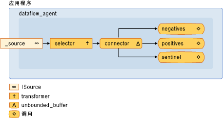

# 演练：创建数据流代理
[!INCLUDE[vs2017banner](../../assembler/inline/includes/vs2017banner.md)]

本文档演示如何创建基于代理的应用程序，这些应用程序基于数据流而不是控制流。  
  
 “控制流”是指程序中操作的执行顺序。  通过使用条件语句、循环等控制结构可调节控制流。  “数据流”是指在所有必需数据都可用时进行计算的编程模型。  数据流编程模型与“消息传递”概念相关，在消息传递中，程序的独立组件通过发送消息与另一个程序进行通信。  
  
 异步代理支持控制流和数据流编程模型。  在某些情况下可以使用控制流模型，而在其他情况下（例如，在代理接收数据并执行基于此数据负载的操作时）可以使用数据流模型。  
  
## 系统必备  
 在开始本演练之前，请阅读下列文档：  
  
-   [异步代理](../../parallel/concrt/asynchronous-agents.md)  
  
-   [异步消息块](../../parallel/concrt/asynchronous-message-blocks.md)  
  
-   [如何：使用消息块筛选器](../../parallel/concrt/how-to-use-a-message-block-filter.md)  
  
##   各节内容  
 本演练包含以下各节：  
  
-   [创建基本控制流代理](#control-flow)  
  
-   [创建基本数据流代理](#dataflow)  
  
-   [创建消息日志记录代理](#logging)  
  
##   创建基本控制流代理  
 请考虑以下定义了 `control_flow_agent` 类的示例。  `control_flow_agent` 类作用于三个消息缓冲区：一个输入缓冲区和两个输出缓冲区。  `run` 方法从循环中的源消息缓冲区读取数据并使用条件语句来引导程序执行流。  该代理会使某个计数器按非零的负值递增，使另一个计数器按非零的正值递增。  在收到零标记值后，该代理会向输出消息缓冲区发送计数器的值。  `negatives` 和 `positives` 方法使应用程序能够从代理读取负值和正值的计数。  
  
 [!code-cpp[concrt-dataflow-agent#1](../../parallel/concrt/codesnippet/CPP/walkthrough-creating-a-dataflow-agent_1.cpp)]  
  
 虽然此示例说明了代理中控制流的基本使用方法，但它演示了基于控制流的编程的串行特性。  尽管输入消息缓冲区中可能包含多条可用消息，但必须按顺序处理每条消息。  通过数据流模型可以同时评估条件语句的两个分支。  当数据流模型可用时，您可以通过它创建作用于数据的更复杂的消息网络。  
  
 \[[Top](#top)\]  
  
##   创建基本数据流代理  
 本节演示如何转换 `control_flow_agent` 类，以便使用数据流模型执行相同的任务。  
  
 数据流代理通过创建消息缓冲区的网络进行工作，而其中每个缓冲区都可提供特定服务。  某些消息块根据消息的负载使用筛选功能来接受或拒绝该消息。  筛选功能可确保消息块只接收特定值。  
  
#### 将控制流代理转换为数据流代理  
  
1.  将 `control_flow_agent` 类的主体复制到另一个类，例如，`dataflow_agent`。  或者，可以重命名 `control_flow_agent` 类。  
  
2.  从 `run` 方法中移除调用 `receive` 的循环主体。  
  
     [!code-cpp[concrt-dataflow-agent#2](../../parallel/concrt/codesnippet/CPP/walkthrough-creating-a-dataflow-agent_2.cpp)]  
  
3.  在 `run` 方法中，在初始化 `negative_count` 和 `positive_count` 变量后，添加跟踪活动操作计数的 `countdown_event` 对象。  
  
     [!code-cpp[concrt-dataflow-agent#6](../../parallel/concrt/codesnippet/CPP/walkthrough-creating-a-dataflow-agent_3.cpp)]  
  
     本主题后面演示了 `countdown_event` 类。  
  
4.  创建将参与数据流网络的消息缓冲区对象。  
  
     [!code-cpp[concrt-dataflow-agent#3](../../parallel/concrt/codesnippet/CPP/walkthrough-creating-a-dataflow-agent_4.cpp)]  
  
5.  连接消息缓冲区以便形成网络。  
  
     [!code-cpp[concrt-dataflow-agent#4](../../parallel/concrt/codesnippet/CPP/walkthrough-creating-a-dataflow-agent_5.cpp)]  
  
6.  等待设置 `event` 和 `countdown event` 对象。  这些事件通过发送信号指示代理已经接收标记值以及所有操作均已完成。  
  
     [!code-cpp[concrt-dataflow-agent#5](../../parallel/concrt/codesnippet/CPP/walkthrough-creating-a-dataflow-agent_6.cpp)]  
  
 下图显示了 `dataflow_agent` 类的完整数据流网络：  
  
   
  
 下表描述了网络中的成员。  
  
|成员|说明|  
|--------|--------|  
|`increment_active`|一个 [concurrency::transformer](../../parallel/concrt/reference/transformer-class.md) 对象，可递增活动事件计数器并将输入值传递到网络的其余部分。|  
|`negatives`, `positives`|一些 [concurrency::call](../../parallel/concrt/reference/call-class.md) 对象，可递增数字的计数并递减活动事件计数器。  这些对象每次都使用筛选器接受负数或正数。|  
|`sentinel`|一个 [concurrency::call](../../parallel/concrt/reference/call-class.md) 对象，它只接受零标记值并递减活动事件计数器。|  
|`connector`|一个 [concurrency::unbounded\_buffer](../Topic/unbounded_buffer%20Class.md) 对象，可将源消息缓冲区连接到内部网络。|  
  
 因为在独立线程上调用了 `run` 方法，所以在完全连接网络以前，其他线程可以将消息发送到该网络。  `_source` 数据成员是一个 `unbounded_buffer` 对象，它可以缓冲从应用程序发送到代理的所有输入。  若要确保网络能够处理所有输入消息，代理首先要链接网络的内部节点，然后再开始将此网络的 `connector` 链接到 `_source` 数据成员。  这可以确保在形成网络时不会处理消息。  
  
 因为此示例中的网络基于数据流而不是控制流，所以网络必须与代理进行通信，该代理已经处理完每个输入值并且标记节点已接收它的值。  此示例使用 `countdown_event` 对象发出已处理所有输入值的信号，并使用 [concurrency::event](../../parallel/concrt/reference/event-class.md) 对象说明标记节点已接收它的值。  当计数器值达到零时，`countdown_event` 类使用 `event` 对象发出信号。  数据流网络的报头每次在收到值时都会递增计数器。  网络的每个终端节点在处理输入值后都会递减计数器。  在代理形成数据流网络以后，它会等待标记节点设置 `event` 对象并等待 `countdown_event` 对象发出其计数器已达到零的信号。  
  
 以下示例显示了 `control_flow_agent`、 `dataflow_agent` 和 `countdown_event` 类。  `wmain` 函数创建一个 `control_flow_agent` 和一个 `dataflow_agent` 对象，并使用 `send_values` 函数将一系列随机值发送到代理。  
  
 [!code-cpp[concrt-dataflow-agent#7](../../parallel/concrt/codesnippet/CPP/walkthrough-creating-a-dataflow-agent_7.cpp)]  
  
 此示例产生下面的示例输出：  
  
  **控制流代理：**  
**有 500523 个负数。**  
**有 499477 个正数。**  
**数据流代理**  
**有 500523 个负数。**  
**有 499477 个正数。**   
### 编译代码  
 复制代码示例，并将此代码粘贴到 Visual Studio项目中或名为 `dataflow-agent.cpp` 的文件中，然后在Visual Studio命令提示符窗口中运行以下命令。  
  
 **cl.exe \/EHsc dataflow\-agent.cpp**  
  
 \[[Top](#top)\]  
  
##   创建消息日志记录代理  
 以下示例显示了 `log_agent` 类，它类似于 `dataflow_agent` 类。  `log_agent` 类可实现将日志消息写入文件和控制台的异步日志记录代理。  `log_agent` 类使应用程序能够将消息分类为信息、警告或错误。  它还使应用程序能够指定是将每个日志类别写入文件或控制台，还是同时写入这两者中。  此示例将所有日志消息写入文件并只将错误消息写入控制台。  
  
 [!code-cpp[concrt-log-filter#1](../../parallel/concrt/codesnippet/CPP/walkthrough-creating-a-dataflow-agent_8.cpp)]  
  
 此示例将下列输出写入控制台。  
  
  **错误：下面是示例错误消息。** 此示例还生成 log.txt 文件，后者包含以下文本。  
  
  **信息：\=\=\=Logging started.\=\=\=**  
**警告：这是该警告消息。**  
**错误：下面是示例错误消息。**  
**信息：\=\=\=Logging finished.\=\=\=**   
### 编译代码  
 复制代码示例，并将此代码粘贴到 Visual Studio项目中或名为`log-filter.cpp`的文件中，然后在Visual Studio命令提示符窗口中运行以下命令。  
  
 **cl.exe \/EHsc log\-filter.cpp**  
  
 \[[Top](#top)\]  
  
## 请参阅  
 [并发运行时演练](../../parallel/concrt/concurrency-runtime-walkthroughs.md)