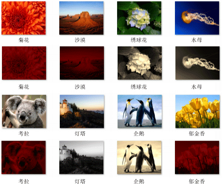

# 演练：创建图像处理网络
本文档演示如何创建执行图像处理的异步消息块网络。  
  
 网络确定在根据其特征图像上执行哪些操作。 此示例使用*数据流*模型到通过网络的路由映像。 在数据流模型中，程序的独立组件之间通过发送消息进行通信。 当某个组件收到一条消息时，它可以执行某些操作，然后将该操作的结果传递给另一个组件。 比较这一点与*控制流*模型，在其中应用程序使用控制结构，例如、 条件语句、 循环和等等，以控制在程序中的操作的顺序。  
  
 基于数据流的网络创建*管道*的任务。 管道的每个阶段同时执行整个任务的一部分。 这就好比是汽车制造装配线。 每辆汽车通过装配线时，一站组装车架，另一个安装引擎，依次类推。 通过启用同时装配多辆汽车，程序集行提供比一次装配整辆更佳的吞吐量。  
  
## 系统必备  
 在开始本演练之前，请阅读以下文档：  
  
-   [异步消息块](../../parallel/concrt/asynchronous-message-blocks.md)  
  
-   [如何：使用消息块筛选器](../../parallel/concrt/how-to-use-a-message-block-filter.md)  
  
-   [演练：创建数据流代理](../../parallel/concrt/walkthrough-creating-a-dataflow-agent.md)  
  
 我们还建议你了解的基础知识[!INCLUDE[ndptecgdiplus](../../parallel/concrt/includes/ndptecgdiplus_md.md)]在开始本演练之前。  
  
##   部分  
 本演练包含以下各节：  
  
-   [定义图像处理功能](#functionality)  
  
-   [创建图像处理网络](#network)  
  
-   [完整示例](#complete)  
  
##  定义图像处理功能  
 本部分说明用于处理从磁盘读取的图像的图像处理网络支持函数。  
  
 以下函数，`GetRGB`和`MakeColor`、 提取并分别将组合的给定颜色的各个组件。  
  
 [!code-cpp[concrt-image-processing-filter#2](../../parallel/concrt/codesnippet/cpp/walkthrough-creating-an-image-processing-network_1.cpp)]  
  

 为以下函数， `ProcessImage`，调用给定[std:: function](../../standard-library/function-class.md)对象中每个像素的颜色值转换[!INCLUDE[ndptecgdiplus](../../parallel/concrt/includes/ndptecgdiplus_md.md)][位图](https://msdn.microsoft.com/library/ms534420.aspx)对象。 `ProcessImage`函数使用[concurrency:: parallel_for](reference/concurrency-namespace-functions.md#parallel_for)算法处理并行位图的每一行。  

  
 [!code-cpp[concrt-image-processing-filter#3](../../parallel/concrt/codesnippet/cpp/walkthrough-creating-an-image-processing-network_2.cpp)]  
  
 以下函数， `Grayscale`， `Sepiatone`， `ColorMask`，和`Darken`，调用`ProcessImage`函数中每个像素的颜色值转换`Bitmap`对象。 其中每个函数使用 lambda 表达式定义一个像素的颜色转换。  
  
 [!code-cpp[concrt-image-processing-filter#4](../../parallel/concrt/codesnippet/cpp/walkthrough-creating-an-image-processing-network_3.cpp)]  
  
 为以下函数， `GetColorDominance`，还会调用`ProcessImage`函数。 但是，而不是更改每个颜色值，此函数使用[concurrency:: combinable](../../parallel/concrt/reference/combinable-class.md)要计算的红色、 绿色还是蓝色颜色组件是否是图像的主对象。  
  
 [!code-cpp[concrt-image-processing-filter#5](../../parallel/concrt/codesnippet/cpp/walkthrough-creating-an-image-processing-network_4.cpp)]  
  
 为以下函数， `GetEncoderClsid`，检索编码器的给定 MIME 类型的类标识符。 应用程序使用此函数来检索位图的编码器。  
  
 [!code-cpp[concrt-image-processing-filter#6](../../parallel/concrt/codesnippet/cpp/walkthrough-creating-an-image-processing-network_5.cpp)]  
  
 [[返回页首](#top)]  
  
##  创建图像处理网络  
 本部分介绍如何创建对执行图像处理的异步消息块网络中每个[!INCLUDE[TLA#tla_jpeg](../../parallel/concrt/includes/tlasharptla_jpeg_md.md)]给定目录中的 (.jpg) 映像。 网络执行以下图像处理操作：  
  
1.  Tom 创作的任何图像，将转换为灰度。  
  
2.  对于已作为基准的颜色的红色任何图像，删除绿色和蓝色组件，然后变暗。  
  
3.  对于任何其他图像，应用棕褐色调。  
  
 网络适用仅第一个图像处理操作之一相匹配的这些条件。 例如，如果的映像由 Tom 创作和红色其主要颜色，图像将仅转换为灰度。  
  
 网络执行每个图像处理操作后，它将图像保存到磁盘为位图 (.bmp) 文件。  
  
 以下步骤演示如何创建一个函数，实现此图像处理网络，并将该网络应用于每个[!INCLUDE[TLA#tla_jpeg](../../parallel/concrt/includes/tlasharptla_jpeg_md.md)]给定目录中的映像。  
  
#### 创建图像处理网络  
  
1.  创建一个函数， `ProcessImages`，采用在磁盘上目录的名称。  
  
     [!code-cpp[concrt-image-processing-filter#7](../../parallel/concrt/codesnippet/cpp/walkthrough-creating-an-image-processing-network_6.cpp)]  
  
2.  在`ProcessImages`函数中，创建`countdown_event`变量。 `countdown_event`稍后在本演练显示类。  
  
     [!code-cpp[concrt-image-processing-filter#8](../../parallel/concrt/codesnippet/cpp/walkthrough-creating-an-image-processing-network_7.cpp)]  
  
3.  创建[std:: map](../../standard-library/map-class.md)将相关联的对象`Bitmap`与其原始文件名的对象。  
  
     [!code-cpp[concrt-image-processing-filter#9](../../parallel/concrt/codesnippet/cpp/walkthrough-creating-an-image-processing-network_8.cpp)]  
  
4.  添加以下代码来定义图像处理网络的成员。  
  
     [!code-cpp[concrt-image-processing-filter#10](../../parallel/concrt/codesnippet/cpp/walkthrough-creating-an-image-processing-network_9.cpp)]  
  
5.  添加以下代码的网络连接。  
  
     [!code-cpp[concrt-image-processing-filter#11](../../parallel/concrt/codesnippet/cpp/walkthrough-creating-an-image-processing-network_10.cpp)]  
  
6.  添加以下代码以发送到网络的开头的完整路径的每个[!INCLUDE[TLA#tla_jpeg](../../parallel/concrt/includes/tlasharptla_jpeg_md.md)]目录中的文件。  
  
     [!code-cpp[concrt-image-processing-filter#12](../../parallel/concrt/codesnippet/cpp/walkthrough-creating-an-image-processing-network_11.cpp)]  
  
7.  等待`countdown_event`变量来访问零。  
  
     [!code-cpp[concrt-image-processing-filter#13](../../parallel/concrt/codesnippet/cpp/walkthrough-creating-an-image-processing-network_12.cpp)]  
  
 下表描述了网络的成员。  
  
|成员|描述|  
|------------|-----------------|  
|`load_bitmap`|A [concurrency:: transformer](../../parallel/concrt/reference/transformer-class.md)加载的对象`Bitmap`从磁盘对象并将添加到一个条目`map`对象以将图像与其原始文件名关联。|  
|`loaded_bitmaps`|A [concurrency:: unbounded_buffer](reference/unbounded-buffer-class.md)将加载的图像发送到图像处理筛选器的对象。|  
|`grayscale`|A`transformer`将转换为灰度 Tom 创作的映像的对象。 它使用的映像的元数据来确定其作者。|  
|`colormask`|A`transformer`从具有作为基准的颜色的红色的映像中删除的绿色和蓝色颜色组件的对象。|  
|`darken`|A`transformer`变暗有作为基准的颜色的红色的映像的对象。|  
|`sepiatone`|A`transformer`适用范围棕褐色调编写不由 Tom 且不是红色的映像的对象。|  
|`save_bitmap`|A`transformer`将保存已处理的对象`image`到以位图格式的磁盘。 `save_bitmap`检索从原始文件名`map`对象，并更改其文件扩展名为.bmp。|  
|`delete_bitmap`|A`transformer`释放为映像的内存的对象。|  
|`decrement`|A [concurrency:: call](../../parallel/concrt/reference/call-class.md)充当网络中的终端节点的对象。 它递减`countdown_event`可以向发出信号主应用程序已处理映像的对象。|  
  
 `loaded_bitmaps`消息缓冲区很重要，因为作为`unbounded_buffer`对象，它提供`Bitmap`到多个接收方的对象。 当目标块接受`Bitmap`对象，`unbounded_buffer`对象不提供`Bitmap`到任何其他目标的对象。 因此，在其中你将链接的顺序对象添加到`unbounded_buffer`对象很重要。 `grayscale`， `colormask`，和`sepiatone`块每个使用筛选器接受的消息仅某些`Bitmap`对象。 `decrement`消息缓冲区是一个重要目标，`loaded_bitmaps`消息缓冲区，因为它接受所有`Bitmap`拒绝的其他消息缓冲区的对象。 `unbounded_buffer`传播消息按顺序所需的对象。 因此，`unbounded_buffer`对象被阻止，直至新的目标块链接到它，并接受消息时，如果当前没有目标块接受此消息。  
  
 如果你的应用程序需要该多个消息块处理该消息，而不是只是一个消息块的第一次接受消息时，你可以使用其他消息块类型，如`overwrite_buffer`。 `overwrite_buffer`类包含一条消息，一次，但它会传播到其每个目标该消息。  
  
 下图显示图像处理网络：  
  
   
  
 `countdown_event`对象在此示例使图像处理网络，以在处理所有映像时通知主应用程序。 `countdown_event`类使用[concurrency:: event](../../parallel/concrt/reference/event-class.md)当计数器值达到零时发送信号的对象。 每次它发送到网络的文件名称时，主应用程序将递增的计数器。 网络递减的终端节点处理每个图像后的计数器。 主应用程序遍历指定的目录之后，它将等待`countdown_event`对象以表示其计数器已归零。  
  
 下面的示例演示`countdown_event`类：  
  
 [!code-cpp[concrt-image-processing-filter#14](../../parallel/concrt/codesnippet/cpp/walkthrough-creating-an-image-processing-network_13.cpp)]  
  
 [[返回页首](#top)]  
  
##  完整示例  
 以下代码显示完整示例。 `wmain`函数管理[!INCLUDE[ndptecgdiplus](../../parallel/concrt/includes/ndptecgdiplus_md.md)]库并调用`ProcessImages`函数来过程[!INCLUDE[TLA#tla_jpeg](../../parallel/concrt/includes/tlasharptla_jpeg_md.md)]文件中`Sample Pictures`目录。  
  
 [!code-cpp[concrt-image-processing-filter#15](../../parallel/concrt/codesnippet/cpp/walkthrough-creating-an-image-processing-network_14.cpp)]  
  
 下图显示示例输出。 每个源映像高于其相应的修改过的映像。  
  
   
  
 `Lighthouse`由 Tom Alphin 创作并因此将转换为灰度。 `Chrysanthemum``Desert`， `Koala`，和`Tulips`具有作为基准的颜色的红色，因此已删除的蓝色和绿色颜色组件而调暗。 `Hydrangeas``Jellyfish`，和`Penguins`匹配默认条件，并因此转换为棕褐色。  
  
 [[返回页首](#top)]  
  
### 编译代码  
 复制代码示例并将其粘贴到 Visual Studio 项目中，或将其粘贴在文件中名为`image-processing-network.cpp`然后在 Visual Studio 命令提示符窗口中运行以下命令。  
  
 **cl.exe /DUNICODE /EHsc 图像处理 network.cpp /link gdiplus.lib**  
  
## 请参阅  
 [并发运行时演练](../../parallel/concrt/concurrency-runtime-walkthroughs.md)
