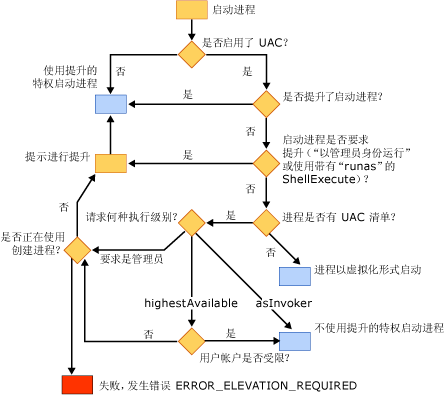

# 用户帐户控制 (UAC) 如何影响应用程序
[!INCLUDE[vs2017banner](../assembler/inline/includes/vs2017banner.md)]

用户帐户控制 \(UAC\) 是 Windows Vista 的一项功能，其中用户帐户具有有限的特权。  可以在下列站点找到关于 UAC 的详细信息：  
  
-   [Windows Vista 用户帐户控制分步指南](http://go.microsoft.com/fwlink/?linkid=53781)  
  
-   [最小特权环境中应用程序开发人员的最佳做法和准则](http://go.microsoft.com/fwlink/?linkid=82444)  
  
-   [了解和配置 Windows Vista 中的用户帐户控制](http://go.microsoft.com/fwlink/?LinkId=82445)  
  
## 在启用 UAC 后生成项目  
 如果在禁用 UAC 的 Windows Vista 中生成 Visual C\+\+ 项目，并在以后启用 UAC，则必须清除并重新生成项目，该项目才能正常工作。  
  
## 需要管理特权的应用程序  
 默认情况下，Visual C\+\+ 链接器将 UAC 片段嵌入具有 `asInvoker` 执行级别的应用程序清单。  如果应用程序需要管理特权才能正确运行（例如，修改注册表的 HKLM 节点或者写入磁盘的受保护区域，如 Windows 目录），则必须修改应用程序。  
  
 第一个选项是修改清单的 UAC 片段，将执行级别更改为 requireAdministrator。  然后，应用程序在运行之前将提示用户提供管理凭据。  有关如何执行此操作的信息，请参见[\/MANIFESTUAC（将 UAC 信息嵌入到清单中）](../build/reference/manifestuac-embeds-uac-information-in-manifest.md)。  
  
 第二个选项是通过指定 **\/MANIFESTUAC:NO** 链接器选项不将 UAC 片段嵌入到清单。  在这种情况下，应用程序将以虚拟化方式运行。  在应用程序结束后，对注册表或文件系统的任何更改将不会保留。  
  
 下面的流程图描述了应用程序的运行方式取决于是否启用了 UAC 和应用程序是否有 UAC 清单：  
  
   
  
## 请参阅  
 [安全性最佳做法](../top/security-best-practices-for-cpp.md)