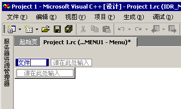

# <a name="creating-menus-c"></a>创建菜单 （c + +）

> [!NOTE]
> **资源窗口**在 Express 版本中不可用。

将资源添加到托管项目的信息，请参阅[桌面应用中的资源](/dotnet/framework/resources/index)中 *.NET Framework 开发人员指南*。 有关手动将资源文件添加到托管项目、 访问资源、 显示静态资源和将资源字符串分配给属性的信息，请参阅[桌面应用中创建资源文件](/dotnet/framework/resources/creating-resource-files-for-desktop-apps)。 全球化和本地化的托管应用中的资源的信息，请参阅[Globalizing and Localizing.NET Framework Applications](/dotnet/standard/globalization-localization/index)。

## <a name="to-create-a-standard-menu"></a>创建标准菜单

1. 从**视图**菜单中，选择**资源视图**，然后右键单击**菜单**标题并选择**添加资源**。 选择 **“菜单”**。

1. 选择菜单栏上的“新建项目”  框（包含“请在此处输入”的矩形）。

   <br/>
   新建项目框

1. 键入新菜单的名称，例如“文件”。

   键入的文本将同时出现在 **菜单** 编辑器 以及 **属性窗口** 中的 [“标题”](/visualstudio/ide/reference/properties-window)框中。 你可以在任一位置编辑新菜单的属性。

   为菜单栏上的新菜单指定名称后，新项目框移到右边（允许你添加另一菜单），并且另一个新项目框在第一个菜单下面打开，以便可以向其添加菜单命令。

   <br/>
   新项目框的焦点在键入菜单名称后转移

   > [!NOTE]
   > 若要在菜单栏上创建单项菜单，请设置**Popup**属性设置为**False**。

## <a name="to-create-a-submenu"></a>创建子菜单

1. 选择你想要创建子菜单的菜单命令。

1. 在出现在右侧的 **新项** 框显中键入新的菜单命令的名称。 此新命令将在子菜单的菜单中显示为第一个。

1. 将其他菜单命令添加到子菜单的菜单中。

## <a name="to-insert-a-new-menu-between-existing-menus"></a>在现有菜单之间插入新菜单

选择现有的菜单名称并按**插入**密钥。 **新项**框插入到所选的项之前。

   \- 或 -

在菜单栏上右键单击并选择**插入新**从快捷菜单。

## <a name="to-add-commands-to-a-menu"></a>将命令添加到菜单

1. 创建菜单。

1. 选择菜单名，例如**文件**。

   每个菜单都将展开，并显示一个新项框让你输入命令。 例如，可以将命令添加**新建**，**打开**，并**关闭**到**文件**菜单。

1. 在新项框中，键入新菜单命令的名称。

   > [!NOTE]
   > 键入的文本将同时出现在 **菜单** 编辑器 以及 **属性窗口** 中的 [“标题”](/visualstudio/ide/reference/properties-window)框中。 你可以在任一位置编辑新菜单的属性。

   > [!TIP]
   > 你可以定义一个允许用户选择菜单命令的助记键（热键）。 输入与号 (`&`) 若要指定为助记键的某个字母前。 用户可以通过键入该字母来选择菜单命令。

1. 在中**属性**窗口中，选择菜单命令适用的属性。 有关详细信息，请参阅[菜单命令属性](../windows/menu-command-properties.md)。

1. 在中**提示符**框中**属性**窗口中，键入你想要在应用程序的状态栏中显示的提示字符串。

   此步骤中创建具有菜单命令创建与相同的资源标识符的字符串表中的项。

   > [!NOTE]
   > 提示只能应用于菜单项**Popup**的属性**True**。 例如，包含子菜单项的顶级菜单项可以有提示。 目的**提示**用于指示会发生什么情况是如果用户选择菜单项。

1. 按**Enter**完成菜单命令。

   将选定新项框，让你可以创建其他菜单命令。

## <a name="to-create-pop-up-menus"></a>若要创建弹出菜单

[弹出菜单](../mfc/menus-mfc.md) 显示常用命令。 它们对指针的位置可以区分上下文。 在应用程序中使用弹出菜单需要先生成菜单，然后将菜单连接到应用程序代码。

创建菜单资源后，应用程序代码需要加载该菜单资源并使用[TrackPopupMenu](/windows/desktop/api/winuser/nf-winuser-trackpopupmenu)才会显示该菜单。 一旦用户通过选择之外，解除了弹出菜单，或选择一个命令，该函数将返回。 如果用户选择一个命令，该命令消息将被发送到传递了其句柄的窗口。

### <a name="to-create-a-pop-up-menu"></a>创建弹出菜单

1. 使用空标题（不提供[标题](../windows/creating-a-menu.md) ） **创建菜单**。

1. [将菜单命令添加到新菜单](../windows/adding-commands-to-a-menu.md)。 将移动到空白菜单标题下的第一个菜单命令 (临时标题显示`Type Here`)。 键入 **标题** 和任何其他信息。

   对弹出菜单中的任何其他菜单命令重复此过程。

1. 保存菜单资源。

### <a name="to-connect-a-pop-up-menu-to-your-application"></a>将弹出菜单连接到应用程序

1. （例如） 添加 WM_CONTEXTMENU 消息处理程序。 有关详细信息，请参阅[消息映射到函数](../mfc/reference/mapping-messages-to-functions.md)。

1. 将以下代码添加到消息处理程序：

    ```cpp
    CMenu menu;
    VERIFY(menu.LoadMenu(IDR_MENU1));
    CMenu* pPopup = menu.GetSubMenu(0);
    ASSERT(pPopup != NULL);
    pPopup->TrackPopupMenu(TPM_LEFTALIGN | TPM_RIGHTBUTTON, point.x, point.y, AfxGetMainWnd());
    ```

   > [!NOTE]
   > [CPoint](../atl-mfc-shared/reference/cpoint-class.md)传递的消息处理程序是屏幕坐标。

   > [!NOTE]
   > 弹出菜单连接到你的应用程序需要 MFC。

### <a name="to-view-a-menu-resource-as-a-pop-up-menu"></a>以弹出菜单方式查看菜单资源

通常情况下，当您在中工作**菜单**编辑器中，菜单资源显示为菜单栏。 但是，你可能拥有在程序运行时添加到应用程序菜单栏的菜单资源。

右键单击该菜单，然后选择**以弹出方式查看**从快捷菜单。

   此选项只是查看首选项，并且不会修改你的菜单。

   > [!NOTE]
   > 若要改回菜单栏视图，请单击**以弹出方式查看**再次 （它将删除复选标记，并返回菜单栏视图）。

## <a name="requirements"></a>要求

Win32

## <a name="see-also"></a>请参阅

[菜单编辑器](../windows/menu-editor.md)