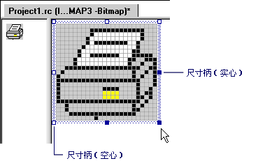

# 调整图像大小（图标的图像编辑器）
行为**图像**编辑器时调整图像的大小取决于是否已[选](../windows/selecting-an-area-of-an-image-image-editor-for-icons.md)整个图像或只是它的一部分。  
  
 所选内容包含仅的映像的一部分时**图像**编辑器通过删除行或列的像素为单位，并使用当前背景色填充空出的区域缩小选定内容或其拉伸的选定内容复制行或列的像素为单位。  
  
 当所选内容包括整个图像**图像**编辑器是收缩和拉伸图像，或可裁剪，并对其进行扩展。  
  
 有两种方式调整图像大小： 调整大小控点和[属性窗口](/visualstudio/ide/reference/properties-window)。 您可以拖动调整大小控点，若要更改的所有大小或映像的一部分。 可以拖动调整大小控点都是可靠的。 您不能拖动空心的句柄。 可以使用**属性**窗口来调整大小整个仅，图像不是所选的一部分。  
  
   
大小调整控点  
  
> [!NOTE]
>  如果有**磁贴网格**中选择选项[网格设置对话框](../windows/grid-settings-dialog-box-image-editor-for-icons.md)，然后调整大小将下一步的平铺网格线对齐。 如果只有**像素网格**选项是选择 （默认设置），调整大小将对齐到下一个可用的像素。  
  
-   [调整整个图像的大小](../windows/resizing-an-entire-image-image-editor-for-icons.md)  
  
-   [裁剪或扩展整个图像](cropping-or-extending-an-entire-image-image-editor-for-icons.md)  
  
-   [缩小或拉伸整个图像](../windows/shrinking-or-stretching-an-entire-image-image-editor-for-icons.md)  
  
-   [缩小或拉伸图像的一部分](../windows/shrinking-or-stretching-part-of-an-image-image-editor-for-icons.md)  
  
 有关将资源添加到托管项目的信息，请参阅[桌面应用中的资源](/dotnet/framework/resources/index)中 *.NET Framework 开发人员指南*。 有关手动将资源文件添加到托管项目、 访问资源、 显示静态资源和将资源字符串分配给属性的信息，请参阅[桌面应用中创建资源文件](/dotnet/framework/resources/creating-resource-files-for-desktop-apps)。 全球化和本地化的托管应用中的资源的信息，请参阅[Globalizing and Localizing.NET Framework Applications](/dotnet/standard/globalization-localization/index)。  
  
## 要求  
 无  
  
## 请参阅  
 [加速键](../windows/accelerator-keys-image-editor-for-icons.md)   
 [编辑图形资源](../windows/editing-graphical-resources-image-editor-for-icons.md)   
 [图标的图像编辑器](../windows/image-editor-for-icons.md)