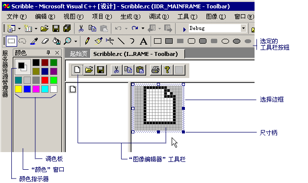

# 工具栏编辑器 （c + +）

**工具栏**编辑器，您可以创建 c + + 工具栏资源并将位图转换为工具栏资源。 **工具栏**编辑器使用的图形化显示来显示工具栏和按钮，非常类似于如何将介绍在完成的应用程序中。

**工具栏**编辑器窗口中显示的按钮图像，图像编辑器窗口相同的两个视图。 拆分栏分隔两个窗格。 你可以将拆分条从一端拖动到另一端来更改窗格的相对大小。 活动窗格将显示选择边框。 主题工具栏位于两个图像视图的上方。

工具栏编辑器

**工具栏**编辑器是类似于**映像**编辑器的功能。 菜单项、 图形工具和位图网格是中的那些相同**图像**编辑器。 上没有菜单命令**图像**菜单，以便您可以切换**工具栏**编辑器并**图像**编辑器。 有关使用的详细信息**图形**工具栏中，**颜色**面板中，或**图像**菜单中，请参阅[的图像编辑器](../windows/image-editor-for-icons.md)。

将资源添加到托管项目的信息，请参阅[桌面应用中的资源](/dotnet/framework/resources/index)中 *.NET Framework 开发人员指南*。 有关手动将资源文件添加到托管项目、 访问资源、 显示静态资源和将资源字符串分配给属性的信息，请参阅[桌面应用中创建资源文件](/dotnet/framework/resources/creating-resource-files-for-desktop-apps)。 全球化和本地化的托管应用中的资源的信息，请参阅[Globalizing and Localizing.NET Framework Applications](/dotnet/standard/globalization-localization/index)。

与**工具栏**编辑器，你可以：

## 创建新工具栏

1. 在中**资源**查看，右键单击.rc 文件，然后选择**添加资源**从快捷菜单。 (如果你的.rc 文件中有一个现有工具栏，只需可以右击**工具栏**文件夹，然后选择**插入工具栏**从快捷菜单。)

   > [!NOTE]
   > 如果你的项目尚未包含 .rc 文件，请参阅 [创建新的资源脚本文件](../windows/how-to-create-a-resource-script-file.md)。

1. 在中**添加资源**对话框中，选择**工具栏**中**资源类型**列表，然后选择**新建**。

   如果一个加号 (**+**) 的旁边将出现**工具栏**资源类型，这意味着工具栏模板都可用。 选择加号以展开模板列表中的，选择一个模板，然后选择**新建**。

## 将位图转换为工具栏资源

通过将位图转换，可以在 c + + 项目中创建一个新的工具栏。 从位图图将转换为工具栏按钮图像。 通常，位图包含在单个位图中，使用每个按钮的一个映像的多个按钮映像。 默认为 16 像素宽和图像的高度，映像可以是任何大小。 可以指定中的按钮图像的大小**新建工具栏资源**对话框中选择时**工具栏编辑器**从**图像**与图像编辑器中的菜单。

**新建工具栏资源**对话框允许您指定的宽度和高度的 c + + 项目中的工具栏资源要添加的按钮。 默认值为 16 × 15 像素。

用于创建工具栏位图有 2048年的最大宽度。 因此，如果您设置**按钮宽度**为 512，只能有四个按钮。 如果将宽度设置为 513，您只能有三个按钮。

该对话框具有以下属性：

|属性|描述|
|---|---|
|**按钮宽度**|提供空间以输入你要从位图资源转换为工具栏资源的工具栏按钮的宽度。 图像裁剪为的宽度和高度指定，和颜色调整为使用标准工具栏颜色 （16 种颜色）。|
|**按钮高度**|提供空间以输入你要从位图资源转换为工具栏资源的工具栏按钮的高度。 图像裁剪为的宽度和高度指定，和颜色调整为使用标准工具栏颜色 （16 种颜色）。|

### 若要将位图转换为工具栏

1. 打开现有的位图资源中[的图像编辑器](../windows/image-editor-for-icons.md)。 (如果位图不是在你的.rc 文件中，右键单击.rc 文件中，选择**导入**从快捷菜单中，导航到你想要添加到你的.rc 文件，该位图，然后选择**打开**。)

1. 从**图像**菜单中，选择**工具栏编辑器**。

   **新建工具栏资源**对话框随即出现。 您可以更改的宽度和高度与位图匹配的图标图像。 然后显示在工具栏编辑器工具栏图像。

1. 若要完成转换，请更改该命令**ID**的按钮使用[属性窗口](/visualstudio/ide/reference/properties-window)。 键入新**ID**或选择**ID**从下拉列表。

   > [!TIP]
   > **属性**窗口包含一个标题栏中的图钉按钮。 选择此按钮启用或禁用**自动隐藏**窗口。 若要快速循环通过所有工具栏按钮属性而无需重新打开各个属性窗口，关闭**自动隐藏**关闭因此**属性**窗口保持不变。

此外可以通过更改新的工具栏上的按钮的命令 Id[属性窗口](/visualstudio/ide/reference/properties-window)。

## 创建、移动和编辑工具栏按钮

您可以轻松地创建、 移动、 复制和编辑工具栏按钮。

默认情况下，新的或空白按钮显示工具栏的右侧。 您可以在编辑前移动此按钮。 当创建一个新按钮时，另一个空白按钮将出现编辑按钮右侧。 当您保存一个工具栏时，不会保存空白的按钮。

工具栏按钮的属性包括：

|属性|描述|
|--------------|-----------------|
|**ID**|定义按钮的 ID。 下拉列表提供了常见**ID**名称。|
|**Width**|设置按钮的宽度。 建议使用 16 个像素。|
|**Height**|设置按钮的高度。 一个按钮的高度更改工具栏上的所有按钮的高度。 建议将 15 个像素。|
|**提示**|定义在状态栏中显示的消息。 添加 \n 和名称将工具提示添加到该工具栏按钮。 有关详细信息，请参阅[创建工具提示](../windows/creating-a-tool-tip-for-a-toolbar-button.md)。|

**宽度**并**高度**应用于所有按钮。 用于创建工具栏位图有 2048年的最大宽度。 因此如果将按钮宽度设置为 512，只能有四个按钮，如果将宽度设置为 513，只能有三个按钮。

请参阅以下操作：

### 若要创建新的工具栏按钮

1. 在中[资源视图](../windows/resource-view-window.md)展开资源文件夹 (例如， *Project1.rc*)。

   > [!NOTE]
   > 如果你的项目尚未包含 .rc 文件，请参阅 [创建新的资源脚本文件](../windows/how-to-create-a-resource-script-file.md)。

1. 展开**工具栏**文件夹，然后选择要编辑的工具栏。

1. 将 ID 分配给工具栏右侧的空白按钮。 您可以通过编辑来实现**ID**属性中的[属性窗口](/visualstudio/ide/reference/properties-window)。 例如，你可能想要提供的工具栏按钮和菜单选项相同的 ID。 在这种情况下，使用下拉列表框选择**ID**的菜单选项。

   或

   选择工具栏右侧的空白按钮 (在**工具栏视图**窗格) 并开始绘制。 分配一个默认按钮命令 ID (ID_BUTTON\<n >)。

您还可以复制并粘贴到为新按钮的工具栏上的图像。

### 若要将图像添加到工具栏中，为的按钮

1. 在中[资源视图](../windows/resource-view-window.md)，通过双击它打开工具栏。

1. 接下来，打开你想要添加到您的工具栏图像。

   > [!NOTE]
   > 如果您在 Visual Studio 中打开该映像，将在中打开**图像**编辑器。 此外可以在其他图形程序中打开的图像。

1. 从**编辑**菜单中，选择**副本**。

1. 选择其选项卡顶部的源窗口中切换到您的工具栏。

1. 从**编辑**菜单中，选择**粘贴**。

   图像将显示在工具栏上，为新按钮。

### 移动工具栏按钮

在中**工具栏视图**窗格中，将你想要将移动到其新位置上工具栏按钮。

### 若要从工具栏中复制按钮

1. 按住**Ctrl**密钥。

1. 在中**工具栏视图**窗格中，将按钮拖到其新位置的工具栏上或某个位置上另一个工具栏。

### 若要删除的工具栏按钮

选择工具栏按钮，然后将其拖出工具栏。

### 若要插入或删除上一个工具栏按钮之间的空间

一般情况下，若要插入按钮之间有空格，它们将彼此拖开工具栏上。 若要删除空间，请将它们拖向彼此。

|操作|步骤|
|------|------|
|若要不后跟一个空格的按钮前插入空格|将按钮拖动到右或向下直到与下一步按钮重叠大约一半。|
|要插入的按钮后跟一个空格前的空间并且要保留尾随空格|拖动按钮，直到右侧或底部边缘刚好接触下一步按钮，或只是重叠。|
|若要前插入空格跟一个空格的按钮并关闭该以下空间|将按钮拖动到右或向下直到与下一步按钮重叠大约一半。|
|若要删除在工具栏按钮之间留一个空格|一侧的空间的空间向另一侧上的按钮拖动按钮，直到它与重叠大约一半的下一步按钮。|

> [!NOTE]
> 如果离开，所拖动的按钮的一侧没有空间并拖动按钮与相邻的按钮，多个中间**工具栏**编辑器还将插入您的按钮在相反一侧的空间拖动。

### 若要更改工具栏按钮的属性

1. 在 c + + 项目中，选择工具栏上的按钮。

1. 键入中的新 ID **ID**属性中的[属性窗口](/visualstudio/ide/reference/properties-window)，或使用下拉列表选择一个新**ID**。

### 若要创建的工具栏按钮的工具提示

1. 选择工具栏上的按钮。

1. 在中[属性窗口](/visualstudio/ide/reference/properties-window)，在**提示**属性字段中，添加按钮状态栏; 的消息显示后的说明，添加`\n`和工具提示名称。

工具提示的常见示例是**打印**按钮**写字板**:

1. 打开**写字板**。

1. 鼠标指针悬停**打印**工具栏按钮。

1. 请注意，word`Print`现在浮动的鼠标指针下。

1. 查看状态栏 (底部**写字板**窗口)-请注意，它现在显示的文本`Prints the active document`。

`Print`中**第 3 步**是"工具提示名称"，并`Prints the active document`从**第 4 步**是"的状态栏按钮描述"。

如果你想使用此效果**工具栏**编辑器中，设置**提示**属性设置为`Prints the active document\nPrint`。

> [!NOTE]
> 您可以使用提示文本编辑[属性窗口](/visualstudio/ide/reference/properties-window)。

## 要求

MFC 或 ATL

## 请参阅

[资源编辑器](../windows/resource-editors.md) 
[菜单和其他资源](https://msdn.microsoft.com/library/windows/desktop/ms632583.aspx) 
[工具栏按钮属性](../windows/toolbar-button-properties.md) 
