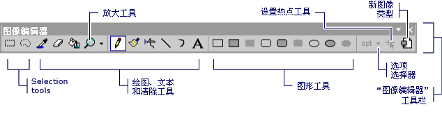
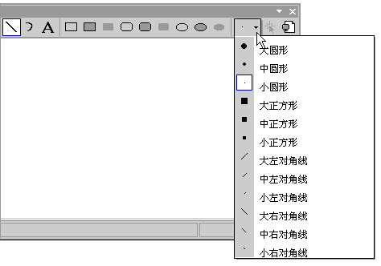

# 工具栏 （图标的图像编辑器 c + +）

**的图像编辑器**工具栏包含用于绘制、 绘制、 输入文本、 擦除和操作视图的工具。 它还包含选项选择器，可以选择使用每个工具的选项。 例如，你可以选择从各种画笔宽度、 放大因子和行样式。

> [!NOTE]
> 中提供的所有工具**的图像编辑器**工具栏上，还提供从**映像**菜单 (在**工具**命令)。

的图像编辑器工具栏

若要使用**的图像编辑器**工具栏和**选项**选择器中，选择的工具或所需选项。

> [!TIP]
> 将鼠标光标悬停工具栏按钮上时，会出现工具提示。 这些提示可以帮助您确定每个按钮的功能。

与**选项**选择器可以指定宽度的线条、 画笔笔画和的详细信息。 上的图标**选项**选择器按钮更改所选具体取决于哪种工具。

的图像编辑器工具栏上的选项选择器

将资源添加到托管项目的信息，请参阅[桌面应用中的资源](/dotnet/framework/resources/index)中 *.NET Framework 开发人员指南*。 有关手动将资源文件添加到托管项目、 访问资源、 显示静态资源和将资源字符串分配给属性的信息，请参阅[桌面应用中创建资源文件](/dotnet/framework/resources/creating-resource-files-for-desktop-apps)。 全球化和本地化的托管应用中的资源的信息，请参阅[Globalizing and Localizing.NET Framework Applications](/dotnet/standard/globalization-localization/index)。

## 使用文本工具对话框

使用**文本工具**对话框中，将文本添加到光标、 位图或图标资源。

若要访问此对话框中，打开[的图像编辑器](../windows/window-panes-image-editor-for-icons.md)。 选择**工具**从**映像**菜单，并选择**文本工具**命令。

### 字体按钮

此时将打开**文本工具字体**对话框中，可以在其中更改字体、 样式或游标字体的大小。 更改应用于中显示的文本**文本**区域。

若要访问此对话框中，选择**字体**按钮**文本工具**对话框。 可用的属性包括：

|属性|描述|
|---|---|
|**字体**|列出可用的字体。|
|**字形**|列出指定的字体的可用样式。|
|**Size**|列出指定的字体的可用点大小。|
|**示例**|显示文本与指定的字体设置的显示方式的示例。|
|**脚本**|列出了可用的语言脚本对于指定的字体。 时选择不同的语言脚本，该语言的字符集可用于创建多语言文档。|

#### 若要更改图像上文本的字体

下面的过程是如何将文本添加到 Windows 应用程序中的图标和操作文本的字体的示例。

1. 创建 c + + Windows 窗体应用程序。 有关详细信息，请参阅[创建一个 Windows 应用程序项目](/previous-versions/visualstudio/visual-studio-2010/42wc9kk5)。 *App.ico*默认情况下将文件添加到你的项目。

1. 在中**解决方案资源管理器**，双击该文件*app.ico*。 [的图像编辑器](../windows/image-editor-for-icons.md)将打开。

1. 从**图像**菜单中，选择**工具**，然后选择**文本工具**。 **文本工具**对话框将出现。

1. 在中**文本工具**对话框中，键入*c + +* 空文本区域中。 此文本将显示在一个可调整大小的框，位于左上角*app.ico*，在**图像编辑器**。

1. 在中**的图像编辑器**，将可调整大小框中拖到 app.ico，以提高文本可读性的中心。

1. 在中**文本工具**对话框中，选择**字体**按钮。 **文本工具字体**对话框将出现。

1. 在中**文本工具字体**对话框中，选择**Times New Roman**从列表中列出的可用字体**字体**列表框。

1. 选择**加粗**从列表中列出的可用字体样式**字体样式**列表框。

1. 选择**10**从列表中的可用点中列出的大小**大小**列表框。

1. 选择“确定”按钮。 **文本工具字体**对话框将关闭，并且新的字体设置将应用于您的文本。

1. 选择**关闭**按钮**文本工具**对话框。 在文本周围的调整大小框将不会出现**的图像编辑器**。

### 文本区域

显示作为资源的一部分显示的文本。 最初此区域为空。

> [!NOTE]
> 如果**透明背景**，则只将文本将被放入映像。 如果**不透明背景**设置，则填充的边界矩形[背景色](../windows/selecting-foreground-or-background-colors-image-editor-for-icons.md)，将放置文本的背景。 有关详细信息，请参阅[选择透明或透明背景](../windows/choosing-a-transparent-or-opaque-background-image-editor-for-icons.md)。

您可以右键单击**文本工具**对话框中，若要访问默认的快捷菜单包含一组标准的 Windows 命令。

## 若要显示或隐藏的图像编辑器工具栏

由于许多绘图工具都可以从[键盘](../windows/accelerator-keys-image-editor-for-icons.md)，有时还是需要隐藏**图像编辑器**工具栏。

上**视图**菜单中，选择**工具栏**然后选择**的图像编辑器**。

   > [!NOTE]
   > 此工具栏中的元素将显示为不可用时的图像文件从当前项目或解决方案不是在中打开**的图像编辑器**。 请参阅[创建图标或其他图像](../windows/creating-an-icon-or-other-image-image-editor-for-icons.md)，用于将图像文件添加到你的项目信息。

## 要求

无

## 请参阅

[颜色窗口](../windows/colors-window-image-editor-for-icons.md) 
[编辑图形资源](../windows/editing-graphical-resources-image-editor-for-icons.md) 
[快捷键](../windows/accelerator-keys-image-editor-for-icons.md) 