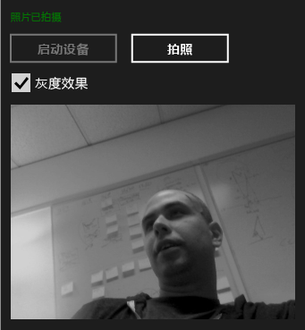

# <a name="walkthrough-creating-a-uwp-app-using-wrl-and-media-foundation"></a>演练： 创建使用 WRL 和媒体基础的 UWP 应用

了解如何使用 Windows 运行时 c + + 模板库 (WRL) 创建使用的通用 Windows 平台 (UWP) 应用程序[Microsoft 媒体基础](/windows/desktop/medfound/microsoft-media-foundation-sdk)。

此示例将创建一个向捕捉自网络摄像头的图像应用灰度效果的自定义媒体基础转换。 该应用利用 C++ 定义自定义转换，并利用 C# 将该组件用于转换捕捉的图像。

> [!NOTE]
> 除了 C#，你也可以利用 JavaScript、Visual Basic 或 C++ 来使用自定义转换组件。

在大多数情况下，可以使用 C + + /cli CX 创建 Windows 运行时。 但是，有时您必须使用 WRL。 例如，为 Microsoft 媒体基础创建媒体扩展时，必须创建实现 COM 和 Windows 运行时接口的组件。 由于 C + + /cli CX 仅可以创建 Windows 运行时对象，若要创建媒体扩展必须使用 WRL，因为它可以使 COM 和 Windows 运行时接口的实现。

> [!NOTE]
> 尽管此代码示例很长，但它演示了创建有用的媒体基础转换所需的最低要求。 你可以将它作为自己的自定义转换的起点。 此示例是改编[媒体扩展示例](http://code.msdn.microsoft.com/windowsapps/Media-extensions-sample-7b466096)，后者使用媒体扩展应用到视频效果、 视频解码，并创建生成媒体流的方案处理程序。

## <a name="prerequisites"></a>系统必备

- 经验[Windows 运行时](https://msdn.microsoft.com/library/windows/apps/br211377.aspx)。

- 熟悉 COM。

- 网络摄像头。

## <a name="key-points"></a>关键点

- 要创建自定义媒体基础组件，请使用 Microsoft 接口定义语言 (MIDL) 定义文件定义一个接口，实现该接口，然后使其可从其他组件激活。

- `namespace`并`runtimeclass`属性，并`NTDDI_WIN8`[版本](/windows/desktop/Midl/version)属性值都是使用 WRL 的媒体基础组件的 MIDL 定义的重要部分。

- [Microsoft::WRL::RuntimeClass](../windows/runtimeclass-class.md)是自定义媒体基础组件的基类。 [Microsoft::WRL::RuntimeClassType::WinRtClassicComMix](../windows/runtimeclasstype-enumeration.md)枚举值，该值作为模板自变量提供，将类标记为使用 Windows 运行时类，而且作为经典的 COM 运行时类。

- [InspectableClass](../windows/inspectableclass-macro.md)宏实现基本的 COM 功能，比如引用计数和`QueryInterface`方法，并设置运行时类名称和信任级别。

- 使用 microsoft:: wrl::[模块类](module-class.md)若要实现的 DLL 入口点函数，例如[DllGetActivationFactory](https://msdn.microsoft.com/library/br205771.aspx)， [DllCanUnloadNow](/windows/desktop/api/combaseapi/nf-combaseapi-dllcanunloadnow)，和[DllGetClassObject](/windows/desktop/api/combaseapi/nf-combaseapi-dllgetclassobject)。

- 将组件 DLL 链接到 runtimeobject.lib。 此外指定[/WINMD](../cppcx/compiler-and-linker-options-c-cx.md)链接器行生成 Windows 元数据。

- 使用项目引用，以便为 UWP 应用可以访问 WRL 组件。

### <a name="to-use-the-wrl-to-create-the-media-foundation-grayscale-transform-component"></a>若要使用 WRL 创建媒体基础灰度转换组件

1. 在 Visual Studio 中创建**空白解决方案**项目。 该项目命名，例如， *MediaCapture*。

1. 添加**DLL (通用 Windows)** 到解决方案。 该项目命名，例如， *GrayscaleTransform*。

1. 添加**Midl 文件 (.idl)** 到项目文件。 例如，命名该文件， *GrayscaleTransform.idl*。

1. 将此代码添加到 GrayscaleTransform.idl:

   [!code-cpp[wrl-media-capture#1](../windows/codesnippet/CPP/walkthrough-creating-a-windows-store-app-using-wrl-and-media-foundation_1.idl)]

1. 使用下面的代码的内容替换为`pch.h`:

   [!code-cpp[wrl-media-capture#2](../windows/codesnippet/CPP/walkthrough-creating-a-windows-store-app-using-wrl-and-media-foundation_2.h)]

1. 向项目添加新的头文件，将其命名`BufferLock.h`，然后将内容替换此代码：

   [!code-cpp[wrl-media-capture#3](../windows/codesnippet/CPP/walkthrough-creating-a-windows-store-app-using-wrl-and-media-foundation_3.h)]

1. `GrayscaleTransform.h` 未在此示例中使用。 如有需要，可以将其从项目中删除。

1. 使用下面的代码的内容替换为`GrayscaleTransform.cpp`:

   [!code-cpp[wrl-media-capture#4](../windows/codesnippet/CPP/walkthrough-creating-a-windows-store-app-using-wrl-and-media-foundation_4.cpp)]

1. 向项目添加新的模块定义文件，将其命名`GrayscaleTransform.def`，然后添加以下代码：

   ```
   EXPORTS
       DllCanUnloadNow                     PRIVATE
       DllGetActivationFactory             PRIVATE
       DllGetClassObject                   PRIVATE
   ```

1. 使用下面的代码的内容替换为`dllmain.cpp`:

   [!code-cpp[wrl-media-capture#6](../windows/codesnippet/CPP/walkthrough-creating-a-windows-store-app-using-wrl-and-media-foundation_6.cpp)]

1. 在项目的**属性页**对话框框中，设置以下**链接器**属性。

   1. 下**输入**，对于**模块定义文件**，指定`GrayScaleTransform.def`。

   1. 此外，在**输入**，添加`runtimeobject.lib`， `mfuuid.lib`，并`mfplat.lib`到**附加依赖项**属性。

   1. 下**Windows 元数据**，请设置**生成 Windows 元数据**到**是 (/ WINMD)**。

### <a name="to-use-the-wrl-the-custom-media-foundation-component-from-a-c-app"></a>若要使用 WRL 从 C# 应用程序的自定义媒体基础组件

1. 添加一个新**C# 空白应用 (通用 Windows)** 投影到`MediaCapture`解决方案。 该项目命名，例如， *MediaCapture*。

1. 在中**MediaCapture**项目中，添加对引用`GrayscaleTransform`项目。 若要了解如何操作，请参阅[如何： 添加或删除引用通过使用引用管理器](/visualstudio/ide/how-to-add-or-remove-references-by-using-the-reference-manager)。

1. 在中`Package.appxmanifest`，然后在**功能**选项卡上，选择**麦克风**并**网络摄像头**。 从网络摄像头中捕捉照片时需要这两项功能。

1. 在中`MainPage.xaml`，将此代码添加到根目录[网格](https://msdn.microsoft.com/library/windows/apps/xaml/windows.ui.xaml.controls.grid.aspx)元素：

   [!code-xml[wrl-media-capture#7](../windows/codesnippet/Xaml/walkthrough-creating-a-windows-store-app-using-wrl-and-media-foundation_7.xaml)]

1. 使用下面的代码的内容替换为`MainPage.xaml.cs`:

   [!code-cs[wrl-media-capture#8](../windows/codesnippet/CSharp/walkthrough-creating-a-windows-store-app-using-wrl-and-media-foundation_8.cs)]

下图显示`MediaCapture app`。



## <a name="next-steps"></a>后续步骤

该示例演示如何从默认网络摄像头逐张捕捉照片。 [媒体扩展示例](http://code.msdn.microsoft.com/windowsapps/Media-extensions-sample-7b466096)执行更多。 它演示如何枚举网络摄像头设备和使用本地方案处理程序，并演示对单张照片和视频流都产生影响的其他媒体效果。

## <a name="see-also"></a>请参阅

[Windows 运行时 C++ 模板库 (WRL)](../windows/windows-runtime-cpp-template-library-wrl.md)<br/>
[Microsoft 媒体基础](/windows/desktop/medfound/microsoft-media-foundation-sdk)<br/>
[媒体扩展示例](http://code.msdn.microsoft.com/windowsapps/Media-extensions-sample-7b466096)